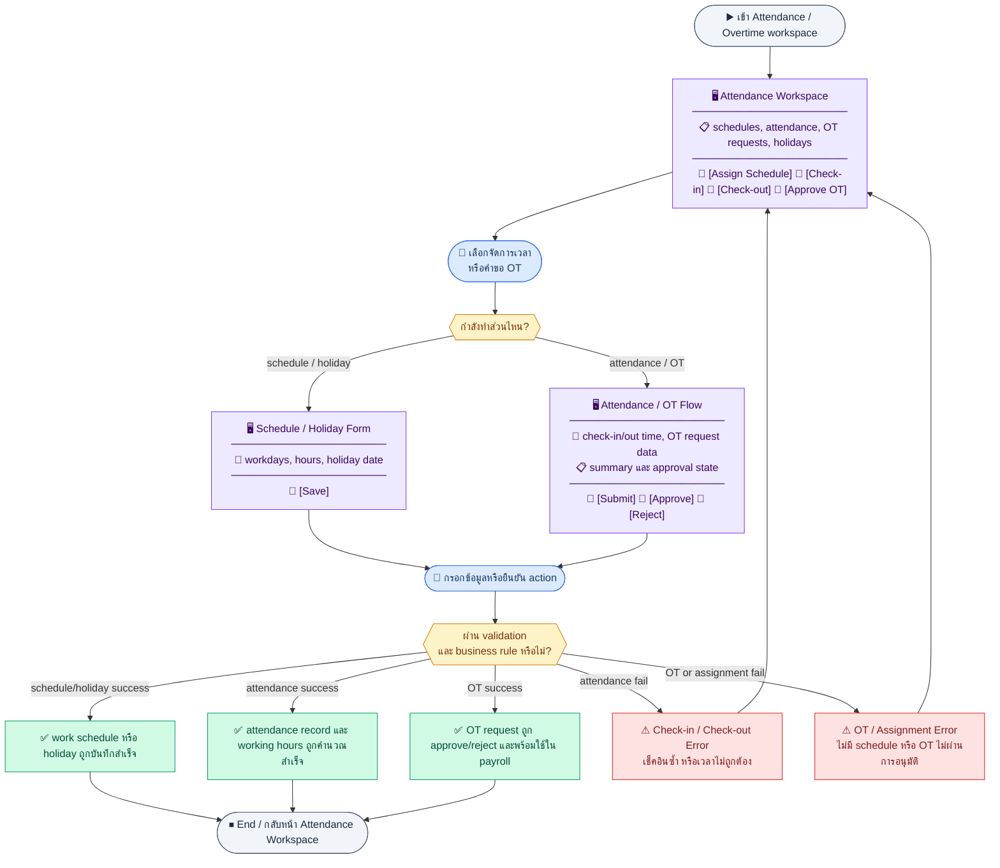
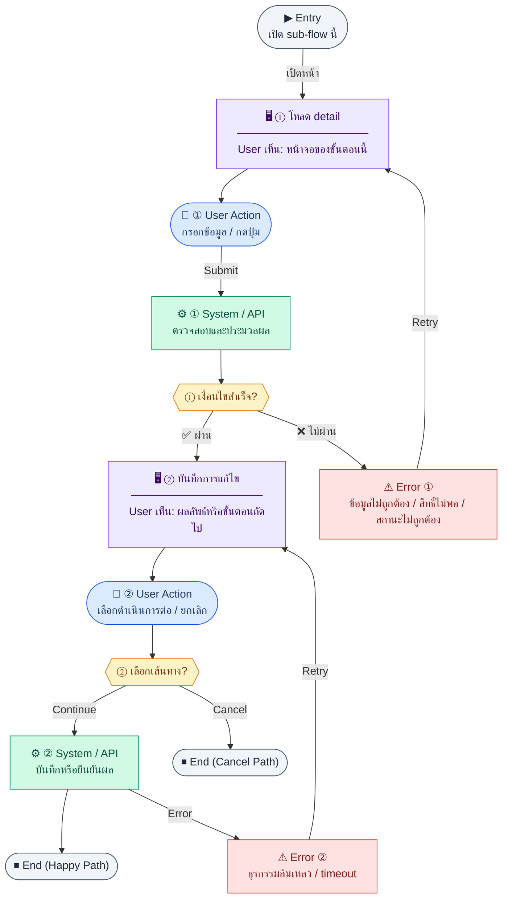
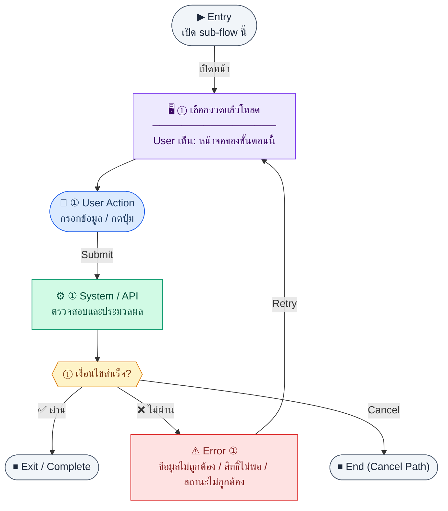
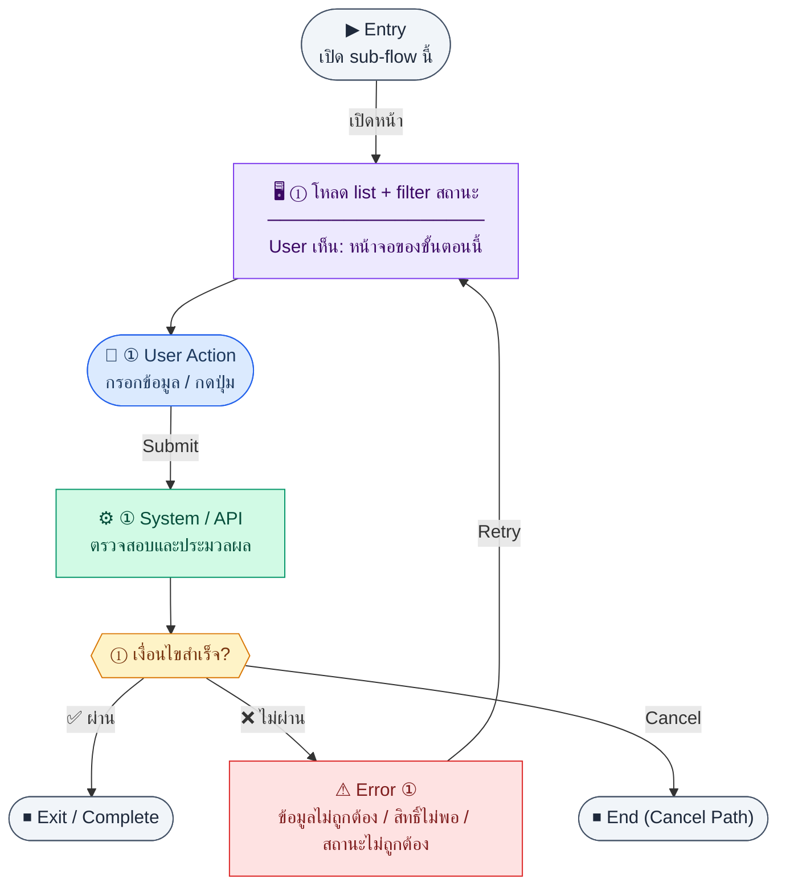
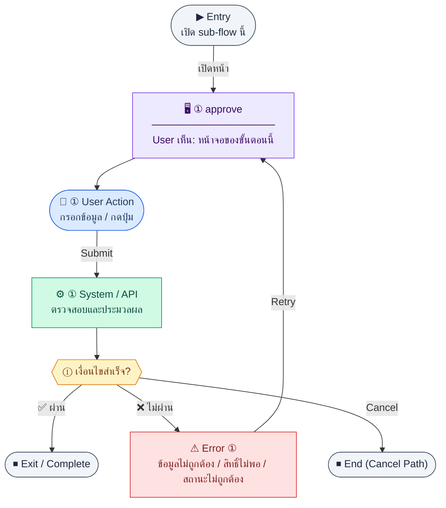

# UX Flow — R2-07 HR: เวลาเข้างาน ตารางงาน OT และวันหยุด

เอกสารนี้ครอบคลุม **Attendance & Time Tracking** ตาม Feature 3.7 ใน `Documents/Requirements/Release_2.md` และ endpoint ทั้งหมดใน `Documents/SD_Flow/HR/attendance_overtime.md` โดยเรียงเป็น sub-flow ที่ audit ได้ทีละคำขอ HTTP

**แหล่งอ้างอิงที่ผูกกับเอกสารนี้**

- Business requirement (BR): `Documents/Requirements/Release_2.md` (ส่วน 3.7 Attendance & Time Tracking, และการเชื่อม payroll)
- Traceability: `Documents/Requirements/Release_2_traceability_mermaid.md` (ความเชื่อม Attendance ↔ Payroll ↔ Notification)
- Sequence / SD_Flow: `Documents/SD_Flow/HR/attendance_overtime.md`
- Related screens / mockups: `Documents/UI_Flow_mockup/Page/R2-07_Attendance_and_Time_Tracking/` (`AttendancePage.md`, `OvertimeList.md`, `WorkScheduleList.md`, `HolidayList.md` — spec จาก UX; preview TBD)

---

## E2E Scenario Flow

> HR และพนักงานใช้ flow นี้เพื่อกำหนดตารางงาน บันทึก check-in/check-out ดูสรุปเวลาและ OT จัดการคำขอ OT และวันหยุด โดยให้ข้อมูลที่ได้ถูกนำไปใช้ต่อใน payroll และ notification สำหรับ absent alert

### Scenario Summary

| Scenario | ขั้นตอน | ผลลัพธ์ |
|----------|---------|---------|
| ✅ จัดการ work schedule | เปิดรายการ schedule → สร้าง/แก้ไข/assign ให้พนักงาน | พนักงานถูกผูกกับเวลาและวันทำงานที่ถูกต้อง |
| ✅ บันทึก check-in | พนักงาน/HR กด check-in | เกิด attendance record ของวันนั้น |
| ✅ บันทึก check-out | เปิด record เดิม → check-out | ระบบคำนวณ `workingHours` และ `otHours` |
| ✅ ดู attendance list/summary | กรองตามพนักงาน/ช่วงวัน | HR เห็น log และสรุปการทำงานต่อ period |
| ✅ จัดการ OT request | สร้างคำขอ OT → HR approve/reject | OT ถูกนับเข้าระบบหรือถูกปฏิเสธ |
| ✅ จัดการวันหยุด | เพิ่ม/ลบ holiday | วันหยุดถูกใช้ใน attendance/payroll |
| ✅ ใช้ใน payroll | payroll process ดึง attendance + approved OT | คำนวณ daily-rate, absent deduction, OT pay ได้ |
| ⚠ attendance หรือ OT ไม่ผ่านกฎ | duplicate check-in, invalid checkout, schedule missing | ระบบแสดง error และให้แก้ไข |

---
## Sub-flow A — ตารางงาน: รายการ (`GET /api/hr/work-schedules`)

### ชื่อ Flow & ขอบเขต

**Flow name:** `Attendance — Work schedules list`

**Actor(s):** `hr_admin`, `super_admin`

**Entry:** เมนู HR → ตั้งค่าเวลา / Work schedules

**Exit:** เลือก schedule เพื่อแก้ไขหรือ assign

**Out of scope:** การคำนวณ OT อัตโนมัติละเอียด (อธิบายใน BR แยกจาก UX ปุ่ม)

---

### Scenario Flow

### สัญลักษณ์ Node (Color Legend)

| สี | Node shape | หมายถึง |
|----|-----------|---------|
| 🟣 ม่วง | สี่เหลี่ยม `["…"]` | **Screen / UI State** |
| 🔵 น้ำเงิน | วงกลม `(["…"])` | **User Action** |
| 🟢 เขียว | สี่เหลี่ยม `["…"]` | **System / API** |
| 🟡 เหลือง | เพชร `{{"…"}}` | **Decision** |
| 🔴 แดง | สี่เหลี่ยม `["…"]` | **Error / Edge case** |
| ⚫ เทา | วงรี `(["…"])` | **Start / End** |

---

### Step A1 — โหลดรายการตาราง

**Goal:** แสดงตารางงานที่นิยามเวลาเข้า-ออกและวันทำงาน

**User sees:** ตาราง/การ์ด schedule, loading

**User can do:** ค้นหา, กรอง, กดสร้างใหม่

**User Action:**
- ประเภท: `เลือกตัวเลือก / กดปุ่ม`
- ช่องที่ใช้กรอง/ดูข้อมูล:
  - `search` *(optional)* : ค้นหาตารางงานตามชื่อ
  - `page` / `limit` *(optional)* : เปลี่ยนหน้ารายการ
- ปุ่ม / Controls ในหน้านี้:
  - `[Create Schedule]` → เปิดฟอร์มสร้าง
  - `[Open Detail]` → ดูหรือแก้ schedule ที่เลือก
  - `[Refresh]` → โหลดรายการล่าสุด

**Frontend behavior:**

- `GET /api/hr/work-schedules` (+ query ตาม BE)
- เก็บผลใน cache สั้น ๆ เมื่อสลับไปหน้า assign แล้วกลับมา

**System / AI behavior:** คืนรายการจาก `work_schedules`

**Success:** 200

**Error:** 401 → refresh auth; 403 → access denied

**Notes:** BR อธิบายว่า schedule ใช้กับ attendance + payroll — แสดงชื่อ schedule ให้ชัดเจนเมื่อ assign

---

### Step A2 — Empty และ permission แบบอ่านอย่างเดียว

**Goal:** HR ที่อ่านได้แต่แก้ไม่ได้ยังเห็น list

**User sees:** ปุ่มสร้าง/แก้ไขถูกซ่อน

**User can do:** ดูอย่างเดียว

**User Action:**
- ประเภท: `กดปุ่ม`
- ปุ่ม / Controls ในหน้านี้:
  - `[Refresh]` → โหลดใหม่เมื่อรายการว่าง
  - `[View Detail]` → เปิด schedule แบบ read-only

**Frontend behavior:** ซ่อนปุ่มจาก permission; ยังเรียก `GET /api/hr/work-schedules`

**System / AI behavior:** 403 บน mutating calls เท่านั้น

**Success:** ประสบการณ์ read-only สม่ำเสมอ

**Error:** —

**Notes:** **permission gates** ตาม brief

---

## Sub-flow B — สร้างตารางงาน (`POST /api/hr/work-schedules`)

### ชื่อ Flow & ขอบเขต

**Flow name:** `Attendance — Create work schedule`

**Actor(s):** HR admin

**Entry:** ปุ่ม "สร้างตารางงาน"

**Exit:** ได้ schedule ใหม่พร้อม `id`

**Out of scope:** import จากไฟล์

---

### Scenario Flow

### สัญลักษณ์ Node (Color Legend)

| สี | Node shape | หมายถึง |
|----|-----------|---------|
| 🟣 ม่วง | สี่เหลี่ยม `["…"]` | **Screen / UI State** |
| 🔵 น้ำเงิน | วงกลม `(["…"])` | **User Action** |
| 🟢 เขียว | สี่เหลี่ยม `["…"]` | **System / API** |
| 🟡 เหลือง | เพชร `{{"…"}}` | **Decision** |
| 🔴 แดง | สี่เหลี่ยม `["…"]` | **Error / Edge case** |
| ⚫ เทา | วงรี `(["…"])` | **Start / End** |

---

### Step B1 — ฟอร์มสร้าง

**Goal:** นิยามเวลาเข้า ออก วันทำงาน Mon–Fri break (ตาม BR table)

**User sees:** ฟอร์มหลายฟิลด์ + preview สัปดาห์

**User can do:** บันทึก, ยกเลิก

**User Action:**
- ประเภท: `กรอกข้อมูล / เลือกตัวเลือก`
- ช่องที่ต้องกรอก:
  - `name` *(required)* : ชื่อตารางงาน
  - `startTime` *(required)* : เวลาเข้างาน
  - `endTime` *(required)* : เวลาเลิกงาน
  - `breakStart` / `breakEnd` *(optional)* : ช่วงพัก
  - `workingDays` *(required)* : วันทำงานในสัปดาห์
- ปุ่ม / Controls ในหน้านี้:
  - `[Save Schedule]` → สร้างตารางงาน
  - `[Cancel]` → ปิดฟอร์ม

**Frontend behavior:**

- validate เวลาเข้า < เวลาออก, break ไม่เกินช่วง, อย่างน้อยหนึ่งวันทำงานถูกเลือก
- `POST /api/hr/work-schedules`

**System / AI behavior:** validate ชื่อซ้ำ (ถ้ามี unique)

**Success:** 201

**Error:** 422

**Notes:** endpoint ตรง SD

---

## Sub-flow C — รายละเอียดและแก้ไขตาราง (`GET` + `PATCH /api/hr/work-schedules/:id`)

### ชื่อ Flow & ขอบเขต

**Flow name:** `Attendance — Work schedule detail & update`

**Actor(s):** HR admin

**Entry:** คลิก schedule จาก list

**Exit:** บันทึกการแก้ไขหรือไป assign

**Out of scope:** version history

---

### Scenario Flow

### สัญลักษณ์ Node (Color Legend)

| สี | Node shape | หมายถึง |
|----|-----------|---------|
| 🟣 ม่วง | สี่เหลี่ยม `["…"]` | **Screen / UI State** |
| 🔵 น้ำเงิน | วงกลม `(["…"])` | **User Action** |
| 🟢 เขียว | สี่เหลี่ยม `["…"]` | **System / API** |
| 🟡 เหลือง | เพชร `{{"…"}}` | **Decision** |
| 🔴 แดง | สี่เหลี่ยม `["…"]` | **Error / Edge case** |
| ⚫ เทา | วงรี `(["…"])` | **Start / End** |

---

### Step C1 — โหลด detail

**Goal:** แสดงค่าปัจจุบันของ schedule

**User sees:** รายละเอียด

**User can do:** แก้ไข

**User Action:**
- ประเภท: `กดปุ่ม`
- ปุ่ม / Controls ในหน้านี้:
  - `[Edit Schedule]` → เข้าโหมดแก้ไข
  - `[Assign Employees]` → ไป flow มอบหมายพนักงาน
  - `[Back to List]` → กลับหน้ารายการ

**Frontend behavior:** `GET /api/hr/work-schedules/:id`

**System / AI behavior:** —

**Success:** 200

**Error:** 404

**Notes:** —

---

### Step C2 — บันทึกการแก้ไข

**Goal:** อัปเดต schedule ที่มีอยู่

**User sees:** ฟอร์มแก้ไข + loading

**User can do:** บันทึก

**User Action:**
- ประเภท: `กรอกข้อมูล / เลือกตัวเลือก`
- ช่องที่ต้องกรอก:
  - `name`, `startTime`, `endTime` *(required if changed)* : ฟิลด์หลักที่แก้ไข
  - `breakStart` / `breakEnd` *(optional)* : ช่วงพัก
  - `workingDays` *(required if changed)* : วันทำงาน
- ปุ่ม / Controls ในหน้านี้:
  - `[Save Changes]` → บันทึกการแก้ไข
  - `[Discard Changes]` → ยกเลิกการแก้ไข

**Frontend behavior:** `PATCH /api/hr/work-schedules/:id` (partial body)

**System / AI behavior:** ตรวจผลกระทบต่อพนักงานที่ถูก assign (ถ้า BE คืน warning)

**Success:** 200

**Error:** 409 ถ้ามีพนักงานจำนวนมากที่ conflict กับการเปลี่ยนแปลง (ตาม BE)

**Notes:** หลัง patch ควร invalidate list `GET /api/hr/work-schedules`

---

## Sub-flow D — มอบหมายตารางให้พนักงาน (`POST /api/hr/work-schedules/:id/assign`)

### ชื่อ Flow & ขอบเขต

**Flow name:** `Attendance — Assign schedule to employees`

**Actor(s):** HR admin

**Entry:** ปุ่ม "มอบหมาย" ในหน้า schedule detail

**Exit:** พนักงานที่เลือกถูกผูก schedule

**Out of scope:** bulk import รหัสพนักงานจาก Excel (ถ้าไม่มี)

---

### Scenario Flow

### สัญลักษณ์ Node (Color Legend)

| สี | Node shape | หมายถึง |
|----|-----------|---------|
| 🟣 ม่วง | สี่เหลี่ยม `["…"]` | **Screen / UI State** |
| 🔵 น้ำเงิน | วงกลม `(["…"])` | **User Action** |
| 🟢 เขียว | สี่เหลี่ยม `["…"]` | **System / API** |
| 🟡 เหลือง | เพชร `{{"…"}}` | **Decision** |
| 🔴 แดง | สี่เหลี่ยม `["…"]` | **Error / Edge case** |
| ⚫ เทา | วงรี `(["…"])` | **Start / End** |

---

### Step D1 — เลือกพนักงาน

**Goal:** เลือกกลุ่มเป้าหมายอย่างชัดเจน

**User sees:** multi-select จาก `GET /api/hr/employees` (โมดูล employee — cross-ref R1-02)

**User can do:** เลือก/ค้นหา

**User Action:**
- ประเภท: `เลือกตัวเลือก / กดปุ่ม`
- ช่องที่ต้องกรอก:
  - `employeeIds` *(required)* : รายชื่อพนักงานที่จะ assign
  - `searchEmployee` *(optional)* : ค้นหาพนักงาน
- ปุ่ม / Controls ในหน้านี้:
  - `[Select Employees]` → เลือกจาก multi-select
  - `[Confirm Assignment]` → ไปขั้น submit
  - `[Cancel]` → ปิด flow

**Frontend behavior:**

- โหลดรายชื่อพนักงานด้วย endpoint HR employees (ไม่ใช่ SD ไฟล์นี้ แต่เป็น dependency ชัดเจน)
- แสดง schedule ปัจจุบันของแต่ละคน (ถ้า BE ส่งมา) เพื่อกัน assign ผิด

**System / AI behavior:** —

**Success:** พร้อม assign

**Error:** โหลดรายชื่อล้มเหลว → บล็อก assign

**Notes:** —

---

### Step D2 — Submit assign

**Goal:** บันทึกความสัมพันธ์ schedule ↔ employees

**User sees:** progress

**User can do:** รอ

**User Action:**
- ประเภท: `กดปุ่ม`
- ข้อมูลที่จะส่ง:
  - `employeeIds` *(required)* : พนักงานที่เลือกทั้งหมด
- ปุ่ม / Controls ในหน้านี้:
  - `[Assign Schedule]` → เรียก `POST /api/hr/work-schedules/:id/assign`
  - `[Back to Selection]` → กลับไปปรับรายชื่อ

**Frontend behavior:** `POST /api/hr/work-schedules/:id/assign` พร้อม body รายการ `employeeIds` (ตามสัญญา BE)

**System / AI behavior:** สร้าง/อัปเดตความสัมพันธ์ใน `employee_schedules` (หรือ model เทียบเท่าตาม schema จริง) เพื่อผูกพนักงานกับ work schedule; ไม่อ้างอิงการเขียนทับ `employees.scheduleId` แบบ single-field

**Success:** 201/200

**Error:** 422 (employee ไม่มี active), 409

**Notes:** endpoint ตรง SD: `POST /api/hr/work-schedules/:id/assign`

---

## Sub-flow E — บันทึกการมาทำงาน: รายการ (`GET /api/hr/attendance`)

### ชื่อ Flow & ขอบเขต

**Flow name:** `Attendance — Daily log table`

**Actor(s):** พนักงานดูของตน; HR ดูทุกคนตามสิทธิ์

**Entry:** route `/hr/attendance` ตาม BR

**Exit:** check-in/out หรือดู summary

**Out of scope:** แก้ไขย้อนหลังด้วยมือ (ถ้าไม่มี PATCH generic ใน SD)

---

### Scenario Flow

### สัญลักษณ์ Node (Color Legend)

| สี | Node shape | หมายถึง |
|----|-----------|---------|
| 🟣 ม่วง | สี่เหลี่ยม `["…"]` | **Screen / UI State** |
| 🔵 น้ำเงิน | วงกลม `(["…"])` | **User Action** |
| 🟢 เขียว | สี่เหลี่ยม `["…"]` | **System / API** |
| 🟡 เหลือง | เพชร `{{"…"}}` | **Decision** |
| 🔴 แดง | สี่เหลี่ยม `["…"]` | **Error / Edge case** |
| ⚫ เทา | วงรี `(["…"])` | **Start / End** |

---

### Step E1 — โหลด log ด้วย filter

**Goal:** แสดง `attendance_records` ตามช่วงวันที่และพนักงาน

**User sees:** ตารางวันที่, เวลาเข้า, เวลาออก, ชั่วโมงทำงาน, OT hours (ถ้ามีในข้อมูล)

**User can do:** เปลี่ยนช่วงวันที่, เลือกพนักงาน (HR)

**User Action:**
- ประเภท: `เลือกตัวเลือก / กดปุ่ม`
- ช่องที่ใช้กรอง/ดูข้อมูล:
  - `dateFrom` *(required)* : วันเริ่มต้น
  - `dateTo` *(required)* : วันสิ้นสุด
  - `employeeId` *(optional for HR only)* : พนักงานที่ต้องการดู
- ปุ่ม / Controls ในหน้านี้:
  - `[Apply Filters]` → โหลด attendance log
  - `[Check In]` → ไป flow ลงเวลาเข้า
  - `[Check Out]` → ไป flow ลงเวลาออก

**Frontend behavior:**

- `GET /api/hr/attendance` พร้อม query `dateFrom`, `dateTo`, `employeeId` ที่ API boundary
- สำหรับ employee ธรรมดา: lock `employeeId` เป็นของตนเองฝั่ง FE + ตรวจอีกชั้นที่ API

**System / AI behavior:** enforce scope "พนักงานเห็นเฉพาะของตน"

**Success:** 200

**Error:** 403 เมื่อพยายามดูคนอื่น

**Notes:** BR ระบุหน้าจอ: daily log + filter

---

### Step E2 — แถววันนี้ยังไม่ check-in (edge)

**Goal:** เน้น UX สำหรับสถานะยังไม่มี record วันนี้

**User sees:** highlight วันนี้ + ปุ่ม check-in เด่น

**User can do:** check-in

**User Action:**
- ประเภท: `กดปุ่ม`
- ปุ่ม / Controls ในหน้านี้:
  - `[Check In Now]` → เริ่มลงเวลาเข้า
  - `[Dismiss Banner]` → ปิดการเน้นแถววันนี้

**Frontend behavior:** ไม่ต้อง refetch ทั้งตารางถ้า optimistic เพิ่มแถว — แต่ต้อง reconcile กับ server

**System / AI behavior:** —

**Success:** ผู้ใช้เข้าใจว่าต้องกด check-in

**Error:** —

**Notes:** เชื่อมกับ Gap F notification ใน BR (cron 07:00) — UX อาจแสดง banner "วันนี้ยังไม่ลงเวลา"

---

## Sub-flow F — Check-in (`POST /api/hr/attendance/check-in`)

### ชื่อ Flow & ขอบเขต

**Flow name:** `Attendance — Check-in`

**Actor(s):** พนักงานที่ login

**Entry:** ปุ่ม check-in บนหน้า attendance หรือ widget บน dashboard

**Exit:** มีแถว attendance วันนี้พร้อมเวลาเข้า

**Out of scope:** GPS geofence (ถ้าไม่มีใน API)

---

### Scenario Flow

### สัญลักษณ์ Node (Color Legend)

| สี | Node shape | หมายถึง |
|----|-----------|---------|
| 🟣 ม่วง | สี่เหลี่ยม `["…"]` | **Screen / UI State** |
| 🔵 น้ำเงิน | วงกลม `(["…"])` | **User Action** |
| 🟢 เขียว | สี่เหลี่ยม `["…"]` | **System / API** |
| 🟡 เหลือง | เพชร `{{"…"}}` | **Decision** |
| 🔴 แดง | สี่เหลี่ยม `["…"]` | **Error / Edge case** |
| ⚫ เทา | วงรี `(["…"])` | **Start / End** |

---

### Step F1 — กด check-in

**Goal:** สร้าง attendance record วันนี้

**User sees:** ปุ่มกลายเป็น loading

**User can do:** รอ — ไม่ควร double-tap

**User Action:**
- ประเภท: `กดปุ่ม`
- ปุ่ม / Controls ในหน้านี้:
  - `[Check In]` → เรียก `POST /api/hr/attendance/check-in`
  - `[Cancel]` → ไม่ลงเวลาในตอนนี้

**Frontend behavior:**

- disable ปุ่มทันทีหลังกด
- `POST /api/hr/attendance/check-in` (body อาจว่างหรือมี metadata ตาม BE)

**System / AI behavior:**

- ป้องกัน check-in ซ้ำในวันเดียวกัน (409)
- คำนวณสายหรือสถานะเทียบ `work_schedules` (ถ้า BE คำนวณ)

**Success:** 201 พร้อม record ใหม่

**Error:** 409 แล้วมี check-in แล้ว → refetch `GET /api/hr/attendance` และ sync UI

**Notes:** endpoint ตรง SD

---

### Step F2 — Offline / network flake

**Goal:** ลดความรู้สึกว่ากดแล้วหาย

**User sees:** toast error + ปุ่มกลับมาใช้ได้

**User can do:** retry

**User Action:**
- ประเภท: `กดปุ่ม`
- ปุ่ม / Controls ในหน้านี้:
  - `[Retry Check In]` → ส่งคำขอใหม่
  - `[Refresh Status]` → ตรวจว่าระบบบันทึกไว้แล้วหรือยัง

**Frontend behavior:** exponential backoff retry 1–2 ครั้งอัตโนมัติ (optional) แล้วมอบให้ user

**System / AI behavior:** —

**Success:** record ถูกสร้างหลัง retry

**Error:** ยัง fail — แจ้งให้ตรวจเน็ต

**Notes:** **retry / edge** ตาม brief

---

## Sub-flow G — Check-out (`PATCH /api/hr/attendance/:id/check-out`)

### ชื่อ Flow & ขอบเขต

**Flow name:** `Attendance — Check-out`

**Actor(s):** พนักงานเจ้าของ record

**Entry:** ปุ่ม check-out เมื่อมีแถววันนี้และยังไม่ checkout

**Exit:** มีเวลาออกและชั่วโมงทำงานคำนวณแล้ว

**Out of scope:** การแก้ checkout ย้อนหลังโดย HR (ถ้าไม่มี endpoint)

---

### Scenario Flow

### สัญลักษณ์ Node (Color Legend)

| สี | Node shape | หมายถึง |
|----|-----------|---------|
| 🟣 ม่วง | สี่เหลี่ยม `["…"]` | **Screen / UI State** |
| 🔵 น้ำเงิน | วงกลม `(["…"])` | **User Action** |
| 🟢 เขียว | สี่เหลี่ยม `["…"]` | **System / API** |
| 🟡 เหลือง | เพชร `{{"…"}}` | **Decision** |
| 🔴 แดง | สี่เหลี่ยม `["…"]` | **Error / Edge case** |
| ⚫ เทา | วงรี `(["…"])` | **Start / End** |

---

### Step G1 — กด check-out

**Goal:** ปิดวงจรวันนั้น

**User sees:** ปุ่ม check-out

**User can do:** กด

**User Action:**
- ประเภท: `กดปุ่ม`
- ปุ่ม / Controls ในหน้านี้:
  - `[Check Out]` → เรียก `PATCH /api/hr/attendance/:id/check-out`
  - `[Cancel]` → ยังไม่ลงเวลาออก

**Frontend behavior:**

- ต้องรู้ `id` ของแถววันนี้จาก state ล่าสุดของ `GET /api/hr/attendance` หรือจาก response check-in
- `PATCH /api/hr/attendance/:id/check-out`

**System / AI behavior:** คำนวณ `workingHours`, `otHours` ตาม BR

**Success:** 200

**Error:** 409 ถ้า checkout แล้ว; 404 ถ้า id ผิด (race) → refetch list

**Notes:** endpoint ตรง SD

---

## Sub-flow H — สรุปภาพรวม (`GET /api/hr/attendance/summary`)

### ชื่อ Flow & ขอบเขต

**Flow name:** `Attendance — Summary per employee / period`

**Actor(s):** HR, manager, พนักงาน (scope ตาม BE)

**Entry:** แท็บ "สรุป" ในหน้า attendance หรือ widget บน dashboard

**Exit:** เห็นสถิติช่วงที่เลือก

**Out of scope:** export รายงาน (ถ้าไม่มี API)

---

### Scenario Flow

### สัญลักษณ์ Node (Color Legend)

| สี | Node shape | หมายถึง |
|----|-----------|---------|
| 🟣 ม่วง | สี่เหลี่ยม `["…"]` | **Screen / UI State** |
| 🔵 น้ำเงิน | วงกลม `(["…"])` | **User Action** |
| 🟢 เขียว | สี่เหลี่ยม `["…"]` | **System / API** |
| 🟡 เหลือง | เพชร `{{"…"}}` | **Decision** |
| 🔴 แดง | สี่เหลี่ยม `["…"]` | **Error / Edge case** |
| ⚫ เทา | วงรี `(["…"])` | **Start / End** |

---

### Step H1 — เลือกงวดแล้วโหลด

**Goal:** แสดงสรุปเช่น วันทำงานจริง, absent, OT รวม (ตามที่ BE คืน)

**User sees:** การ์ดสรุป + กราฟเล็ก (ถ้ามี design)

**User can do:** เปลี่ยนงวด

**User Action:**
- ประเภท: `เลือกตัวเลือก / กดปุ่ม`
- ช่องที่ต้องกรอก:
  - `dateFrom` *(required)* : วันเริ่มงวด
  - `dateTo` *(required)* : วันสิ้นสุดงวด
  - `employeeId` *(optional)* : พนักงานเป้าหมาย
- ปุ่ม / Controls ในหน้านี้:
  - `[Load Summary]` → เรียก summary ตามงวด
  - `[Reset Filters]` → ล้างค่า filter

**Frontend behavior:** `GET /api/hr/attendance/summary` พร้อม query `dateFrom`, `dateTo`, `employeeId`

**System / AI behavior:** aggregate จาก `attendance_records` + holidays (ตาม BR R2)

**Success:** 200

**Error:** 403

**Notes:** BR ระบุให้ payroll detail แสดง attendance summary — UX payroll ควร reuse component สรุปนี้และเรียก endpoint เดียวกัน

---

## Sub-flow I — OT: รายการ (`GET /api/hr/overtime`)

### ชื่อ Flow & ขอบเขต

**Flow name:** `Attendance — Overtime request list`

**Actor(s):** พนักงาน (ของตน), HR (ทั้งหมด)

**Entry:** `/hr/overtime`

**Exit:** สร้างคำขอหรืออนุมัติ/ปฏิเสธ

**Out of scope:** การคำนวณอัตรา OT ละเอียดใน UI (แสดงผลลัพธ์จาก BE พอ)

---

### Scenario Flow

### สัญลักษณ์ Node (Color Legend)

| สี | Node shape | หมายถึง |
|----|-----------|---------|
| 🟣 ม่วง | สี่เหลี่ยม `["…"]` | **Screen / UI State** |
| 🔵 น้ำเงิน | วงกลม `(["…"])` | **User Action** |
| 🟢 เขียว | สี่เหลี่ยม `["…"]` | **System / API** |
| 🟡 เหลือง | เพชร `{{"…"}}` | **Decision** |
| 🔴 แดง | สี่เหลี่ยม `["…"]` | **Error / Edge case** |
| ⚫ เทา | วงรี `(["…"])` | **Start / End** |

---

### Step I1 — โหลด list + filter สถานะ

**Goal:** แสดง `overtime_requests` ตาม status / employee

**User sees:** ตาราง, filter

**User can do:** เปลี่ยน filter

**User Action:**
- ประเภท: `เลือกตัวเลือก / กดปุ่ม`
- ช่องที่ใช้กรอง/ดูข้อมูล:
  - `status` *(optional)* : pending, approved, rejected
  - `employeeId` *(optional for HR)* : กรองตามพนักงาน
- ปุ่ม / Controls ในหน้านี้:
  - `[Apply Filters]` → โหลดรายการ OT
  - `[Create OT Request]` → เปิดฟอร์มสร้างคำขอ

**Frontend behavior:** `GET /api/hr/overtime` + query

**System / AI behavior:** enforce visibility

**Success:** 200

**Error:** network

**Notes:** —

---

## Sub-flow J — OT: สร้างคำขอ (`POST /api/hr/overtime`)

### Scenario Flow

### สัญลักษณ์ Node (Color Legend)

| สี | Node shape | หมายถึง |
|----|-----------|---------|
| 🟣 ม่วง | สี่เหลี่ยม `["…"]` | **Screen / UI State** |
| 🔵 น้ำเงิน | วงกลม `(["…"])` | **User Action** |
| 🟢 เขียว | สี่เหลี่ยม `["…"]` | **System / API** |
| 🟡 เหลือง | เพชร `{{"…"}}` | **Decision** |
| 🔴 แดง | สี่เหลี่ยม `["…"]` | **Error / Edge case** |
| ⚫ เทา | วงรี `(["…"])` | **Start / End** |

---

### Step J1 — ฟอร์มสร้าง

**Goal:** ส่งวันที่ ช่วงเวลา เหตุผล

**User sees:** ฟอร์ม

**User can do:** ส่งคำขอ

**User Action:**
- ประเภท: `กรอกข้อมูล / เลือกตัวเลือก`
- ช่องที่ต้องกรอก:
  - `requestDate` *(required)* : วันที่ทำ OT
  - `startTime` *(required)* : เวลาเริ่ม
  - `endTime` *(required)* : เวลาสิ้นสุด
  - `reason` *(required)* : เหตุผลการทำ OT
- ปุ่ม / Controls ในหน้านี้:
  - `[Submit OT Request]` → สร้างคำขอ OT
  - `[Cancel]` → ปิดฟอร์ม

**Frontend behavior:**

- validate `endTime` > `startTime`, วันที่ไม่อยู่ในอนาคตเกิน policy (ถ้ามี)
- `POST /api/hr/overtime`

**System / AI behavior:** สร้างคำขอสถานะ pending

**Success:** 201

**Error:** 422

**Notes:** endpoint ตรง SD

---

## Sub-flow K — OT: รายละเอียด (`GET /api/hr/overtime/:id`)

### Scenario Flow

### สัญลักษณ์ Node (Color Legend)

| สี | Node shape | หมายถึง |
|----|-----------|---------|
| 🟣 ม่วง | สี่เหลี่ยม `["…"]` | **Screen / UI State** |
| 🔵 น้ำเงิน | วงกลม `(["…"])` | **User Action** |
| 🟢 เขียว | สี่เหลี่ยม `["…"]` | **System / API** |
| 🟡 เหลือง | เพชร `{{"…"}}` | **Decision** |
| 🔴 แดง | สี่เหลี่ยม `["…"]` | **Error / Edge case** |
| ⚫ เทา | วงรี `(["…"])` | **Start / End** |

---

### Step K1 — เปิด detail

**Goal:** ดูเหตุผลและสถานะก่อน approve

**User sees:** รายละเอียด

**User can do:** อนุมัติ/ปฏิเสธ (HR)

**User Action:**
- ประเภท: `กดปุ่ม`
- ปุ่ม / Controls ในหน้านี้:
  - `[Approve]` → ไป flow อนุมัติ
  - `[Reject]` → ไป flow ปฏิเสธ
  - `[Back to List]` → กลับหน้ารายการ OT

**Frontend behavior:** `GET /api/hr/overtime/:id`

**System / AI behavior:** —

**Success:** 200

**Error:** 404

**Notes:** —

---

## Sub-flow L — OT: อนุมัติ (`PATCH /api/hr/overtime/:id/approve`)

### Scenario Flow

### สัญลักษณ์ Node (Color Legend)

| สี | Node shape | หมายถึง |
|----|-----------|---------|
| 🟣 ม่วง | สี่เหลี่ยม `["…"]` | **Screen / UI State** |
| 🔵 น้ำเงิน | วงกลม `(["…"])` | **User Action** |
| 🟢 เขียว | สี่เหลี่ยม `["…"]` | **System / API** |
| 🟡 เหลือง | เพชร `{{"…"}}` | **Decision** |
| 🔴 แดง | สี่เหลี่ยม `["…"]` | **Error / Edge case** |
| ⚫ เทา | วงรี `(["…"])` | **Start / End** |

---

### Step L1 — approve

**Goal:** เปลี่ยนสถานะเป็น approved เพื่อนำไปคิด payroll ตาม BR

**User sees:** modal ยืนยัน

**User can do:** ยืนยัน

**User Action:**
- ประเภท: `กดปุ่ม`
- ปุ่ม / Controls ในหน้านี้:
  - `[Confirm Approve]` → เรียก `PATCH /api/hr/overtime/:id/approve`
  - `[Cancel]` → ยกเลิกการอนุมัติ

**Frontend behavior:** `PATCH /api/hr/overtime/:id/approve`

**System / AI behavior:** ตรวจสิทธิ์ approver, state pending

**Success:** 200

**Error:** 409/403

**Notes:** BR ระบุอัตรา OT วันหยุด/สุดสัปดาห์ — แสดงคำนวณเบื้องต้นถ้า BE ส่ง `estimatedPay` (optional)

---

## Sub-flow M — OT: ปฏิเสธ (`PATCH /api/hr/overtime/:id/reject`)

### Scenario Flow

### สัญลักษณ์ Node (Color Legend)

| สี | Node shape | หมายถึง |
|----|-----------|---------|
| 🟣 ม่วง | สี่เหลี่ยม `["…"]` | **Screen / UI State** |
| 🔵 น้ำเงิน | วงกลม `(["…"])` | **User Action** |
| 🟢 เขียว | สี่เหลี่ยม `["…"]` | **System / API** |
| 🟡 เหลือง | เพชร `{{"…"}}` | **Decision** |
| 🔴 แดง | สี่เหลี่ยม `["…"]` | **Error / Edge case** |
| ⚫ เทา | วงรี `(["…"])` | **Start / End** |

---

### Step M1 — reject พร้อมเหตุผล

**Goal:** ปฏิเสธคำขอพร้อมเหตุผล

**User sees:** modal เหตุผล (required)

**User can do:** ยืนยัน

**User Action:**
- ประเภท: `กรอกข้อมูล / กดปุ่ม`
- ช่องที่ต้องกรอก:
  - `reason` *(required)* : เหตุผลที่ใช้ปฏิเสธ
- ปุ่ม / Controls ในหน้านี้:
  - `[Confirm Reject]` → เรียก `PATCH /api/hr/overtime/:id/reject`
  - `[Cancel]` → ปิด modal

**Frontend behavior:** `PATCH /api/hr/overtime/:id/reject` + body

**System / AI behavior:** บันทึกผู้ปฏิเสธ

**Success:** 200

**Error:** 409

**Notes:** —

---

## Sub-flow N — วันหยุด: รายการ (`GET /api/hr/holidays`)

### Scenario Flow

### สัญลักษณ์ Node (Color Legend)

| สี | Node shape | หมายถึง |
|----|-----------|---------|
| 🟣 ม่วง | สี่เหลี่ยม `["…"]` | **Screen / UI State** |
| 🔵 น้ำเงิน | วงกลม `(["…"])` | **User Action** |
| 🟢 เขียว | สี่เหลี่ยม `["…"]` | **System / API** |
| 🟡 เหลือง | เพชร `{{"…"}}` | **Decision** |
| 🔴 แดง | สี่เหลี่ยม `["…"]` | **Error / Edge case** |
| ⚫ เทา | วงรี `(["…"])` | **Start / End** |

---

### Step N1 — โหลด holidays

**Goal:** แสดงวันหยุดนักขัตฤกษ์และบริษัทที่มีผลกับ attendance/payroll

**User sees:** ปฏิทินหรือตาราง

**User can do:** เลือกเดือน

**User Action:**
- ประเภท: `เลือกตัวเลือก / กดปุ่ม`
- ช่องที่ใช้กรอง/ดูข้อมูล:
  - `dateFrom` / `dateTo` *(optional)* : ช่วงวันที่ต้องการดูวันหยุด
- ปุ่ม / Controls ในหน้านี้:
  - `[Add Holiday]` → เปิดฟอร์มเพิ่มวันหยุด
  - `[Delete]` → ลบวันหยุดที่เลือก

**Frontend behavior:** `GET /api/hr/holidays` + query `dateFrom`, `dateTo`

**System / AI behavior:** คืน `holidays`

**Success:** 200

**Error:** —

**Notes:** BR ระบุ holiday ไม่นับเป็น absent

---

## Sub-flow O — วันหยุด: สร้าง (`POST /api/hr/holidays`)

### Scenario Flow

### สัญลักษณ์ Node (Color Legend)

| สี | Node shape | หมายถึง |
|----|-----------|---------|
| 🟣 ม่วง | สี่เหลี่ยม `["…"]` | **Screen / UI State** |
| 🔵 น้ำเงิน | วงกลม `(["…"])` | **User Action** |
| 🟢 เขียว | สี่เหลี่ยม `["…"]` | **System / API** |
| 🟡 เหลือง | เพชร `{{"…"}}` | **Decision** |
| 🔴 แดง | สี่เหลี่ยม `["…"]` | **Error / Edge case** |
| ⚫ เทา | วงรี `(["…"])` | **Start / End** |

---

### Step O1 — เพิ่มวันหยุด

**Goal:** เพิ่มวันหยุดบริษัท

**User sees:** ฟอร์มวันที่ + ชื่อวันหยุด + ประเภท (ถ้ามี)

**User can do:** บันทึก

**User Action:**
- ประเภท: `กรอกข้อมูล / เลือกตัวเลือก`
- ช่องที่ต้องกรอก:
  - `date` *(required)* : วันที่เป็นวันหยุด
  - `name` *(required)* : ชื่อวันหยุด
  - `type` *(optional)* : ประเภทวันหยุดถ้า BE รองรับ
- ปุ่ม / Controls ในหน้านี้:
  - `[Save Holiday]` → สร้างวันหยุด
  - `[Cancel]` → ปิดฟอร์ม

**Frontend behavior:** `POST /api/hr/holidays`

**System / AI behavior:** validate ไม่ซ้ำวันเดียวกันและประเภทเดียวกัน (ถ้ามี)

**Success:** 201

**Error:** 409

**Notes:** endpoint ตรง SD

---

## Sub-flow P — วันหยุด: ลบ (`DELETE /api/hr/holidays/:id`)

### Scenario Flow

### สัญลักษณ์ Node (Color Legend)

| สี | Node shape | หมายถึง |
|----|-----------|---------|
| 🟣 ม่วง | สี่เหลี่ยม `["…"]` | **Screen / UI State** |
| 🔵 น้ำเงิน | วงกลม `(["…"])` | **User Action** |
| 🟢 เขียว | สี่เหลี่ยม `["…"]` | **System / API** |
| 🟡 เหลือง | เพชร `{{"…"}}` | **Decision** |
| 🔴 แดง | สี่เหลี่ยม `["…"]` | **Error / Edge case** |
| ⚫ เทา | วงรี `(["…"])` | **Start / End** |

---

### Step P1 — ลบวันหยุด

**Goal:** เอาวันหยุดออกจากปฏิทิน

**User sees:** modal ยืนยัน

**User can do:** ยืนยัน

**User Action:**
- ประเภท: `กดปุ่ม`
- ปุ่ม / Controls ในหน้านี้:
  - `[Confirm Delete]` → เรียก `DELETE /api/hr/holidays/:id`
  - `[Cancel]` → ไม่ลบวันหยุด

**Frontend behavior:** `DELETE /api/hr/holidays/:id` แล้ว invalidate `GET /api/hr/holidays`

**System / AI behavior:** ตรวจผลกระทบต่อ payroll ที่คำนวณแล้ว (warning ถ้า BE ส่ง)

**Success:** 200 message deleted

**Error:** 409 ถ้าใช้ในรอบที่ปิดแล้ว

**Notes:** SD ไม่มี `PATCH` สำหรับ holiday — การแก้ไขอาจใช้ delete+create ใน UX จนกว่าจะมี API เพิ่ม

---

## Coverage Checklist

| Endpoint | Covered in UX file | Notes |
|----------|-------------------|-------|
| `GET /api/hr/work-schedules` | Sub-flow A, Steps A1–A2 | `Documents/SD_Flow/HR/attendance_overtime.md` |
| `POST /api/hr/work-schedules` | Sub-flow B, Step B1 | `attendance_overtime.md` — สร้างตารางงาน |
| `GET /api/hr/work-schedules/:id` | Sub-flow C, Step C1 | `attendance_overtime.md` — detail ตาราง |
| `PATCH /api/hr/work-schedules/:id` | Sub-flow C, Step C2 | `attendance_overtime.md` — แก้ไขตาราง |
| `POST /api/hr/work-schedules/:id/assign` | Sub-flow D, Steps D1–D2 | `attendance_overtime.md` — มอบหมายพนักงาน |
| `GET /api/hr/attendance` | Sub-flow E, Steps E1–E2 | `attendance_overtime.md` — daily log |
| `POST /api/hr/attendance/check-in` | Sub-flow F, Steps F1–F2 | `attendance_overtime.md` — check-in |
| `PATCH /api/hr/attendance/:id/check-out` | Sub-flow G, Step G1 | `attendance_overtime.md` — check-out |
| `GET /api/hr/attendance/summary` | Sub-flow H, Step H1 | `attendance_overtime.md` — สรุปช่วงเวลา (reuse กับ payroll ตาม BR) |
| `GET /api/hr/overtime` | Sub-flow I, Step I1 | `attendance_overtime.md` — รายการ OT |
| `POST /api/hr/overtime` | Sub-flow J, Step J1 | `attendance_overtime.md` — สร้างคำขอ OT |
| `GET /api/hr/overtime/:id` | Sub-flow K, Step K1 | `attendance_overtime.md` — detail OT |
| `PATCH /api/hr/overtime/:id/approve` | Sub-flow L, Step L1 | `attendance_overtime.md` — อนุมัติ OT |
| `PATCH /api/hr/overtime/:id/reject` | Sub-flow M, Step M1 | `attendance_overtime.md` — ปฏิเสธ OT |
| `GET /api/hr/holidays` | Sub-flow N, Step N1 | `attendance_overtime.md` — รายการวันหยุด |
| `POST /api/hr/holidays` | Sub-flow O, Step O1 | `attendance_overtime.md` — เพิ่มวันหยุด |
| `DELETE /api/hr/holidays/:id` | Sub-flow P, Step P1 | `attendance_overtime.md` — ลบวันหยุด (แก้ไข = delete+create จนกว่ามี PATCH) |
| `GET /api/hr/employees` | Sub-flow D, Step D1 | `Documents/SD_Flow/HR/employee.md` — shared selector dependency with `R1-02` |

อ้างอิง `attendance_overtime.md` เป็นหลัก; โครงสอดคล้อง `Documents/UX_Flow/_TEMPLATE.md` / `Login.md`

### Coverage Lock Notes (2026-04-16)
- check-in/check-out response ต้องรองรับ `workedMinutes`, `lateMinutes`, `overtimeMinutes`
- OT approve/reject modal ต้อง bind กับ `approverId`, `approvedAt`/`rejectedAt`, `rejectReason`
- summary view (`GET /api/hr/attendance/summary`) เป็น source เดียวกับ payroll attendance aggregation
- event แจ้งเตือน absence/late ต้อง trace กลับไป notification workflow ได้
- attendance warnings และ absence/late outcomes ต้อง map เป็น UX state เดียวกันกับ notification/alert context ไม่ invent threshold state เองนอก payload
- ถ้า BE ส่ง notification payload (`eventType`, `entityType`, `entityId`, `actionUrl`, `message`) ต้องใช้ payload นี้เป็น deep-link/action baseline ของ attendance alerts
- warning ที่กระทบ payroll calculation หลังแก้ attendance/holiday ต้องคง context ให้ผู้ใช้กลับไป review summary หรือ payroll impact ต่อได้
