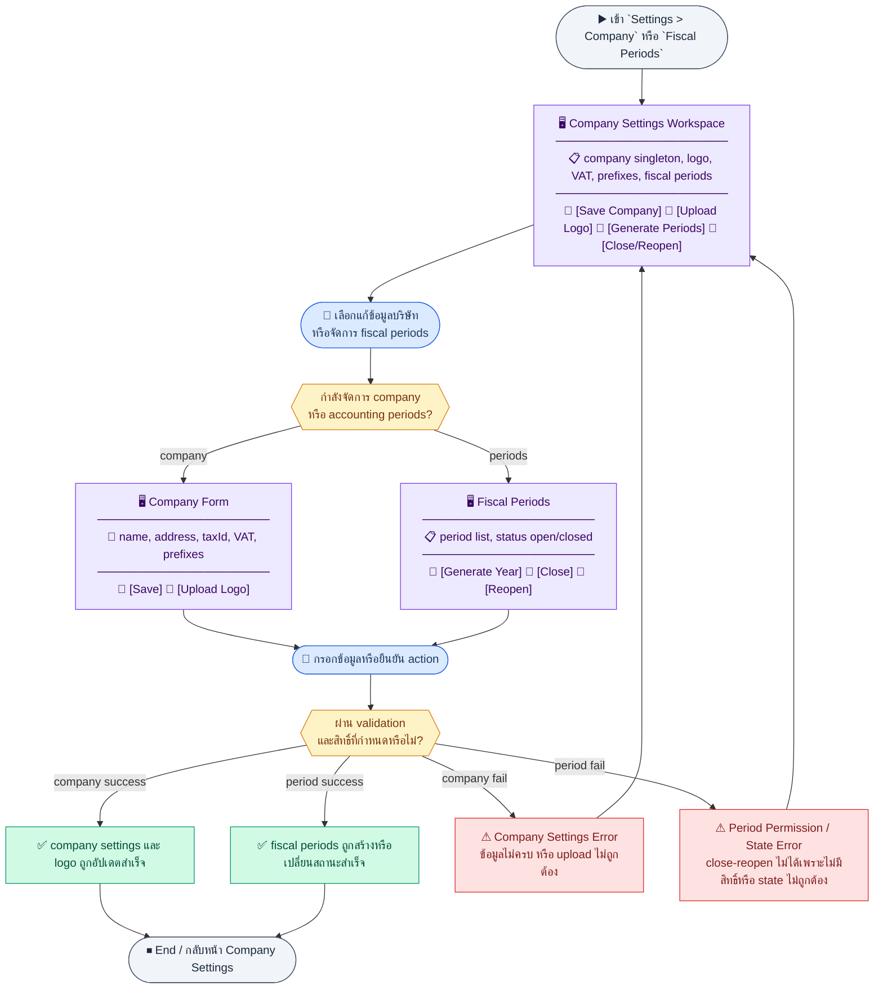
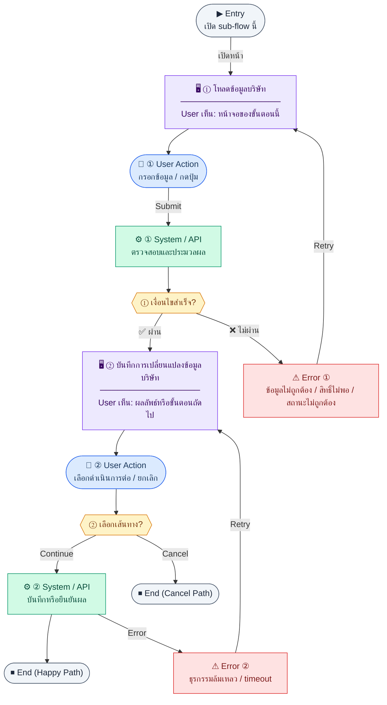
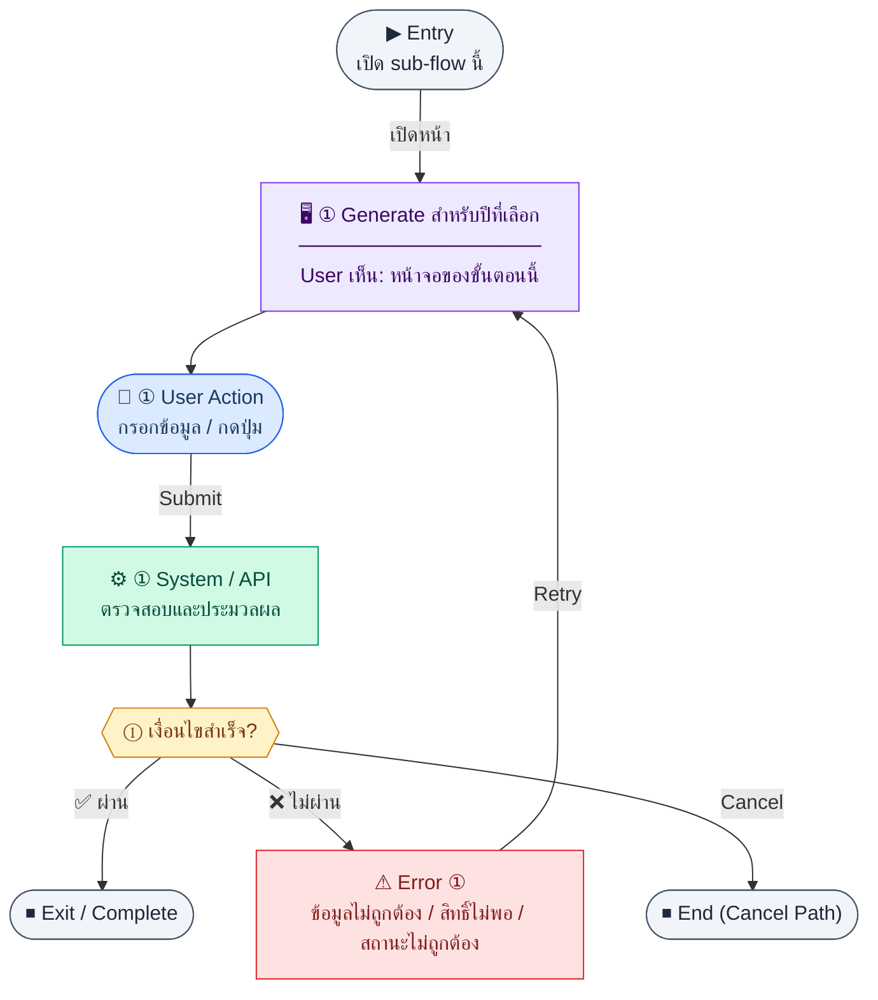
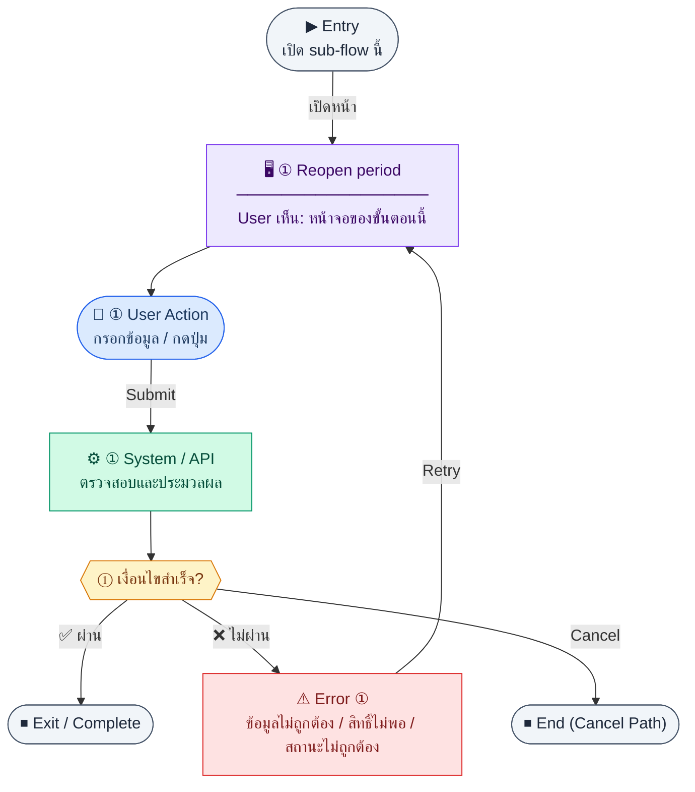

# UX Flow — Settings บริษัทและรอบบัญชี (Company & Fiscal)

ใช้เป็น UX flow สำหรับ Release 2 ส่วน **ข้อมูลบริษัท (singleton)** และ **รอบบัญชี (fiscal periods)** โดยผูกกับ endpoint ชุดเดียวกับ `Documents/SD_Flow/User_Login/settings_admin_r2.md` ในหัวข้อ company + fiscal (ไม่รวม notifications/audit ในไฟล์นี้)

**แหล่งอ้างอิงที่ผูกกับเอกสารนี้**

- Business requirement (BR): `Documents/Requirements/Release_2.md` (Feature 3.8 Company / Organization Settings)
- Traceability: `Documents/Requirements/Release_2_traceability_mermaid.md` (Settings — company & fiscal)
- Sequence / SD_Flow: `Documents/SD_Flow/User_Login/settings_admin_r2.md` (ส่วน `GET/PUT` company, `POST` logo, fiscal-periods)
- Related screens (ตาม BR): `/settings/company`, `/settings/fiscal-periods`

---

## E2E Scenario Flow

> ผู้ดูแลระบบเข้าจัดการข้อมูลบริษัท โลโก้ VAT และ prefix เอกสารจากหน้า singleton settings พร้อมสร้าง เปิด-ปิดรอบบัญชีตามสิทธิ์ เพื่อให้ทุกเอกสารและรายงานของระบบใช้ค่าเดียวกันอย่างสอดคล้อง

### Scenario Summary

| Scenario | ขั้นตอน | ผลลัพธ์ |
|----------|---------|---------|
| ✅ โหลด company settings | เปิด `/settings/company` | เห็นค่าปัจจุบันของบริษัทจาก singleton |
| ✅ แก้ไขข้อมูลบริษัท | ปรับชื่อ/ที่อยู่/tax/VAT/prefix → บันทึก | ค่ากลางของเอกสารทั้งระบบถูกอัปเดต |
| ✅ อัปโหลดโลโก้ | เลือกไฟล์ logo → upload | ได้ `logoUrl` ใหม่สำหรับ print/export |
| ✅ ดู fiscal periods | เปิด `/settings/fiscal-periods` | เห็น period list และสถานะ `open/closed` |
| ✅ generate periods | สั่ง generate ปีบัญชี | ระบบสร้าง period ของปีนั้นให้อัตโนมัติ |
| ✅ close/reopen period | super admin สั่งปิดหรือเปิด period | ระบบบังคับสถานะรอบบัญชีตามนโยบาย |
| ⚠ settings ไม่ผ่าน validation | field ไม่ครบหรือ upload ไม่ถูกต้อง | ระบบแสดง error และไม่บันทึก |
| ⚠ period action ไม่ผ่านสิทธิ์หรือ state | close/reopen โดยผู้ใช้ไม่ถูก role หรือ state ไม่ถูกต้อง | ระบบ block action และแจ้งเหตุผล |

---
## ชื่อ Flow & ขอบเขต

**Flow name:** `Settings — ข้อมูลบริษัท โลโก้ และรอบบัญชี`

**Actor(s):** ผู้ดูแลระบบที่มีสิทธิ์ settings (รายละเอียดตาม RBAC); การ **ปิด/เปิดรอบบัญชี** ตาม BR ต้องเป็น `super_admin`

**Entry:** `/settings/company` หรือ `/settings/fiscal-periods`

**Exit:** บันทึกข้อมูลบริษัท, อัปโหลดโลโก้, หรือจัดการรอบบัญชีสำเร็จ

**Out of scope:** การตั้งค่าแจ้งเตือน (`notification-configs`), audit log viewer, เอกสาร PDF

---

## Endpoint กลุ่มบริษัท (Company)

| Method | Path |
|--------|------|
| `GET` | `/api/settings/company` |
| `PUT` | `/api/settings/company` |
| `POST` | `/api/settings/company/logo` |

---

## Sub-flow A — อ่านและแก้ไขข้อมูลบริษัท (Singleton)

### Scenario Flow

### สัญลักษณ์ Node (Color Legend)

| สี | Node shape | หมายถึง |
|----|-----------|---------|
| 🟣 ม่วง | สี่เหลี่ยม `["…"]` | **Screen / UI State** |
| 🔵 น้ำเงิน | วงกลม `(["…"])` | **User Action** |
| 🟢 เขียว | สี่เหลี่ยม `["…"]` | **System / API** |
| 🟡 เหลือง | เพชร `{{"…"}}` | **Decision** |
| 🔴 แดง | สี่เหลี่ยม `["…"]` | **Error / Edge case** |
| ⚫ เทา | วงรี `(["…"])` | **Start / End** |

---

### Step A1 — โหลดข้อมูลบริษัท

**Goal:** แสดงฟอร์มข้อมูลบริษัทจากแถวเดียว (singleton) โดยไม่ต้องมี id ใน path

**User sees:** ฟิลด์ชื่อ TH/EN, เลขนิติ, ที่อยู่, โทร, อีเมล, เว็บ, สกุลเงิน, `fiscalYearStart`, VAT, prefix เอกสาร (`invoicePrefix`, `poPrefix`, `quotPrefix`, `soPrefix`) ตาม BR

**User can do:** อ่านค่า, เตรียมแก้ไข

**User Action:**
- ประเภท: `กดปุ่ม`
- ปุ่ม / Controls ในหน้านี้:
  - `[Edit Company Settings]` → เข้าโหมดแก้ไข
  - `[Retry]` → โหลดข้อมูลบริษัทใหม่

**Frontend behavior:** `GET /api/settings/company` หลัง bootstrap หน้า

**System / AI behavior:** อ่าน `company_settings` แถวเดียว

**Success:** bind ฟอร์มครบ

**Error:** 404/500 — แสดง error และ retry

**Notes:** BR ระบุ singleton — FE ไม่ควรออกแบบให้ผู้ใช้เลือก "หลายบริษัท" ใน flow นี้

### Step A2 — บันทึกการเปลี่ยนแปลงข้อมูลบริษัท

**Goal:** อัปเดตข้อมูลบริษัทแบบ replace ตาม `PUT`

**User sees:** ปุ่มบันทึก, validation errors, loading

**User can do:** แก้ไขฟิลด์และบันทึก

**User Action:**
- ประเภท: `กรอกข้อมูล / เลือกตัวเลือก`
- ช่องที่ต้องกรอก:
  - `companyName` *(required)* : ชื่อบริษัท
  - `companyNameEn` *(optional)* : ชื่อบริษัทภาษาอังกฤษ
  - `taxId` *(required)* : เลขนิติ/ภาษี
  - `address` *(required)* : ที่อยู่
  - `phone` *(optional)* : เบอร์โทรบริษัท
  - `email` *(optional)* : อีเมลบริษัท
  - `website` *(optional)* : เว็บไซต์บริษัท
  - `logoUrl` *(optional)* : ลิงก์โลโก้
  - `currency` *(required)* : สกุลเงินหลัก
  - `fiscalYearStart` *(required)* : เดือนเริ่มปีบัญชี (1–12)
  - `fiscalYearStartDay` *(required, default 1)* : วันเริ่มต้นในเดือน (1–28) — แสดง hint "จำกัดที่ 28 เพื่อรองรับกุมภาพันธ์"
  - `vatRegistered` *(required)* : สถานะ VAT registration
  - `vatNo` *(optional)* : เลข VAT
  - `defaultVatRate` *(required)* : อัตรา VAT ปริยาย
  - `invoicePrefix` *(required)* : prefix invoice
  - `poPrefix` *(required)* : prefix purchase order
  - `quotPrefix` *(required)* : prefix quotation
  - `soPrefix` *(required)* : prefix sales order
- ปุ่ม / Controls ในหน้านี้:
  - `[Save Company Settings]` → เรียก `PUT /api/settings/company`
  - `[Cancel]` → ยกเลิกการแก้ไข

**Frontend behavior:**

- client validation (รูปแบบเลขผู้เสียภาษี, ช่วง `defaultVatRate`, ฯลฯ)
- `PUT /api/settings/company` body ชุดเต็มตามสัญญา API

**System / AI behavior:** UPDATE singleton; BR ระบุว่าเปลี่ยน `invoicePrefix` ต้องไม่กระทบ running sequence — คาดหวัง validation ฝั่ง BE

**Success:** 200; แสดงข้อความสำเร็จ; refresh header แอปถ้าแสดงชื่อ/โลโก้

**Error:** 400 validation, 409 business rule

**Notes:** การเปลี่ยนข้อมูลมีผลกับ PDF header ทุกโมดูลที่อ้าง `company_settings`

---

## Sub-flow B — อัปโหลดโลโก้บริษัท

### Scenario Flow

### สัญลักษณ์ Node (Color Legend)

| สี | Node shape | หมายถึง |
|----|-----------|---------|
| 🟣 ม่วง | สี่เหลี่ยม `["…"]` | **Screen / UI State** |
| 🔵 น้ำเงิน | วงกลม `(["…"])` | **User Action** |
| 🟢 เขียว | สี่เหลี่ยม `["…"]` | **System / API** |
| 🟡 เหลือง | เพชร `{{"…"}}` | **Decision** |
| 🔴 แดง | สี่เหลี่ยม `["…"]` | **Error / Edge case** |
| ⚫ เทา | วงรี `(["…"])` | **Start / End** |

---

### Step B1 — เลือกไฟล์และอัปโหลด

**Goal:** อัปเดต `logoUrl` ผ่าน object storage ตาม BR

**User sees:** ตัวอย่างโลโก้ปัจจุบัน, ปุ่มเลือกไฟล์, progress bar

**User can do:** เลือกไฟล์ภาพที่ผ่านเกณฑ์ขนาด/ชนิดไฟล์ของระบบ

**User Action:**
- ประเภท: `เลือกไฟล์ / กดปุ่ม`
- ช่องที่ต้องกรอก:
  - `logoFile` *(required)* : ไฟล์ภาพโลโก้
- ปุ่ม / Controls ในหน้านี้:
  - `[Upload Logo]` → เรียก `POST /api/settings/company/logo`
  - `[Cancel]` → ยกเลิกการอัปโหลด

**Frontend behavior:**

- สร้าง `FormData` และ `POST /api/settings/company/logo` เป็น `multipart/form-data` พร้อม `Authorization`
- จำกัดขนาดไฟล์ฝั่ง client ก่อนส่ง

**System / AI behavior:** BR ระบุ resize, เก็บใน object storage, return URL

**Success:** 201/200 ตามสัญญา; อัปเดต preview ด้วย `logoUrl` ใหม่

**Error:** 413 ไฟล์ใหญ่เกิน, 415 ชนิดไม่รองรับ, 401/403

**Notes:** หลังสำเร็จอาจต้อง `GET /api/settings/company` อีกครั้งเพื่อ sync ฟิลด์อื่นที่ BE อัปเดตพร้อมกัน

---

## Endpoint กลุ่มรอบบัญชี (Fiscal periods)

| Method | Path |
|--------|------|
| `GET` | `/api/settings/fiscal-periods` |
| `GET` | `/api/settings/fiscal-periods/current` |
| `POST` | `/api/settings/fiscal-periods/generate` |
| `PATCH` | `/api/settings/fiscal-periods/:id/close` |
| `PATCH` | `/api/settings/fiscal-periods/:id/reopen` |

---

## Sub-flow C — รายการรอบบัญชีและรอบปัจจุบัน

### Scenario Flow

### สัญลักษณ์ Node (Color Legend)

| สี | Node shape | หมายถึง |
|----|-----------|---------|
| 🟣 ม่วง | สี่เหลี่ยม `["…"]` | **Screen / UI State** |
| 🔵 น้ำเงิน | วงกลม `(["…"])` | **User Action** |
| 🟢 เขียว | สี่เหลี่ยม `["…"]` | **System / API** |
| 🟡 เหลือง | เพชร `{{"…"}}` | **Decision** |
| 🔴 แดง | สี่เหลี่ยม `["…"]` | **Error / Edge case** |
| ⚫ เทา | วงรี `(["…"])` | **Start / End** |

---

### Step C1 — แสดงรายการ periods

**Goal:** ให้ผู้ใช้เห็นทุกรอบ (ปี/เดือน/สถานะ open|closed)

**User sees:** ตาราง `/settings/fiscal-periods` คอลัมน์ year, month, startDate, endDate, status, วันที่ปิด

**User can do:** เรียง/กรองปี, เปิด action close/reopen ตามสิทธิ์

**User Action:**
- ประเภท: `เลือกตัวเลือก / กดปุ่ม`
- ช่องที่ใช้กรอง:
  - `year` *(optional)* : กรองตามปีบัญชี
  - `status` *(optional)* : open หรือ closed
  - `dateFrom` *(optional)* : วันเริ่มช่วงที่ต้องการดู
  - `dateTo` *(optional)* : วันสิ้นสุดช่วงที่ต้องการดู
- ปุ่ม / Controls ในหน้านี้:
  - `[Generate Periods]` → ไปฟอร์ม generate
  - `[Close Period]` → เปิด action ปิดรอบ
  - `[Reopen Period]` → เปิด action เปิดรอบ

**Frontend behavior:** `GET /api/settings/fiscal-periods` พร้อม query `year`, `status`, `dateFrom`, `dateTo`, `page`, `limit` ตามสัญญา

**System / AI behavior:** อ่าน `fiscal_periods`

**Success:** ตารางแสดงครบ

**Error:** มาตรฐาน

**Notes:** BR ระบุ `UNIQUE (year, month)`

### Step C2 — แสดงรอบที่เปิดอยู่ (Current open)

**Goal:** เน้นรอบที่ใช้โพสต์รายการบัญชีปัจจุบัน

**User sees:** chip หรือ banner "รอบบัญชีปัจจุบัน"

**User can do:** —

**User Action:**
- ประเภท: `กดปุ่ม`
- ปุ่ม / Controls ในหน้านี้:
  - `[Open Current Period]` → ไฮไลต์แถวรอบบัญชีปัจจุบัน
  - `[Generate Periods]` → ไปสร้างรอบใหม่เมื่อยังไม่มี current open

**Frontend behavior:** `GET /api/settings/fiscal-periods/current` แท็บเดียวกับ list หรือบล็อกด้านบน

**System / AI behavior:** resolve รอบ open ตามกฎบัญชี

**Success:** แสดงรอบ current ชัดเจน

**Error:** 404 ถ้าไม่มีรอบ open — UX ควรชี้ไปที่ generate

**Notes:** BR ระบุว่าปิด period แล้วไม่สามารถ post journal ย้อนหลังได้ — ควรแสดงคำเตือนเมื่อใกล้ปิดรอบ

---

## Sub-flow D — สร้างรอบบัญชีอัตโนมัติ (Generate)

### Scenario Flow

### สัญลักษณ์ Node (Color Legend)

| สี | Node shape | หมายถึง |
|----|-----------|---------|
| 🟣 ม่วง | สี่เหลี่ยม `["…"]` | **Screen / UI State** |
| 🔵 น้ำเงิน | วงกลม `(["…"])` | **User Action** |
| 🟢 เขียว | สี่เหลี่ยม `["…"]` | **System / API** |
| 🟡 เหลือง | เพชร `{{"…"}}` | **Decision** |
| 🔴 แดง | สี่เหลี่ยม `["…"]` | **Error / Edge case** |
| ⚫ เทา | วงรี `(["…"])` | **Start / End** |

---

### Step D1 — Generate สำหรับปีและ granularity ที่เลือก

**Goal:** สร้างชุด `fiscal_periods` สำหรับปีบัญชีที่ระบุ ด้วย granularity ที่ต้องการ พร้อม preview ก่อนยืนยัน

**User sees:**
- dialog 3 ขั้นตอน: (1) กรอกปี + เลือก granularity + กำหนด startMonth → (2) preview ตาราง period ที่จะสร้าง → (3) ผลลัพธ์
- step 2 แสดง badge "สร้างใหม่" (เขียว) / "มีอยู่แล้ว" (เทา) ต่อแถว
- warning banner ถ้า partial, error banner ถ้าครบแล้ว (409)

**User can do:** เลือก granularity และ start month ก่อน preview แล้วค่อยยืนยัน

**User Action:**
- ประเภท: `กรอกข้อมูล / เลือกตัวเลือก / กดปุ่ม`
- ช่องที่ต้องกรอก:
  - `year` *(required)* : ปีที่ต้องการ generate
  - `granularity` *(required, default `1M`)* : รูปแบบรอบบัญชี
    - `1M` — รายเดือน (12 periods)
    - `1Q` — รายไตรมาส (4 periods)
    - `1H` — ครึ่งปี (2 periods)
    - `1Y` — รายปี (1 period)
  - `startMonth` *(optional, default = `fiscalYearStart` จาก company_settings)* : เดือนเริ่มต้นปีบัญชี (1–12) — แสดง hint ว่าค่าปัจจุบันคืออะไร
  - `startDay` *(optional, default = `fiscalYearStartDay` จาก company_settings)* : วันเริ่มต้นในเดือน (1–28) — แสดง hint "วันที่ 1 = เริ่มต้นเดือน (ทั่วไป)"; จำกัด 28
- ปุ่ม / Controls ในหน้านี้:
  - `[ดูตัวอย่าง]` → คำนวณ periods ฝั่ง FE แสดง preview table (ก่อนยิง API)
  - `[สร้างรอบบัญชี]` → เรียก `POST /api/settings/fiscal-periods/generate`
  - `[ยกเลิก]` → ปิด dialog

**Frontend behavior:**
- Preview คำนวณ FE ล้วน (ไม่ต้องยิง API): จาก `year + granularity + startMonth` → แสดงตาราง period พร้อม startDate/endDate
- เมื่อยืนยัน: `POST /api/settings/fiscal-periods/generate` body `{ year, granularity, startMonth? }`

**System / AI behavior:** BE คำนวณ startDate/endDate แต่ละ periodNo จาก startMonth + granularity; INSERT เฉพาะ period ที่ยังไม่มีใน `(year, granularity, periodNo)`

**Success:** 201; refresh `GET /api/settings/fiscal-periods`; แสดง `สร้างใหม่ N รอบ · skip M รอบ`

**Error:** 409 ครบแล้ว (disable ปุ่ม generate ตั้งแต่ step preview), 400 params ผิด

**Notes:**
- แสดง hint ค่า `startMonth` และ `startDay` ปัจจุบันจาก company_settings เพื่อให้ user รู้ว่าถ้าไม่ override จะได้ผลอะไร
- Preview table คำนวณ FE ล้วน: `startDate[p=1]` = วันที่ `startDay` ของ `startMonth`; `endDate[n]` = `startDate[n+1] - 1 day`
- `label` field จาก BE เช่น "Q2 FY2026 (Apr 15 – Jul 14)" สะท้อน startDay ที่เลือก

---

## Sub-flow E — ปิดรอบบัญชี (Close)

### Scenario Flow

### สัญลักษณ์ Node (Color Legend)

| สี | Node shape | หมายถึง |
|----|-----------|---------|
| 🟣 ม่วง | สี่เหลี่ยม `["…"]` | **Screen / UI State** |
| 🔵 น้ำเงิน | วงกลม `(["…"])` | **User Action** |
| 🟢 เขียว | สี่เหลี่ยม `["…"]` | **System / API** |
| 🟡 เหลือง | เพชร `{{"…"}}` | **Decision** |
| 🔴 แดง | สี่เหลี่ยม `["…"]` | **Error / Edge case** |
| ⚫ เทา | วงรี `(["…"])` | **Start / End** |

---

### Step E1 — Close period

**Goal:** ปิดรอบเพื่อหยุดการบันทึกย้อนหลังในรอบนั้น

**User sees:** ปุ่ม close + confirm เน้นผลกระทบต่อการบันทึกบัญชี

**User can do:** ยืนยัน

**User Action:**
- ประเภท: `กรอกข้อมูล / กดปุ่ม`
- ช่องที่ต้องกรอก:
  - `confirmPeriodLabel` *(required, FE confirmation only)* : พิมพ์ปี/เดือนเพื่อยืนยัน
  - `reason` *(optional, API field)* : เหตุผลการปิดรอบ
- ปุ่ม / Controls ในหน้านี้:
  - `[Close Period]` → เรียก `PATCH /api/settings/fiscal-periods/:id/close`
  - `[Cancel]` → ยกเลิก

**Frontend behavior:** `PATCH /api/settings/fiscal-periods/:id/close` โดยส่ง `reason` เมื่อผู้ใช้กรอก; `confirmPeriodLabel` ใช้ตรวจใน FE ก่อนยิง API

**System / AI behavior:** BR กำหนดต้องเป็น `super_admin`; บันทึก `closedAt`, `closedBy`

**Success:** 200; แถวเป็น `closed`

**Error:** 403 ไม่ใช่ super_admin, 409 กฎการปิด (เช่น มีรายการค้าง)

**Notes:** ควรซ่อนปุ่ม close สำหรับผู้ใช้ที่ไม่มีสิทธิ์ตั้งแต่ใน FE

---

## Sub-flow F — เปิดรอบบัญชีใหม่ (Reopen)

### Scenario Flow

### สัญลักษณ์ Node (Color Legend)

| สี | Node shape | หมายถึง |
|----|-----------|---------|
| 🟣 ม่วง | สี่เหลี่ยม `["…"]` | **Screen / UI State** |
| 🔵 น้ำเงิน | วงกลม `(["…"])` | **User Action** |
| 🟢 เขียว | สี่เหลี่ยม `["…"]` | **System / API** |
| 🟡 เหลือง | เพชร `{{"…"}}` | **Decision** |
| 🔴 แดง | สี่เหลี่ยม `["…"]` | **Error / Edge case** |
| ⚫ เทา | วงรี `(["…"])` | **Start / End** |

---

### Step F1 — Reopen period

**Goal:** เปิดรอบที่ปิดผิดพลาดหรือตามคำสั่ง audit (กรณีพิเศษ)

**User sees:** ปุ่ม reopen + confirm สองชั้น (เพราะมีความเสี่ยงสูง)

**User can do:** ยืนยัน

**User Action:**
- ประเภท: `กรอกข้อมูล / กดปุ่ม`
- ช่องที่ต้องกรอก:
  - `confirmPeriodLabel` *(required, FE confirmation only)* : พิมพ์ปี/เดือนเพื่อยืนยัน reopen
  - `reopenReason` *(optional, API field)* : เหตุผลการเปิดรอบใหม่
- ปุ่ม / Controls ในหน้านี้:
  - `[Reopen Period]` → เรียก `PATCH /api/settings/fiscal-periods/:id/reopen`
  - `[Cancel]` → ยกเลิก

**Frontend behavior:** `PATCH /api/settings/fiscal-periods/:id/reopen`

**System / AI behavior:** BR กำหนดต้องเป็น `super_admin`

**Success:** 200; สถานะกลับเป็น `open`

**Error:** 403, 409

**Notes:** UI ควรส่ง `reopenReason` (optional) เมื่อมีการ reopen เพื่อรองรับ audit trace

---

## Coverage Checklist

| Endpoint | Covered in UX file | Notes |
|----------|-------------------|-------|
| `GET /api/settings/company` | Sub-flow A — อ่านและแก้ไขข้อมูลบริษัท (Singleton) | Step A1 load singleton |
| `PUT /api/settings/company` | Sub-flow A — อ่านและแก้ไขข้อมูลบริษัท (Singleton) | Step A2 full replace |
| `POST /api/settings/company/logo` | Sub-flow B — อัปโหลดโลโก้บริษัท | multipart FormData |
| `GET /api/settings/fiscal-periods` | Sub-flow C — รายการรอบบัญชีและรอบปัจจุบัน | Step C1 list |
| `GET /api/settings/fiscal-periods/current` | Sub-flow C — รายการรอบบัญชีและรอบปัจจุบัน | Step C2 current open |
| `POST /api/settings/fiscal-periods/generate` | Sub-flow D — สร้างรอบบัญชีอัตโนมัติ (Generate) | Year body |
| `PATCH /api/settings/fiscal-periods/:id/close` | Sub-flow E — ปิดรอบบัญชี (Close) | super_admin |
| `PATCH /api/settings/fiscal-periods/:id/reopen` | Sub-flow F — เปิดรอบบัญชีใหม่ (Reopen) | super_admin; high risk |

### Coverage Lock Notes (2026-04-16)
- canonical fields สำหรับ company settings คือ `companyName`, `companyNameEn`, `currency`
- เลิกใช้ alias เดิม (`companyNameTh`, `defaultCurrency`) ใน UX/SD/Checklist
- `reopen` flow ต้องรองรับ `reopenReason` เพื่อผูกกับ audit log
- fiscal-period list semantics ต้องรองรับทั้ง `year` / `status` และ canonical date-range query `dateFrom` / `dateTo`
