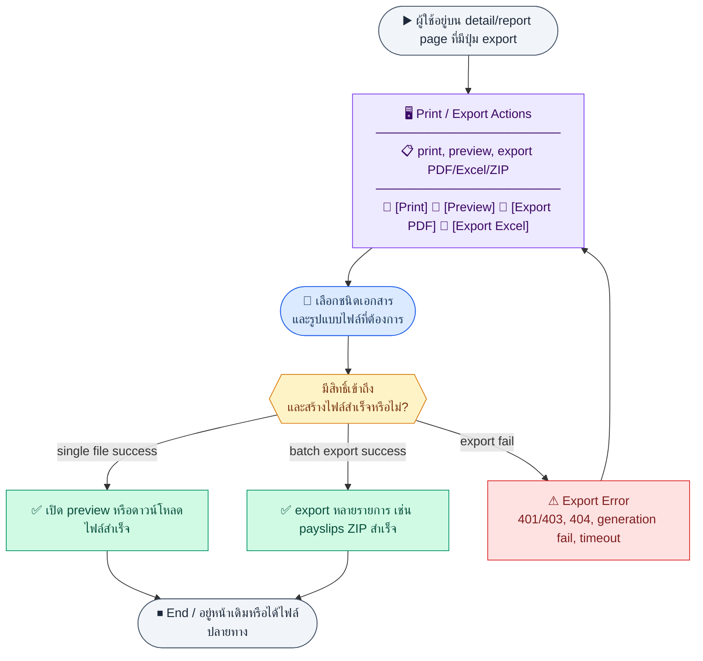
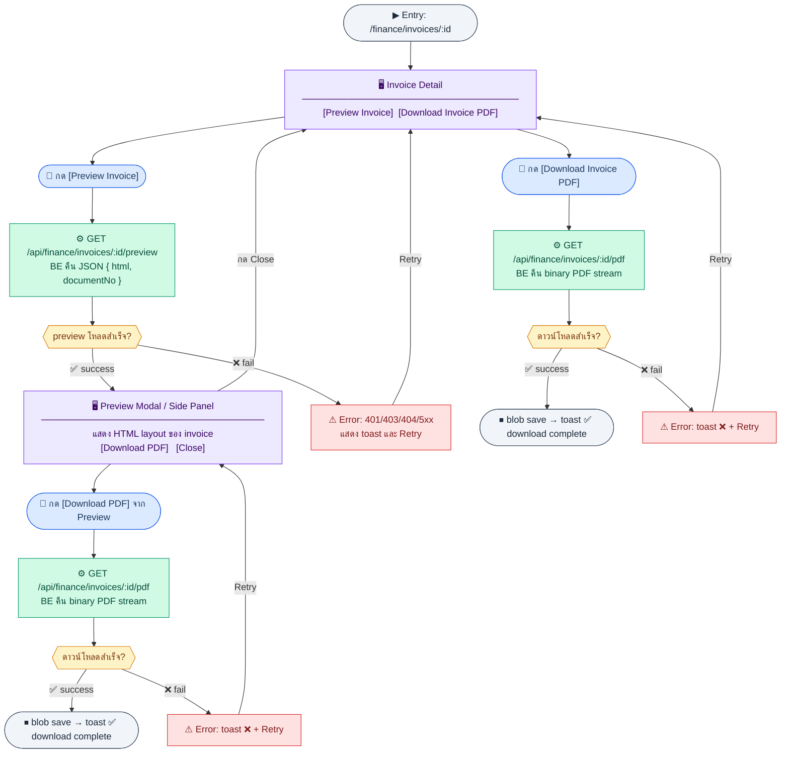
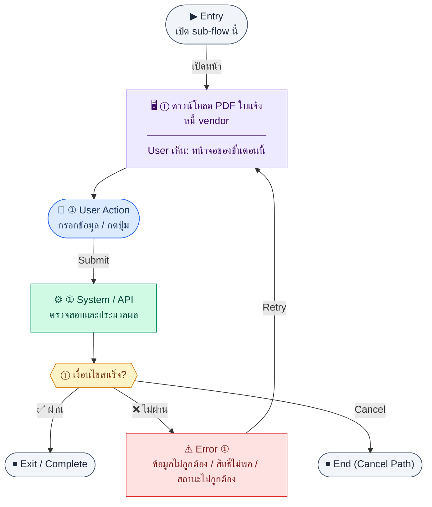
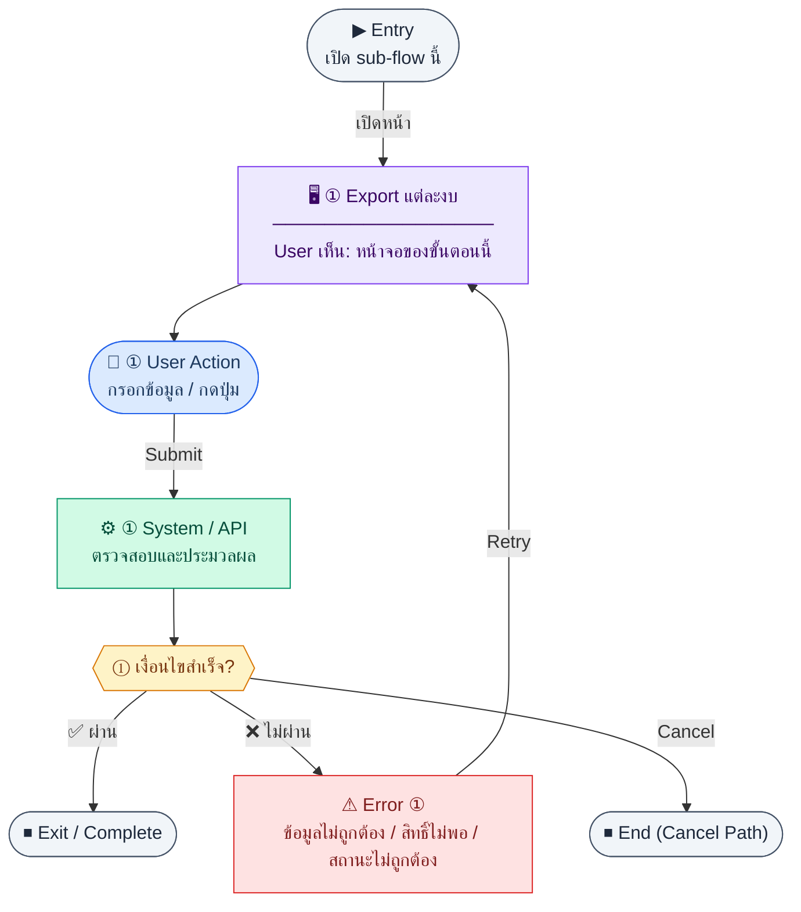
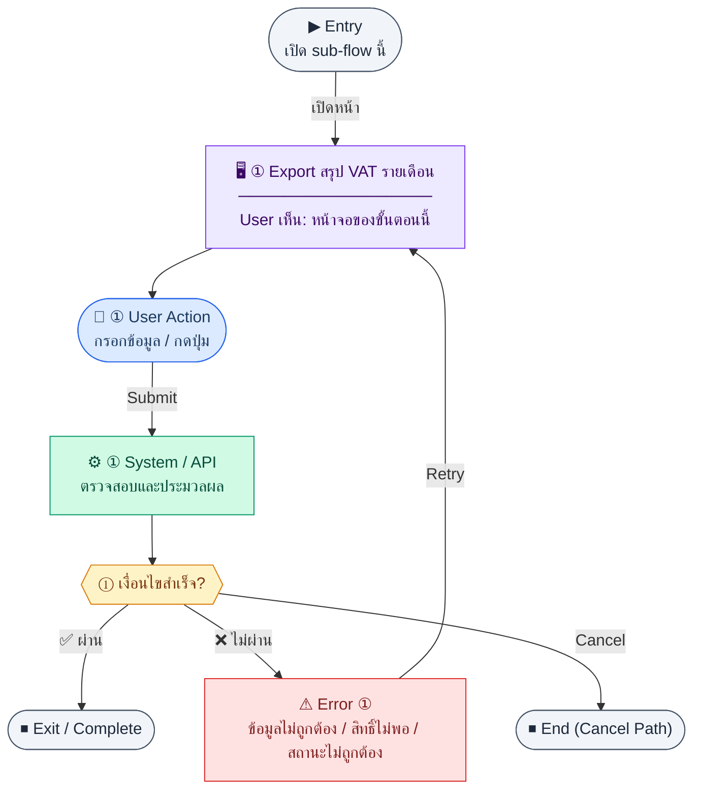
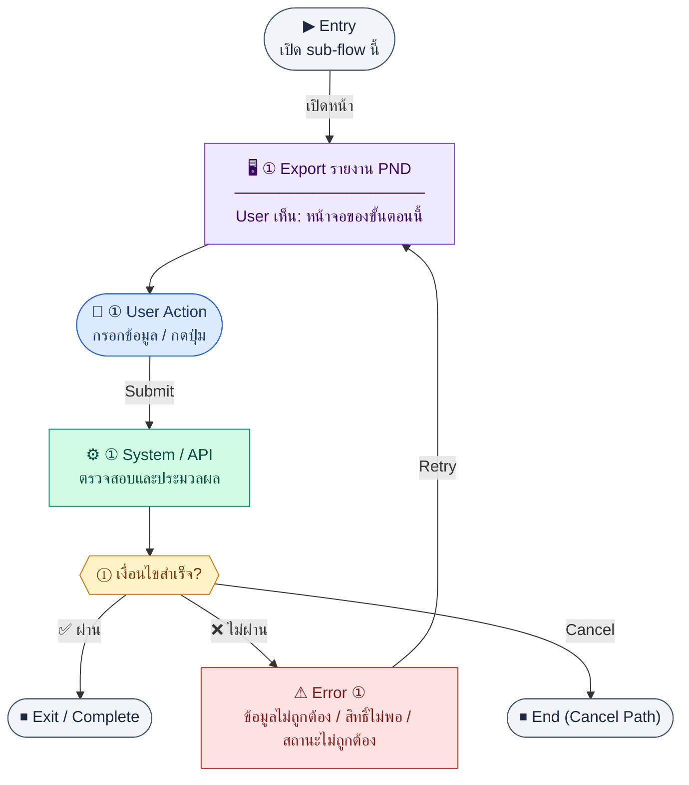
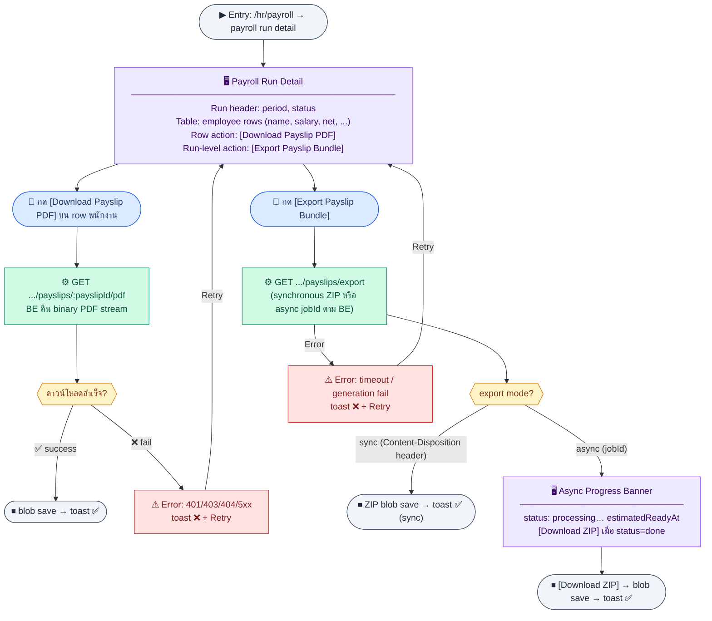

# UX Flow — พิมพ์ / ส่งออกเอกสาร (Document Print & Export)

รวม **endpoint สำคัญสำหรับ PDF และ export** ตาม `Documents/SD_Flow/Finance/document_exports.md` และ payslip ที่เกี่ยวข้องจาก HR API — ใช้เป็นแคตตาล็อก UX สำหรับปุ่มดาวน์โหลดทั่วระบบ

**แหล่งอ้างอิงที่ผูกกับเอกสารนี้**

- Business requirement (BR): `Documents/Requirements/Release_2.md` (export งบ, VAT, PND, เอกสารการเงิน), `Documents/Requirements/Release_1.md` (invoice baseline ถ้าอ้างอิง)
- Traceability: `Documents/Requirements/Release_2_traceability_mermaid.md` (Feature 3.9 — Document Print / Export)
- Sequence / SD_Flow: `Documents/SD_Flow/Finance/document_exports.md`
- บริบทแหล่งข้อมูล: `Documents/SD_Flow/Finance/invoices.md`, `Documents/SD_Flow/Finance/ap.md`, `Documents/SD_Flow/Finance/quotation_sales_orders.md`, `Documents/SD_Flow/Finance/purchase_orders.md`, `Documents/SD_Flow/Finance/tax.md`, `Documents/SD_Flow/Finance/reports.md`

---

## E2E Scenario Flow

> ผู้ใช้ที่มีสิทธิ์จากแต่ละโมดูลกดพิมพ์ ดู preview หรือ export เอกสารทางการและรายงานในรูปแบบไฟล์ โดยระบบดึงข้อมูลต้นทางและ company settings มาสร้าง PDF/Excel/ZIP อย่างปลอดภัยผ่าน token เดียวกัน

### Scenario Summary

| Scenario | ขั้นตอน | ผลลัพธ์ |
|----------|---------|---------|
| ✅ พิมพ์ Invoice | เปิด invoice detail → กด Print PDF หรือ Preview | ได้ PDF หรือ HTML preview ของ invoice |
| ✅ พิมพ์ AP Bill / PO / Quotation | เปิด detail เอกสาร → กดดาวน์โหลด | ได้เอกสารทางการตามต้นทาง |
| ✅ พิมพ์ WHT certificate | เปิดรายการ WHT → เลือก certificate → Print | ได้ PDF ใบรับรองหัก ณ ที่จ่าย |
| ✅ ดาวน์โหลด payslip | เปิด payroll run → เลือก payslip | ได้ PDF รายบุคคล |
| ✅ Export payslips ทั้งชุด | จาก payroll run กด Export All | ได้ ZIP รวม payslips |
| ✅ Export รายงานการเงิน/ภาษี | จากหน้ารายงานกด `pdf/xlsx` | ได้ไฟล์สำหรับนำเสนอหรือยื่นงาน |
| ⚠ เอกสารหรือไฟล์สร้างไม่สำเร็จ | ไม่มีสิทธิ์, เอกสารไม่พบ, หรือ generation fail | ระบบแจ้ง export error และให้ retry |

---
## ชื่อ Flow & ขอบเขต

**Flow name:** `Cross-module — Authorized PDF / Binary Export`

**Actor(s):** ผู้ใช้ที่มีสิทธิ์ตามเอกสารต้นทาง (เช่น finance สำหรับ invoice, HR สำหรับ payslip)

**Entry:** ปุ่ม “ดาวน์โหลด PDF / Export / Preview” บนหน้า detail หรือรายงาน

**Exit:** ได้ไฟล์หรือ preview บนหน้าจอ

**Out of scope:** การออกแบบ template PDF ภายใน; การเก็บไฟล์ใน object storage ฝั่ง BE

---

## หลักการ Frontend ร่วม (ทุก endpoint)

**Goal:** จัดการ response แบบไฟล์อย่างปลอดภัยและสอดคล้อง session

**User sees:** สถานะ loading, ชื่อไฟล์ที่ดาวน์โหลด, toast สำเร็จ/ล้มเหลว

**User can do:** ยกเลิกขณะรอ (ถ้า implement ได้)

**Frontend behavior:**

- ส่ง `Authorization: Bearer <access_token>` ทุกคำขอ
- ถ้า `Content-Type` เป็น `application/pdf` หรือ spreadsheet → ใช้ `blob` + `URL.createObjectURL` หรือเปิดแท็บใหม่ตามนโยบาย security
- ถ้า response เป็น JSON wrapper — ตาม contract จริงของ BE (SD บางจุดใช้ `{ "file": ... }` เป็น documentation placeholder)

**System / AI behavior:** BE สร้างไฟล์จาก DB + company settings; ไม่มี AI

**Success:** HTTP 200 และไฟล์ถูกบันทึก/เปิด

**Error:** 401 → login; 403; 404 ไม่มีเอกสาร; 5xx + retry

**Notes:** ดู pattern การจัดการ token/session ใน `Documents/UX_Flow/Functions/R1-01_Auth_Login_and_Session.md`

---

## Sub-flow A — Invoice AR (PDF + Preview)

**กลุ่ม endpoint:** `GET /api/finance/invoices/:id/pdf`, `GET /api/finance/invoices/:id/preview`

**หน้าที่ใช้:** `/finance/invoices/:id` (Invoice Detail)

**หลักการ:** Preview และ Download เป็น **2 actions อิสระ** บนหน้าเดียวกัน — ไม่ใช่ sequential; user เลือกทำอันใดอันหนึ่งได้เลย

### Scenario Flow

### สัญลักษณ์ Node (Color Legend)

| สี | Node shape | หมายถึง |
|----|-----------|---------|
| 🟣 ม่วง | สี่เหลี่ยม `["…"]` | **Screen / UI State** |
| 🔵 น้ำเงิน | วงกลม `(["…"])` | **User Action** |
| 🟢 เขียว | สี่เหลี่ยม `["…"]` | **System / API** |
| 🟡 เหลือง | เพชร `{{"…"}}` | **Decision** |
| 🔴 แดง | สี่เหลี่ยม `["…"]` | **Error / Edge case** |
| ⚫ เทา | วงรี `(["…"])` | **Start / End** |

---

### Step A1 — Download Invoice PDF (inline)

**Goal:** ได้ PDF ส่งลูกค้า — triggered โดยตรงจากปุ่มบน invoice detail

**Frontend behavior:** `GET /api/finance/invoices/:id/pdf` → response เป็น `application/pdf` binary stream → ใช้ `blob + URL.createObjectURL` บันทึกไฟล์

**Notes:** ใช้บนหน้า `/finance/invoices/:id`; ไม่มี jobId — synchronous inline download

**User Action:**
- ประเภท: `กดปุ่ม`
- ปุ่ม / Controls ในหน้านี้:
  - `[Download Invoice PDF]` → เรียก `GET /api/finance/invoices/:id/pdf`
  - `[Retry]` → ลองดาวน์โหลดใหม่เมื่อ error

### Step A2 — Preview Invoice (HTML preview modal)

**Goal:** ดู layout บนหน้าจอก่อนโดยไม่ดาวน์โหลด — ลดรอบสร้าง PDF ซ้ำ

**Frontend behavior:** `GET /api/finance/invoices/:id/preview` → response เป็น JSON `{ data: { html, documentNo } }` → render HTML ใน modal หรือ side panel

**Notes:** Preview เป็น action อิสระจาก Download — user เลือกทำก่อน/หลัง/แทนกันได้; ภายใน preview มีปุ่ม `[Download PDF]` ที่เรียก Step A1 ซ้ำ

**User Action:**
- ประเภท: `กดปุ่ม`
- ปุ่ม / Controls ในหน้านี้:
  - `[Preview Invoice]` → เปิด preview modal
  - `[Download PDF]` (ภายใน modal) → trigger Step A1
  - `[Close Preview]` → ปิด modal กลับหน้า detail

## Sub-flow B — AP / Vendor invoice PDF

**กลุ่ม endpoint:** `GET /api/finance/ap/vendor-invoices/:id/pdf`

### Scenario Flow

### สัญลักษณ์ Node (Color Legend)

| สี | Node shape | หมายถึง |
|----|-----------|---------|
| 🟣 ม่วง | สี่เหลี่ยม `["…"]` | **Screen / UI State** |
| 🔵 น้ำเงิน | วงกลม `(["…"])` | **User Action** |
| 🟢 เขียว | สี่เหลี่ยม `["…"]` | **System / API** |
| 🟡 เหลือง | เพชร `{{"…"}}` | **Decision** |
| 🔴 แดง | สี่เหลี่ยม `["…"]` | **Error / Edge case** |
| ⚫ เทา | วงรี `(["…"])` | **Start / End** |

---

### Step B1 — ดาวน์โหลด PDF ใบแจ้งหนี้ vendor

**Goal:** เก็บสำเนาใบแจ้งหนี้คู่ค้า

**Frontend behavior:** `GET /api/finance/ap/vendor-invoices/:id/pdf`

**Notes:** เชื่อมกับ `Documents/SD_Flow/Finance/ap.md` และ PO เมื่อบิลผูก `poId`

---

**User Action:**
- ประเภท: `กดปุ่ม`
- ปุ่ม / Controls ในหน้านี้:
  - `[Download Vendor Invoice PDF]` → ดาวน์โหลดใบแจ้งหนี้ vendor
  - `[Retry]` → ลองใหม่

## Sub-flow C — Quotation PDF

**กลุ่ม endpoint:** `GET /api/finance/quotations/:id/pdf`

### Scenario Flow

### สัญลักษณ์ Node (Color Legend)

| สี | Node shape | หมายถึง |
|----|-----------|---------|
| 🟣 ม่วง | สี่เหลี่ยม `["…"]` | **Screen / UI State** |
| 🔵 น้ำเงิน | วงกลม `(["…"])` | **User Action** |
| 🟢 เขียว | สี่เหลี่ยม `["…"]` | **System / API** |
| 🟡 เหลือง | เพชร `{{"…"}}` | **Decision** |
| 🔴 แดง | สี่เหลี่ยม `["…"]` | **Error / Edge case** |
| ⚫ เทา | วงรี `(["…"])` | **Start / End** |

---

### Step C1 — ดาวน์โหลดใบเสนอราคา

**Goal:** ส่งให้ลูกค้าเป็น PDF

**Frontend behavior:** `GET /api/finance/quotations/:id/pdf`

**Notes:** คู่กับ flow ใน `R2-11_Sales_Order_Quotation.md`

---

**User Action:**
- ประเภท: `กดปุ่ม`
- ปุ่ม / Controls ในหน้านี้:
  - `[Download Quotation PDF]` → ดาวน์โหลดใบเสนอราคา
  - `[Retry]` → ลองใหม่

## Sub-flow D — Purchase Order PDF

**กลุ่ม endpoint:** `GET /api/finance/purchase-orders/:id/pdf`

### Scenario Flow

### สัญลักษณ์ Node (Color Legend)

| สี | Node shape | หมายถึง |
|----|-----------|---------|
| 🟣 ม่วง | สี่เหลี่ยม `["…"]` | **Screen / UI State** |
| 🔵 น้ำเงิน | วงกลม `(["…"])` | **User Action** |
| 🟢 เขียว | สี่เหลี่ยม `["…"]` | **System / API** |
| 🟡 เหลือง | เพชร `{{"…"}}` | **Decision** |
| 🔴 แดง | สี่เหลี่ยม `["…"]` | **Error / Edge case** |
| ⚫ เทา | วงรี `(["…"])` | **Start / End** |

---

### Step D1 — ดาวน์โหลด PO

**Goal:** ส่ง vendor ยืนยันการสั่งซื้อ

**Frontend behavior:** `GET /api/finance/purchase-orders/:id/pdf`

**Notes:** คู่กับ `R2-06_Purchase_Order.md`

---

**User Action:**
- ประเภท: `กดปุ่ม`
- ปุ่ม / Controls ในหน้านี้:
  - `[Download PO PDF]` → ดาวน์โหลดเอกสาร PO
  - `[Retry]` → ลองใหม่

## Sub-flow E — WHT certificate PDF

**กลุ่ม endpoint:** `GET /api/finance/tax/wht-certificates/:id/pdf`

### Scenario Flow

### สัญลักษณ์ Node (Color Legend)

| สี | Node shape | หมายถึง |
|----|-----------|---------|
| 🟣 ม่วง | สี่เหลี่ยม `["…"]` | **Screen / UI State** |
| 🔵 น้ำเงิน | วงกลม `(["…"])` | **User Action** |
| 🟢 เขียว | สี่เหลี่ยม `["…"]` | **System / API** |
| 🟡 เหลือง | เพชร `{{"…"}}` | **Decision** |
| 🔴 แดง | สี่เหลี่ยม `["…"]` | **Error / Edge case** |
| ⚫ เทา | วงรี `(["…"])` | **Start / End** |

---

### Step E1 — ดาวน์โหลดใบหัก ณ ที่จ่าย

**Goal:** หลักฐานการหักภาษี

**Frontend behavior:** `GET /api/finance/tax/wht-certificates/:id/pdf`

**Notes:** คู่กับ `R2-03_Thai_Tax_VAT_WHT.md`

---

**User Action:**
- ประเภท: `กดปุ่ม`
- ปุ่ม / Controls ในหน้านี้:
  - `[Download WHT Certificate]` → ดาวน์โหลดใบหัก ณ ที่จ่าย
  - `[Retry]` → ลองใหม่

## Sub-flow F — งบการเงิน: Export P&L / Balance Sheet / Cash Flow

**กลุ่ม endpoint:** `GET /api/finance/reports/profit-loss/export`, `GET /api/finance/reports/balance-sheet/export`, `GET /api/finance/reports/cash-flow/export`

### Scenario Flow

### สัญลักษณ์ Node (Color Legend)

| สี | Node shape | หมายถึง |
|----|-----------|---------|
| 🟣 ม่วง | สี่เหลี่ยม `["…"]` | **Screen / UI State** |
| 🔵 น้ำเงิน | วงกลม `(["…"])` | **User Action** |
| 🟢 เขียว | สี่เหลี่ยม `["…"]` | **System / API** |
| 🟡 เหลือง | เพชร `{{"…"}}` | **Decision** |
| 🔴 แดง | สี่เหลี่ยม `["…"]` | **Error / Edge case** |
| ⚫ เทา | วงรี `(["…"])` | **Start / End** |

---

### Step F1 — Export แต่ละงบ

**Goal:** ดาวน์โหลดไฟล์ตามช่วงวันที่เดียวกับหน้าจอ

**Frontend behavior:**

- P&L: `GET /api/finance/reports/profit-loss/export?...&format=`
- Balance sheet: `GET /api/finance/reports/balance-sheet/export?...&format=`
- Cash flow: `GET /api/finance/reports/cash-flow/export?...&format=`

**Notes:** พารามิเตอร์ `format` (pdf/xlsx) ตาม BR §3.4; รายละเอียด UX บนหน้าจอดู `R2-04_Financial_Statements.md`

---

**User Action:**
- ประเภท: `เลือกตัวเลือก / กดปุ่ม`
- ช่องที่ต้องกรอก:
  - `statementType` *(required)* : profit-loss, balance-sheet, cash-flow
  - `format` *(required)* : pdf หรือ xlsx
  - `periodFrom` / `periodTo` หรือ `asOfDate` *(required ตามประเภทรายงาน)* : ช่วงรายงาน
- ปุ่ม / Controls ในหน้านี้:
  - `[Export Statement]` → เรียก export ตาม statement ที่เลือก
  - `[Cancel]` → ปิด dialog

## Sub-flow G — VAT summary export

**กลุ่ม endpoint:** `GET /api/finance/tax/vat-summary/export`

### Scenario Flow

### สัญลักษณ์ Node (Color Legend)

| สี | Node shape | หมายถึง |
|----|-----------|---------|
| 🟣 ม่วง | สี่เหลี่ยม `["…"]` | **Screen / UI State** |
| 🔵 น้ำเงิน | วงกลม `(["…"])` | **User Action** |
| 🟢 เขียว | สี่เหลี่ยม `["…"]` | **System / API** |
| 🟡 เหลือง | เพชร `{{"…"}}` | **Decision** |
| 🔴 แดง | สี่เหลี่ยม `["…"]` | **Error / Edge case** |
| ⚫ เทา | วงรี `(["…"])` | **Start / End** |

---

### Step G1 — Export สรุป VAT รายเดือน

**Goal:** ส่งออกข้อมูล PP.30

**Frontend behavior:** `GET /api/finance/tax/vat-summary/export?month=&year=&format=`

**Notes:** คู่กับ `R2-03_Thai_Tax_VAT_WHT.md`

---

**User Action:**
- ประเภท: `เลือกตัวเลือก / กดปุ่ม`
- ช่องที่ต้องกรอก:
  - `month` *(required)* : เดือนภาษี
  - `year` *(required)* : ปีภาษี
  - `format` *(required)* : pdf หรือ xlsx
- ปุ่ม / Controls ในหน้านี้:
  - `[Export VAT Summary]` → เรียก `GET /api/finance/tax/vat-summary/export`
  - `[Cancel]` → ยกเลิก

## Sub-flow H — PND report export

**กลุ่ม endpoint:** `GET /api/finance/tax/pnd-report/export`

### Scenario Flow

### สัญลักษณ์ Node (Color Legend)

| สี | Node shape | หมายถึง |
|----|-----------|---------|
| 🟣 ม่วง | สี่เหลี่ยม `["…"]` | **Screen / UI State** |
| 🔵 น้ำเงิน | วงกลม `(["…"])` | **User Action** |
| 🟢 เขียว | สี่เหลี่ยม `["…"]` | **System / API** |
| 🟡 เหลือง | เพชร `{{"…"}}` | **Decision** |
| 🔴 แดง | สี่เหลี่ยม `["…"]` | **Error / Edge case** |
| ⚫ เทา | วงรี `(["…"])` | **Start / End** |

---

### Step H1 — Export รายงาน PND

**Goal:** ได้ไฟล์ PDF/XLSX สำหรับการยื่น/เก็บถาวร

**Frontend behavior:** `GET /api/finance/tax/pnd-report/export?form=&month=&year=&format=`

**Notes:** คู่กับหน้า `/finance/tax/wht`

---

**User Action:**
- ประเภท: `เลือกตัวเลือก / กดปุ่ม`
- ช่องที่ต้องกรอก:
  - `form` *(required)* : แบบ PND
  - `month` *(required)* : เดือนภาษี
  - `year` *(required)* : ปีภาษี
  - `format` *(required)* : pdf หรือ xlsx
- ปุ่ม / Controls ในหน้านี้:
  - `[Export PND Report]` → เรียก `GET /api/finance/tax/pnd-report/export`
  - `[Cancel]` → ยกเลิก

## Sub-flow I — Payslip (HR): PDF รายคน + export ชุด run

**กลุ่ม endpoint:** `GET /api/hr/payroll/runs/:runId/payslips/:payslipId/pdf`, `GET /api/hr/payroll/runs/:runId/payslips/export`

**หน้าที่ใช้:** `/hr/payroll` → payroll run detail (payslip list)

**หลักการ:** Step I1 (รายคน) และ I2 (ทั้ง run) เป็น **2 actions อิสระ** บนหน้าเดียวกัน — I1 อยู่บน table row ของแต่ละพนักงาน; I2 อยู่บน run-level action bar

### Scenario Flow

### สัญลักษณ์ Node (Color Legend)

| สี | Node shape | หมายถึง |
|----|-----------|---------|
| 🟣 ม่วง | สี่เหลี่ยม `["…"]` | **Screen / UI State** |
| 🔵 น้ำเงิน | วงกลม `(["…"])` | **User Action** |
| 🟢 เขียว | สี่เหลี่ยม `["…"]` | **System / API** |
| 🟡 เหลือง | เพชร `{{"…"}}` | **Decision** |
| 🔴 แดง | สี่เหลี่ยม `["…"]` | **Error / Edge case** |
| ⚫ เทา | วงรี `(["…"])` | **Start / End** |

---

### Step I1 — ดาวน์โหลด payslip รายบุคคล (inline)

**Goal:** HR หรือเจ้าของสลิปได้ PDF รายบุคคล

**Frontend behavior:** `GET /api/hr/payroll/runs/:runId/payslips/:payslipId/pdf` → binary PDF stream → blob download; ไม่มี jobId — synchronous inline

**Notes:** ปุ่มอยู่บน **table row** ของแต่ละพนักงานใน payroll run detail; สิทธิ์จำกัดเฉพาะ HR / เจ้าของสลิป (ดู `document_exports.md`)

**User Action:**
- ประเภท: `กดปุ่มใน table row`
- ปุ่ม / Controls ในหน้านี้:
  - `[Download Payslip PDF]` (per row) → เรียก `GET /api/hr/payroll/runs/:runId/payslips/:payslipId/pdf`
  - `[Retry]` → ลองใหม่เมื่อ error

### Step I2 — Export payslips ทั้ง run (bulk)

**Goal:** HR ได้ ZIP รวม payslips ทุกคนใน run เดียวกัน

**Frontend behavior:** `GET /api/hr/payroll/runs/:runId/payslips/export`
- ถ้า BE ตอบ synchronous → blob save ZIP ทันที
- ถ้า BE ตอบ async jobId → poll status → แสดง progress banner → เมื่อ `status=done` แสดงปุ่ม `[Download ZIP]`

**Notes:** ปุ่มอยู่บน **run-level action bar** ไม่ใช่ row; อาจใช้เวลานาน — ต้องแสดง loading/progress state ชัดเจน; ถ้า BE ยังไม่ implement async ให้ใช้ disabled button + spinner ระหว่างรอ

**User Action:**
- ประเภท: `กดปุ่ม (run-level)`
- ปุ่ม / Controls ในหน้านี้:
  - `[Export Payslip Bundle]` → เรียก `GET /api/hr/payroll/runs/:runId/payslips/export`
  - `[Download ZIP]` (แสดงเมื่อ async job เสร็จ)
  - `[Cancel]` → ยกเลิก / ปิด progress banner

---

## Coverage Checklist

| Endpoint | Covered in UX file | Notes |
| --- | --- | --- |
| `GET /api/finance/invoices/:id/pdf` | Sub-flow A — Invoice AR (PDF + Preview) | Step A1; authorized blob download. |
| `GET /api/finance/invoices/:id/preview` | Sub-flow A — Invoice AR (PDF + Preview) | Step A2; on-screen preview. |
| `GET /api/finance/ap/vendor-invoices/:id/pdf` | Sub-flow B — AP / Vendor invoice PDF | Step B1; PO-linked bills context (`ap.md`). |
| `GET /api/finance/quotations/:id/pdf` | Sub-flow C — Quotation PDF | Step C1; pairs `R2-11_Sales_Order_Quotation.md`. |
| `GET /api/finance/purchase-orders/:id/pdf` | Sub-flow D — Purchase Order PDF | Step D1; pairs `R2-06_Purchase_Order.md`. |
| `GET /api/finance/tax/wht-certificates/:id/pdf` | Sub-flow E — WHT certificate PDF | Step E1; pairs `R2-03_Thai_Tax_VAT_WHT.md`. |
| `GET /api/finance/reports/profit-loss/export` | Sub-flow F — งบการเงิน: Export P&L / Balance Sheet / Cash Flow | Step F1; `format` query; pairs `R2-04`. |
| `GET /api/finance/reports/balance-sheet/export` | Sub-flow F — งบการเงิน: Export P&L / Balance Sheet / Cash Flow | Step F1. |
| `GET /api/finance/reports/cash-flow/export` | Sub-flow F — งบการเงิน: Export P&L / Balance Sheet / Cash Flow | Step F1. |
| `GET /api/finance/tax/vat-summary/export` | Sub-flow G — VAT summary export | Step G1; pairs `R2-03`. |
| `GET /api/finance/tax/pnd-report/export` | Sub-flow H — PND report export | Step H1; pairs `R2-03`. |
| `GET /api/hr/payroll/runs/:runId/payslips/:payslipId/pdf` | Sub-flow I — Payslip (HR): PDF รายคน + export ชุด run | Step I1; HR-scoped auth. |
| `GET /api/hr/payroll/runs/:runId/payslips/export` | Sub-flow I — Payslip (HR): PDF รายคน + export ชุด run | Step I2; bulk export / async if BE supports. |

**User Action:**
- ประเภท: `กดปุ่ม`
- ปุ่ม / Controls ในหน้านี้:
  - `[Export Payslip Bundle]` → เรียก `GET /api/hr/payroll/runs/:runId/payslips/export`
  - `[Retry]` → ลองใหม่เมื่อ export ล้มเหลว
  - `[Cancel]` → ยกเลิก

## Coverage Lock Notes (2026-04-16)

### In-scope endpoints
- invoice/ap/quotation/po pdf endpoints
- report export endpoints
- payslip export endpoints

### UX lock
- ต้องแยกให้ชัดว่า endpoint ไหนเป็น inline download และ endpoint ไหนเป็น async export job
- ถ้าเป็น async export UI ต้องรองรับสถานะ `jobId`, `status`, `estimatedReadyAt`, `downloadUrl`, `expiresAt`
- support matrix ขั้นต่ำของเอกสารนี้คือ:
  - inline PDF: invoice, AP bill, quotation, purchase order, WHT certificate, payslip รายคน
  - format export (`pdf`/`xlsx`): P&L, balance sheet, cash flow, VAT summary, PND report
  - async-capable export: flows ที่ SD ระบุ `jobId` / polling contract
- ถ้า endpoint เป็น synchronous inline download ต้องสื่อชัดว่าไม่มี `jobId`; ถ้าเป็น async job ต้องไม่สร้าง fake download state ก่อน poll ได้ `downloadUrl`

