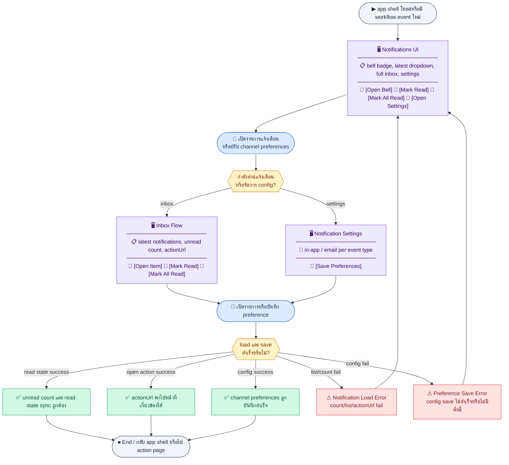
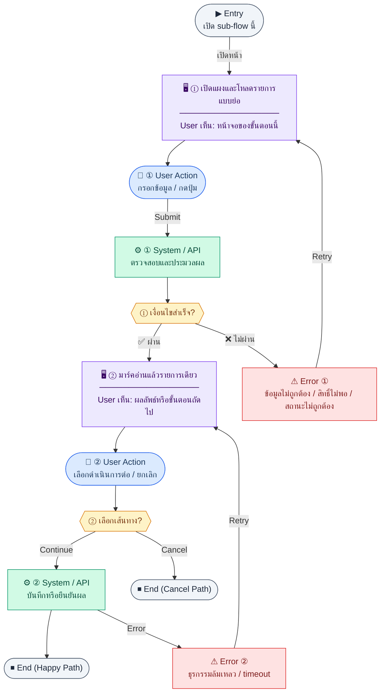
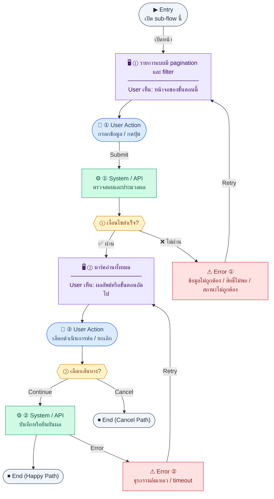
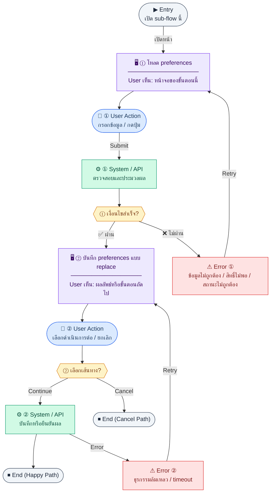
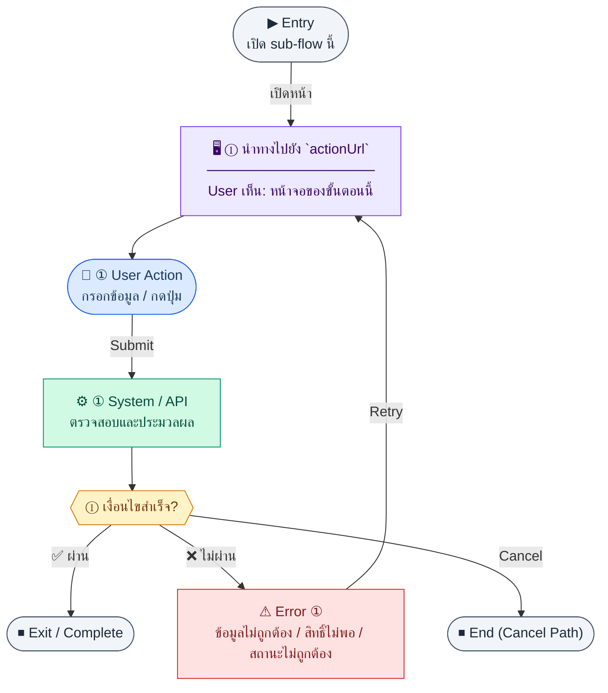

# UX Flow — การแจ้งเตือนและ Workflow Alerts

ใช้เป็น UX flow สำหรับ **กระดิ่งแจ้งเตือนใน header**, หน้ารายการแจ้งเตือนเต็ม, และ **หน้าตั้งค่าช่องทางแจ้งเตือน** ใน Release 2 โดยผูกกับ endpoint จาก `Documents/SD_Flow/User_Login/settings_admin_r2.md` และ BR Feature 3.10

**แหล่งอ้างอิงที่ผูกกับเอกสารนี้**

- Business requirement (BR): `Documents/Requirements/Release_2.md` (Feature 3.10 Notification / Workflow Alerts)
- Traceability: `Documents/Requirements/Release_2_traceability_mermaid.md` (notifications)
- Sequence / SD_Flow: `Documents/SD_Flow/User_Login/settings_admin_r2.md` (ส่วน notifications + notification-configs)
- Related screens (ตาม BR): `Header` (dropdown), `/notifications`, `/settings/notifications`

---

## E2E Scenario Flow

> ผู้ใช้ทุกคนรับการแจ้งเตือนจาก workflow สำคัญผ่าน bell, inbox และหน้าตั้งค่าช่องทาง โดยสามารถติดตาม unread count, เปิดรายการล่าสุด, mark read/mark all read และกำหนดว่าจะรับ in-app หรือ email ต่อ event type ใดบ้าง

### Scenario Summary

| Scenario | ขั้นตอน | ผลลัพธ์ |
|----------|---------|---------|
| ✅ ดู unread badge | โหลด app shell | bell แสดงจำนวนแจ้งเตือนที่ยังไม่อ่าน |
| ✅ เปิด dropdown ล่าสุด | กด bell | เห็น 5 รายการล่าสุดและลิงก์ไปหน้าเต็ม |
| ✅ อ่านรายการทีละรายการ | เปิด notification แล้วกดรายการ | item ถูก mark read และพาไป `actionUrl` |
| ✅ mark all read | กดคำสั่งใน dropdown หรือหน้า list | unread count กลับถูกต้อง |
| ✅ ดู inbox ทั้งหมด | เข้า `/notifications` | เห็นรายการ paginated และ filter unread-only |
| ✅ ตั้งค่า channel | เข้า `/settings/notifications` → toggle in-app/email | preference ต่อ event type ถูกบันทึก |
| ✅ รับ workflow alert | ระบบ trigger จาก leave/payroll/AP/PO/overdue/absent | ผู้ใช้ที่เกี่ยวข้องได้รับแจ้งตามสิทธิ์และ config |
| ⚠ count/list/config โหลดหรือบันทึกไม่สำเร็จ | network, permission, หรือ actionUrl fail | ระบบแจ้ง error และให้ retry |

---
## ชื่อ Flow & ขอบเขต

**Flow name:** `Notifications — อ่าน ทำเครื่องหมายอ่านแล้ว และตั้งค่า channel`

**Actor(s):** ผู้ใช้ที่ login ทุกคน (รับแจ้งเตือนของตนเอง); การแก้ **notification-configs** เป็นของ user ปัจจุบัน

**Entry:** กดกระดิ่งใน app shell, หรือเข้า `/notifications`, หรือ `/settings/notifications`

**Exit:** ผู้ใช้อ่าน/มาร์คอ่านแล้วได้, badge unread ถูกต้อง, หรือบันทึกการตั้งค่า channel สำเร็จ

**Out of scope:** รายละเอียดการ implement queue อีเมล (SMTP/SendGrid), โค้ด cron ภายใน BE

---

## Endpoint กลุ่มรับและอ่านแจ้งเตือน (Inbox)

| Method | Path |
|--------|------|
| `GET` | `/api/notifications` |
| `GET` | `/api/notifications/unread-count` |
| `PATCH` | `/api/notifications/:id/read` |
| `POST` | `/api/notifications/mark-all-read` |

---

## Sub-flow A — Badge จำนวนยังไม่อ่าน (Header)

### Scenario Flow

### สัญลักษณ์ Node (Color Legend)

| สี | Node shape | หมายถึง |
|----|-----------|---------|
| 🟣 ม่วง | สี่เหลี่ยม `["…"]` | **Screen / UI State** |
| 🔵 น้ำเงิน | วงกลม `(["…"])` | **User Action** |
| 🟢 เขียว | สี่เหลี่ยม `["…"]` | **System / API** |
| 🟡 เหลือง | เพชร `{{"…"}}` | **Decision** |
| 🔴 แดง | สี่เหลี่ยม `["…"]` | **Error / Edge case** |
| ⚫ เทา | วงรี `(["…"])` | **Start / End** |

---

### Step A1 — โหลด unread count

**Goal:** แสดงตัวเลขบนกระดิ่งให้ตรงกับจำนวนแจ้งเตือนที่ยังไม่อ่าน

**User sees:** bell icon + badge (ซ่อนเมื่อ 0)

**User can do:** —

**User Action:**
- ประเภท: `กดปุ่ม`
- ปุ่ม / Controls ในหน้านี้:
  - `[Open Notifications]` → เปิด dropdown หรือหน้ารายการเต็ม
  - `[Retry]` → โหลด unread count ใหม่

**Frontend behavior:**

- เรียก `GET /api/notifications/unread-count` ตอนโหลด app shell และหลัง events สำคัญ (รับแจ้งเตือนใหม่, mark read, websocket ถ้ามี)
- debounce/poll interval ตามนโยบายผลิตภัณฑ์

**System / AI behavior:** นับแถว `notifications` ที่ `isRead=false` ของ `userId` ปัจจุบัน

**Success:** badge ตรงกับข้อมูลจริง

**Error:** ถ้า fail เงียบ ๆ อาจซ่อน badge พร้อมไอคอน warning เล็กน้อย — หลีกเลี่ยงการค้างตัวเลขผิด

**Notes:** BR ระบุว่า bell แสดง unread count

---

## Sub-flow B — แผงดรอปดาวน์ (ล่าสุด 5 รายการ)

### Scenario Flow

### สัญลักษณ์ Node (Color Legend)

| สี | Node shape | หมายถึง |
|----|-----------|---------|
| 🟣 ม่วง | สี่เหลี่ยม `["…"]` | **Screen / UI State** |
| 🔵 น้ำเงิน | วงกลม `(["…"])` | **User Action** |
| 🟢 เขียว | สี่เหลี่ยม `["…"]` | **System / API** |
| 🟡 เหลือง | เพชร `{{"…"}}` | **Decision** |
| 🔴 แดง | สี่เหลี่ยม `["…"]` | **Error / Edge case** |
| ⚫ เทา | วงรี `(["…"])` | **Start / End** |

---

### Step B1 — เปิดแผงและโหลดรายการแบบย่อ

**Goal:** ให้ผู้ใช้เห็นแจ้งเตือนล่าสุดโดยไม่ต้องออกจากหน้าปัจจุบัน

**User sees:** รายการ 5 รายการล่าสุด, สถานะอ่าน/ยังไม่อ่าน, ลิงก์ "ดูทั้งหมด"

**User can do:** คลิกรายการเพื่อไป `actionUrl`, มาร์คอ่านเมื่อเปิด (ถ้า product ต้องการ)

**User Action:**
- ประเภท: `กดปุ่ม`
- ปุ่ม / Controls ในหน้านี้:
  - `[Open Notification]` → ไป `actionUrl`
  - `[View All]` → ไป `/notifications`
  - `[Retry]` → โหลดรายการล่าสุดใหม่

**Frontend behavior:**

- `GET /api/notifications` พร้อม `limit=5` และเรียงตาม `createdAt DESC` (ถ้า BE รองรับ)
- optional query `unreadOnly=true` เมื่อโหมด "เฉพาะยังไม่อ่าน"

**System / AI behavior:** ดึงจากตาราง `notifications`

**Success:** แสดงรายการและ deep link

**Error:** แสดงข้อความในแผงเล็ก ๆ

**Notes:** BR ระบุ dropdown: 5 ล่าสุด + "View all"

### Step B2 — มาร์คอ่านแล้วรายการเดียว

**Goal:** ลด badge เมื่อผู้ใช้เปิด/อ่านรายการ

**User sees:** รายการเปลี่ยนเป็นอ่านแล้ว visually

**User can do:** เปิดรายการหรือกด "ทำเครื่องหมายอ่านแล้ว"

**User Action:**
- ประเภท: `กดปุ่ม`
- ปุ่ม / Controls ในหน้านี้:
  - `[Mark as Read]` → เรียก `PATCH /api/notifications/:id/read`
  - `[Open Notification]` → เปิด deep link ของรายการนั้น

**Frontend behavior:** `PATCH /api/notifications/:id/read` (body ตามสัญญา — อาจว่าง `{}`)

**System / AI behavior:** ตั้ง `isRead=true`, `readAt=now`

**Success:** 200; เรียก `unread-count` ซ้ำหรือ optimistic decrement

**Error:** 404 id ไม่พบ, 403

**Notes:** ถ้าเปิด deep link ไปหน้าอื่น อาจมาร์คอ่านหลัง navigation สำเร็จ

---

## Sub-flow C — หน้ารายการเต็ม (`/notifications`)

### Scenario Flow

### สัญลักษณ์ Node (Color Legend)

| สี | Node shape | หมายถึง |
|----|-----------|---------|
| 🟣 ม่วง | สี่เหลี่ยม `["…"]` | **Screen / UI State** |
| 🔵 น้ำเงิน | วงกลม `(["…"])` | **User Action** |
| 🟢 เขียว | สี่เหลี่ยม `["…"]` | **System / API** |
| 🟡 เหลือง | เพชร `{{"…"}}` | **Decision** |
| 🔴 แดง | สี่เหลี่ยม `["…"]` | **Error / Edge case** |
| ⚫ เทา | วงรี `(["…"])` | **Start / End** |

---

### Step C1 — รายการแบบมี pagination และ filter

**Goal:** ดูประวัติแจ้งเตือนทั้งหมดและกรองเฉพาะยังไม่อ่าน

**User sees:** ตาราง/รายการ, ตัวกรอง `unreadOnly`, pagination

**User can do:** เปิดรายการ, มาร์คอ่านทีละรายการ, ใช้ "อ่านทั้งหมด"

**User Action:**
- ประเภท: `กรอกข้อมูล / เลือกตัวเลือก`
- ช่องที่ใช้กรอง:
  - `unreadOnly` *(optional)* : เฉพาะยังไม่อ่าน
  - `eventType` *(optional)* : ประเภท event
  - `dateFrom` / `dateTo` *(optional)* : ช่วงวันที่
- ปุ่ม / Controls ในหน้านี้:
  - `[Apply Filters]` → โหลดรายการเต็ม
  - `[Open Notification]` → ไปหน้าที่เกี่ยวข้อง
  - `[Mark All Read]` → ไปขั้นตอนอ่านทั้งหมด

**Frontend behavior:**

- `GET /api/notifications` พร้อม `unreadOnly`, `eventType`, `dateFrom`, `dateTo`, `page`, `limit` ตาม BR
- ใช้ `PATCH /api/notifications/:id/read` เหมือน sub-flow B

**System / AI behavior:** list + meta

**Success:** ผู้ใช้ค้นหาเหตุการณ์ workflow ย้อนหลังได้

**Error:** มาตรฐาน

**Notes:** แสดง `eventType`, `title`, `message`, `entityType`/`entityId` สำหรับ debug ของผู้ใช้ power

### Step C2 — มาร์คอ่านทั้งหมด

**Goal:** เคลียร์ inbox อย่างรวดเร็ว

**User sees:** ปุ่ม "อ่านทั้งหมด" + confirm (optional)

**User can do:** ยืนยัน

**User Action:**
- ประเภท: `กดปุ่ม`
- ปุ่ม / Controls ในหน้านี้:
  - `[Confirm Mark All Read]` → เรียก `POST /api/notifications/mark-all-read`
  - `[Cancel]` → ยกเลิก

**Frontend behavior:** `POST /api/notifications/mark-all-read`

**System / AI behavior:** อัปเดตทุกแถวของ user ปัจจุบัน

**Success:** 201/200 ตามสัญญา; badge กลับเป็น 0; refresh list

**Error:** 403/500

**Notes:** ปุ่มควร disabled ขณะรอและเมื่อ unread เป็น 0 อยู่แล้ว

---

## Endpoint กลุ่มตั้งค่า (Notification configs)

| Method | Path |
|--------|------|
| `GET` | `/api/settings/notification-configs` |
| `PUT` | `/api/settings/notification-configs` |

---

## Sub-flow D — ตั้งค่า channel ตาม event type (`/settings/notifications`)

### Scenario Flow

### สัญลักษณ์ Node (Color Legend)

| สี | Node shape | หมายถึง |
|----|-----------|---------|
| 🟣 ม่วง | สี่เหลี่ยม `["…"]` | **Screen / UI State** |
| 🔵 น้ำเงิน | วงกลม `(["…"])` | **User Action** |
| 🟢 เขียว | สี่เหลี่ยม `["…"]` | **System / API** |
| 🟡 เหลือง | เพชร `{{"…"}}` | **Decision** |
| 🔴 แดง | สี่เหลี่ยม `["…"]` | **Error / Edge case** |
| ⚫ เทา | วงรี `(["…"])` | **Start / End** |

---

### Step D1 — โหลด preferences

**Goal:** แสดง toggle in-app / email ต่อ `eventType`

**User sees:** ตาราง event types จาก BR (`LEAVE_SUBMITTED`, `PAYROLL_APPROVAL_REQUIRED`, …) พร้อมสองคอลัมน์ช่องทาง

**User can do:** เปิด/ปิด `channelInApp`, `channelEmail` ต่อแถว

**User Action:**
- ประเภท: `กดปุ่ม / เลือกตัวเลือก`
- ช่องที่ต้องกรอก:
  - `channelInApp` *(optional)* : toggle ต่อ eventType
  - `channelEmail` *(optional)* : toggle ต่อ eventType
- ปุ่ม / Controls ในหน้านี้:
  - `[Save Preferences]` → ไปขั้นตอนบันทึก
  - `[Retry]` → โหลด preferences ใหม่

**Frontend behavior:** `GET /api/settings/notification-configs`

**System / AI behavior:** อ่าน `notification_configs` ของ user ปัจจุบัน

**Success:** bind UI

**Error:** 403/500

**Notes:** ตาราง `notification_configs` มี `UNIQUE (userId, eventType)` ตาม BR

### Step D2 — บันทึก preferences แบบ replace

**Goal:** อัปเดตการตั้งค่าทั้งชุดของ user

**User sees:** ปุ่มบันทึก, loading, toast

**User can do:** แก้หลายแถวแล้วกดบันทึกครั้งเดียว

**User Action:**
- ประเภท: `กดปุ่ม`
- ปุ่ม / Controls ในหน้านี้:
  - `[Save Preferences]` → เรียก `PUT /api/settings/notification-configs`
  - `[Reset Changes]` → คืนค่าจาก server ล่าสุด
  - `[Cancel]` → ยกเลิก

**Frontend behavior:** `PUT /api/settings/notification-configs` body เป็น object ตาม canonical contract:
`{ "configs": [{ "eventType": "...", "channelInApp": true, "channelEmail": false }] }`

**System / AI behavior:** upsert ต่อ eventType หรือ replace ทั้งชุดตาม implementation

**Success:** 200

**Error:** 400 validation `eventType` ไม่รู้จัก

**Notes:** การตั้งค่านี้ไม่สร้างแจ้งเตือนย้อนหลัง — มีผลกับการส่งครั้งถัดไปจาก `NotificationService`

---

## Sub-flow E — Deep link จากแจ้งเตือนไปยังงาน (Cross-page)

### Scenario Flow

### สัญลักษณ์ Node (Color Legend)

| สี | Node shape | หมายถึง |
|----|-----------|---------|
| 🟣 ม่วง | สี่เหลี่ยม `["…"]` | **Screen / UI State** |
| 🔵 น้ำเงิน | วงกลม `(["…"])` | **User Action** |
| 🟢 เขียว | สี่เหลี่ยม `["…"]` | **System / API** |
| 🟡 เหลือง | เพชร `{{"…"}}` | **Decision** |
| 🔴 แดง | สี่เหลี่ยม `["…"]` | **Error / Edge case** |
| ⚫ เทา | วงรี `(["…"])` | **Start / End** |

---

### Step E1 — นำทางไปยัง `actionUrl`

**Goal:** ลดเวลาตามงานจากแจ้งเตือนไปยังหน้าอนุมัติ/รายละเอียด

**User sees:** หน้าเป้าหมาย เช่น `/finance/ap/...`, `/hr/leaves/...`

**User can do:** ดำเนินการ workflow ต่อ

**User Action:**
- ประเภท: `กดปุ่ม`
- ปุ่ม / Controls ในหน้านี้:
  - `[Open Related Record]` → router ไป `actionUrl`
  - `[Mark as Read]` → มาร์คแจ้งเตือนว่าอ่านแล้ว
  - `[Back to Notifications]` → กลับหน้ารายการ

**Frontend behavior:** router ไป `actionUrl` จาก payload; หลังโหลดหน้าเป้าหมายอาจเรียก `PATCH /api/notifications/:id/read`

**System / AI behavior:** หน้าเป้าหมายใช้ API ของโดเมนนั้น (นอก scope ไฟล์นี้)

**Success:** ผู้ใช้อยู่บนหน้าที่เกี่ยวข้องกับเหตุการณ์

**Error:** 404 ถ้า entity ถูกลบ — แสดงข้อความและยังมาร์คอ่านแจ้งเตือนได้

**Notes:** BR ระบุ `actionUrl` ในโมเดล `notifications`

---

## Coverage Checklist

| Endpoint | Covered in UX file | Notes |
|----------|-------------------|-------|
| `GET /api/notifications/unread-count` | Sub-flow A — Badge จำนวนยังไม่อ่าน (Header) | App shell + poll/debounce |
| `GET /api/notifications` | Sub-flow B — แผงดรอปดาวน์ (ล่าสุด 5 รายการ); Sub-flow C — หน้ารายการเต็ม (`/notifications`) | limit=5 vs paginated full list |
| `PATCH /api/notifications/:id/read` | Sub-flow B — แผงดรอปดาวน์; Sub-flow C — หน้ารายการเต็ม; Sub-flow E — Deep link | Per-item read |
| `POST /api/notifications/mark-all-read` | Sub-flow C — หน้ารายการเต็ม (`/notifications`) | Step C2 bulk |
| `GET /api/settings/notification-configs` | Sub-flow D — ตั้งค่า channel ตาม event type (`/settings/notifications`) | Step D1 load prefs |
| `PUT /api/settings/notification-configs` | Sub-flow D — ตั้งค่า channel ตาม event type (`/settings/notifications`) | Step D2 replace batch |

### Coverage Lock Notes (2026-04-16)
- event type catalog ที่ใช้อ้างอิงร่วมกัน:
  - `LEAVE_SUBMITTED`, `LEAVE_APPROVED`, `LEAVE_REJECTED`
- `PAYROLL_APPROVAL_REQUIRED`, `PAYROLL_PAID`
- `AR_PAYMENT_RECEIVED`, `SYSTEM_ALERT`
- `AP_APPROVAL_REQUIRED`, `AP_APPROVED`, `AP_REJECTED`
- list filter ที่ UI ใช้ได้ต้อง trace ได้จาก API query (`unreadOnly`, `eventType`, `page`, `limit`)
- `actionUrl` ถือเป็น required behavior สำหรับ deep-link จาก notification ไปหน้าปลายทาง
- full list / archived list ต้องรองรับ `dateFrom`, `dateTo` และแสดง `archiveBoundaryDate` เมื่อ BE ส่งมาเพื่ออธิบาย retention boundary
- empty-state ต้องแยกระหว่าง `ไม่มี notification เลย`, `ไม่มี unread`, และ `ผลลัพธ์ในช่วงวันที่ที่กรองว่าง` ไม่ใช้ข้อความเดียวทับทั้งหมด
- archived/read states ต้องใช้ `isRead` + query context จาก API จริง ไม่ infer จากตำแหน่งใน list เอง
