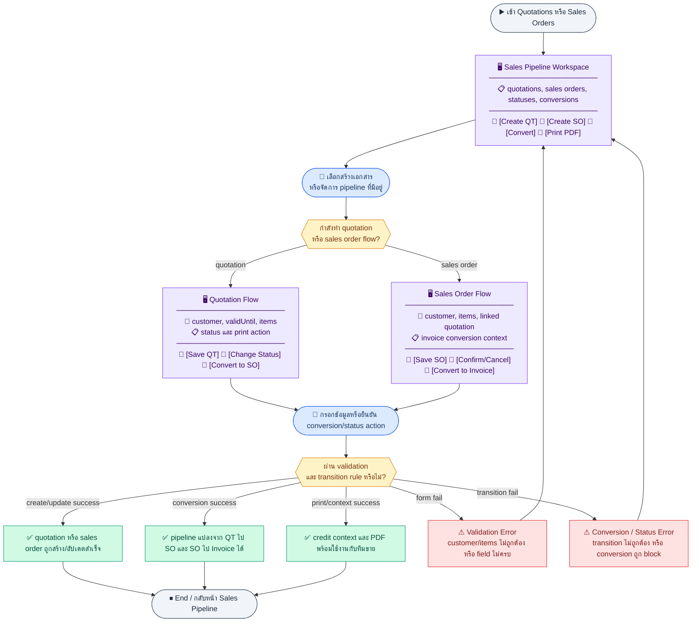

# UX Flow — ใบเสนอราคา (Quotation) และใบสั่งขาย (Sales Order)

ครอบคลุม pipeline **Quotation: list/create/detail/update/status/convert/pdf** และ **Sales Order: list/create/detail/status/convert to invoice** ตาม `quotation_sales_orders.md` และการเชื่อมไป **Invoice** ตาม SD_Flow

**แหล่งอ้างอิงที่ผูกกับเอกสารนี้**

- Business requirement (BR): `Documents/Requirements/Release_2.md` (§ Sales workflow: Quotation → SO → Invoice — ตามโครงรายการในเอกสาร R2)
- Traceability: `Documents/Requirements/Release_2_traceability_mermaid.md` (Feature 3.11 — Sales Order / Quotation)
- Sequence / SD_Flow: `Documents/SD_Flow/Finance/quotation_sales_orders.md`, `Documents/SD_Flow/Finance/invoices.md` (แปลงเป็น invoice), `Documents/SD_Flow/Finance/document_exports.md` (`GET /api/finance/quotations/:id/pdf`)
- ลูกค้า / เครดิต: `Documents/SD_Flow/Finance/customers.md`, BR Gap E ใน `Documents/Requirements/Release_2.md`

---

## E2E Scenario Flow

> ผู้ใช้ฝ่ายขายหรือการเงินสร้างและติดตาม Quotation จนถูกยอมรับ แปลงเป็น Sales Order และต่อยอดเป็น Invoice โดยคงข้อมูลลูกค้า รายการสินค้า สถานะ และ warning เรื่องเครดิต/ยอดค้างอย่างต่อเนื่องตลอด pipeline

### Scenario Summary

| Scenario | ขั้นตอน | ผลลัพธ์ |
|----------|---------|---------|
| ✅ ดูรายการ Quotation | เปิด `/finance/quotations` → กรองตาม status/customer | เห็น pipeline quotation ทั้งหมด |
| ✅ สร้าง Quotation | เลือกลูกค้า → ใส่ valid until และ items → บันทึก | ได้ QT ใหม่สถานะ `draft` |
| ✅ ส่ง/ยอมรับ/ปฏิเสธ QT | เปิด detail → เปลี่ยน status | quotation ขยับใน sales pipeline |
| ✅ แปลง QT เป็น SO | กด convert-to-so จาก QT ที่เหมาะสม | ได้ sales order ใหม่และ QT เป็น `accepted` |
| ✅ ดูหรือสร้าง SO | เปิดรายการ/detail SO หรือสร้างโดยตรง | เห็น linked quotation และ invoice context |
| ✅ แปลง SO เป็น Invoice | จาก SO detail กด convert-to-invoice | ได้ invoice ใหม่และอัปเดตสถานะที่เกี่ยวข้อง |
| ✅ ดาวน์โหลด QT PDF | จาก quotation detail กด Print | ได้เอกสารเสนอราคาเป็น PDF |
| ⚠ conversion หรือ status ไม่ผ่าน rule | invalid transition, customer invalid, หรือ conversion blocked | ระบบแสดง error และ block action |

---
## ชื่อ Flow & ขอบเขต

**Flow name:** `Finance — Quotation & Sales Order Pipeline`

**Actor(s):** `finance_manager`, `sales` (ถ้ามีใน RBAC จริง)

**Entry:** `/finance/quotations` หรือ `/finance/sales-orders`

**Exit:** มี QT/SO ในสถานะที่ต้องการ หรือแปลงเป็น SO/Invoice สำเร็จ

**Out of scope:** การจัดส่งสินค้า (logistics) หลัง SO confirmed

---

## Part 1 — Quotation

### Sub-flow Q1 — รายการใบเสนอราคา (List)

**กลุ่ม endpoint:** `GET /api/finance/quotations`

#### Step Q1a — เปิดตาราง QT

**Goal:** ค้นหาและเลือก quotation

**User sees:** ตาราง `quotNo`, ลูกค้า, วันที่, สถานะ, ยอดรวม

**User can do:** กรอง `status`, `customerId`, `search`, แบ่งหน้า `page`/`limit`

**Frontend behavior:**

- `GET /api/finance/quotations?page=&limit=&search=&status=&customerId=`

**System / AI behavior:** list + `meta.total`

**Success:** แสดงรายการครบ

**Error:** 401/403

**Notes:** SD ระบุ query params ชัดเจน

---

### Sub-flow Q2 — สร้างใบเสนอราคา (Create)

**กลุ่ม endpoint:** `POST /api/finance/quotations`

#### Step Q2a — สร้าง QT ใหม่

**Goal:** บันทึกใบเสนอราคาพร้อมรายการสินค้า/บริการ

**User sees:** `/finance/quotations/new` — เลือกลูกค้า, วันออก, valid until, ตาราง `items`

**User can do:** เพิ่มบรรทัด, บันทึก

**Frontend behavior:**

- โหลดลูกค้า: `GET /api/finance/customers/options` (จาก customers SD)
- `POST /api/finance/quotations` body ตาม SD (customerId, issueDate, validUntil, items[])
- ถ้า response มี `creditWarning` (Gap E เมื่อ BE ใส่ใน POST quotation) → แสดง banner

**System / AI behavior:** insert quotation + items; สถานะเริ่ม `draft`

**Success:** 201 + redirect `/finance/quotations/:id`

**Error:** 400 validation; `creditWarning` ไม่ใช่ error แต่ต้องแสดงชัด

**Notes:** `POST /api/finance/quotations`

---

### Sub-flow Q3 — รายละเอียดและแก้ไข (Detail + Update)

**กลุ่ม endpoint:** `GET /api/finance/quotations/:id`, `PATCH /api/finance/quotations/:id`

#### Step Q3a — ดูรายละเอียด QT

**Goal:** ตรวจสอบเงื่อนไขและรายการก่อนส่งหรือแปลง SO

**User sees:** หัวเอกสาร, รายการ, ยอดรวม, ปุ่ม actions (สถานะ, PDF, แปลง SO)

**User can do:** แก้ไขเมื่อเป็น draft

**Frontend behavior:**

- `GET /api/finance/quotations/:id`

**System / AI behavior:** คืน `items` ครบ

**Success:** โหลดครบ

**Error:** 404

#### Step Q3b — แก้ไข QT (draft)

**Goal:** อัปเดตรายการหรือหมายเหตุ

**User sees:** โหมดแก้ไข

**User can do:** บันทึก

**Frontend behavior:**

- `PATCH /api/finance/quotations/:id` — SD ระบุว่าแก้ได้เฉพาะ draft; ถ้าไม่ใช่ draft ให้ปิดฟอร์มแก้ไขฝั่ง FE

**System / AI behavior:** partial update

**Success:** 200

**Error:** 409 ไม่ใช่ draft

**Notes:** `PATCH /api/finance/quotations/:id`

---

### Sub-flow Q4 — เปลี่ยนสถานะ QT (Status)

**กลุ่ม endpoint:** `PATCH /api/finance/quotations/:id/status`

#### Step Q4a — ส่ง/ยอมรับ/ปฏิเสธ

**Goal:** ขยับ workflow เช่น `sent`, `accepted`, `rejected`

**User sees:** dropdown สถานะ

**User can do:** เลือกและยืนยัน

**Frontend behavior:**

- `PATCH /api/finance/quotations/:id/status` body `{ "status": "<value>" }`

**System / AI behavior:** อัปเดต `quotations.status`

**Success:** badge สถานะเปลี่ยน

**Error:** 409 transition

**Notes:** `PATCH /api/finance/quotations/:id/status`

---

### Sub-flow Q5 — แปลง QT เป็น Sales Order (Convert to SO)

**กลุ่ม endpoint:** `POST /api/finance/quotations/:id/convert-to-so`

#### Step Q5a — Convert

**Goal:** สร้าง SO จาก QT พร้อมคัดลอกรายการ

**User sees:** dialog ยืนยัน

**User can do:** ยืนยัน

**Frontend behavior:**

- `POST /api/finance/quotations/:id/convert-to-so` (body ว่างตาม SD)
- 201 → นำทางไป `GET /api/finance/sales-orders/:salesOrderId` หรือ route `/finance/sales-orders/:id`

**System / AI behavior:** insert `sales_orders` + items จาก quotation

**Success:** ได้ `salesOrderId`, `soNo`, `quotationId`, `quotationStatus` ใน response เพื่อใช้ success state และ navigation

**Error:** 409 QT ไม่พร้อมแปลง

**Notes:** `POST /api/finance/quotations/:id/convert-to-so`

---

### Sub-flow Q6 — PDF ใบเสนอราคา

**กลุ่ม endpoint:** `GET /api/finance/quotations/:id/pdf`

#### Step Q6a — ดาวน์โหลด PDF

**Goal:** ส่งลูกค้าเป็นไฟล์

**Frontend behavior:** `GET /api/finance/quotations/:id/pdf`

**Notes:** รายละเอียดการจัดการ blob ดู `R2-09_Document_Print_Export.md`

---

## Part 2 — Sales Order

### Sub-flow S1 — รายการ SO (List)

**กลุ่ม endpoint:** `GET /api/finance/sales-orders`

#### Step S1a — เปิดตาราง SO

**Goal:** ค้นหาและเลือก SO

**User sees:** ตาราง `soNo`, ลูกค้า, สถานะ, ยอด

**User can do:** กรอง `page`,`limit`,`search`,`status`,`customerId`

**Frontend behavior:**

- `GET /api/finance/sales-orders?page=&limit=&search=&status=&customerId=`

**System / AI behavior:** list + meta

**Success:** แสดงครบ

**Error:** 401/403

**Notes:** `GET /api/finance/sales-orders`

---

### Sub-flow S2 — สร้าง SO โดยตรง (Create SO)

**กลุ่ม endpoint:** `POST /api/finance/sales-orders`

#### Step S2a — สร้าง SO ไม่ผ่าน QT

**Goal:** บันทึก SO ใหม่เมื่อไม่มี quotation ต้นทาง

**User sees:** ฟอร์มลูกค้า, orderDate, items

**User can do:** บันทึก

**Frontend behavior:**

- `GET /api/finance/customers/options`
- `POST /api/finance/sales-orders` body ตาม SD (`customerId`, `orderDate`, `items`)
- จัดการ `creditWarning` ถ้ามี (Gap E)

**System / AI behavior:** insert SO + lines

**Success:** 201 + redirect detail

**Error:** 400

**Notes:** `POST /api/finance/sales-orders`

---

### Sub-flow S3 — รายละเอียด SO (Detail)

**กลุ่ม endpoint:** `GET /api/finance/sales-orders/:id`

#### Step S3a — ดู SO

**Goal:** ตรวจสอบรายการก่อน confirm หรือแปลง invoice

**User sees:** รายการ, สถานะ, ลิงก์ invoice ที่สร้างแล้ว (ถ้า BE ส่ง)

**User can do:** เปลี่ยนสถานะ, แปลง invoice, (ถ้ามีในอนาคต) แก้ไขผ่าน endpoint ที่ BE เพิ่ม — ใน SD ปัจจุบันมีเฉพาะ `PATCH .../status`

**Frontend behavior:**

- `GET /api/finance/sales-orders/:id`

**System / AI behavior:** SD ระบุว่า select รวม linked invoices

**Success:** ข้อมูลครบ

**Error:** 404

**Notes:** `GET /api/finance/sales-orders/:id`

---

### Sub-flow S4 — สถานะ SO (Status)

**กลุ่ม endpoint:** `PATCH /api/finance/sales-orders/:id/status`

#### Step S4a — confirm / cancel

**Goal:** ปรับสถานะ SO ให้สอดคล้องการส่งมอบ/บัญชี

**User sees:** ปุ่ม/dropdown สถานะ

**User can do:** เลือกสถานะ

**Frontend behavior:**

- `PATCH /api/finance/sales-orders/:id/status` body `{ "status": "confirmed" }` เป็นต้น

**System / AI behavior:** update `sales_orders.status`

**Success:** 200

**Error:** 409

**Notes:** `PATCH /api/finance/sales-orders/:id/status`

---

### Sub-flow S5 — แปลง SO เป็น Invoice (Convert to invoice)

**กลุ่ม endpoint:** `POST /api/finance/sales-orders/:id/convert-to-invoice`

#### Step S5a — สร้าง invoice จาก SO

**Goal:** เปิดใบแจ้งหนี้จากยอดคงเหลือของ SO (qty ที่เหลือ invoice ได้ — ตาม BR/BE)

**User sees:** dialog ยืนยัน + สรุปยอดที่จะถูก invoice

**User can do:** ยืนยัน

**Frontend behavior:**

- `POST /api/finance/sales-orders/:id/convert-to-invoice`
- 201 → navigate `/finance/invoices/:invoiceId` และอาจเรียก `GET /api/finance/invoices/:id`

**System / AI behavior:** insert invoice + items จาก SO remaining qty (ตาม SD sequence)

**Success:** ได้ `invoiceId`, `invoiceNo`, `salesOrderId`, `salesOrderStatus` เพื่อใช้ success state และ navigation

**Error:** 409 ไม่มียอดให้ invoice; 400

**Notes:** เชื่อม `Documents/SD_Flow/Finance/invoices.md` (`POST /api/finance/invoices` เป็นอีกทางสร้าง invoice โดยตรง — คนละ flow)

## Coverage Checklist

| Endpoint | Covered in UX file | Notes |
| --- | --- | --- |
| `GET /api/finance/quotations` | Sub-flow Q1 — รายการใบเสนอราคา (List) | Step Q1a; list filters per SD. |
| `POST /api/finance/quotations` | Sub-flow Q2 — สร้างใบเสนอราคา (Create) | Step Q2a; `creditWarning` if present. |
| `GET /api/finance/quotations/:id` | Sub-flow Q3 — รายละเอียดและแก้ไข (Detail + Update) | Step Q3a. |
| `PATCH /api/finance/quotations/:id` | Sub-flow Q3 — รายละเอียดและแก้ไข (Detail + Update) | Step Q3b; draft-only. |
| `PATCH /api/finance/quotations/:id/status` | Sub-flow Q4 — เปลี่ยนสถานะ QT (Status) | Step Q4a. |
| `POST /api/finance/quotations/:id/convert-to-so` | Sub-flow Q5 — แปลง QT เป็น Sales Order (Convert to SO) | Step Q5a. |
| `GET /api/finance/quotations/:id/pdf` | Sub-flow Q6 — PDF ใบเสนอราคา | Step Q6a; `document_exports.md`. |
| `GET /api/finance/sales-orders` | Sub-flow S1 — รายการ SO (List) | Step S1a. |
| `POST /api/finance/sales-orders` | Sub-flow S2 — สร้าง SO โดยตรง (Create SO) | Step S2a; `creditWarning` if present. |
| `GET /api/finance/sales-orders/:id` | Sub-flow S3 — รายละเอียด SO (Detail) | Step S3a; linked invoices in payload. |
| `PATCH /api/finance/sales-orders/:id/status` | Sub-flow S4 — สถานะ SO (Status) | Step S4a. |
| `POST /api/finance/sales-orders/:id/convert-to-invoice` | Sub-flow S5 — แปลง SO เป็น Invoice (Convert to invoice) | Step S5a. |
| `GET /api/finance/customers/options` | Sub-flow Q2 — สร้างใบเสนอราคา (Create); Sub-flow S2 — สร้าง SO โดยตรง (Create SO) | Customer picker; `customers.md`. |
| `GET /api/finance/invoices/:id` | Sub-flow S5 — แปลง SO เป็น Invoice (Convert to invoice) | Step S5a; post-convert navigation (`invoices.md`). |
| `POST /api/finance/invoices` | — | Alternate invoice create path per `invoices.md`; not stepped in this UX file. |

## Coverage Lock Notes (2026-04-16)

### In-scope endpoints
- quotation list/create/detail/status/convert/pdf
- sales-order list/create/detail/status/convert-to-invoice
- `GET /api/finance/customers/options`

### Canonical flow rules
- conversion response หลัง `convert-to-so` และ `convert-to-invoice` ต้องถูกใช้เป็น source of truth สำหรับ navigation และ success state
- customer picker และ credit warning ต้อง reuse customer contract เดียวกับ customer management

### UX lock
- pipeline detail fields ต้องชัดว่าอะไรเป็น quotation-only, sales-order-only, และ invoice-conversion navigation
