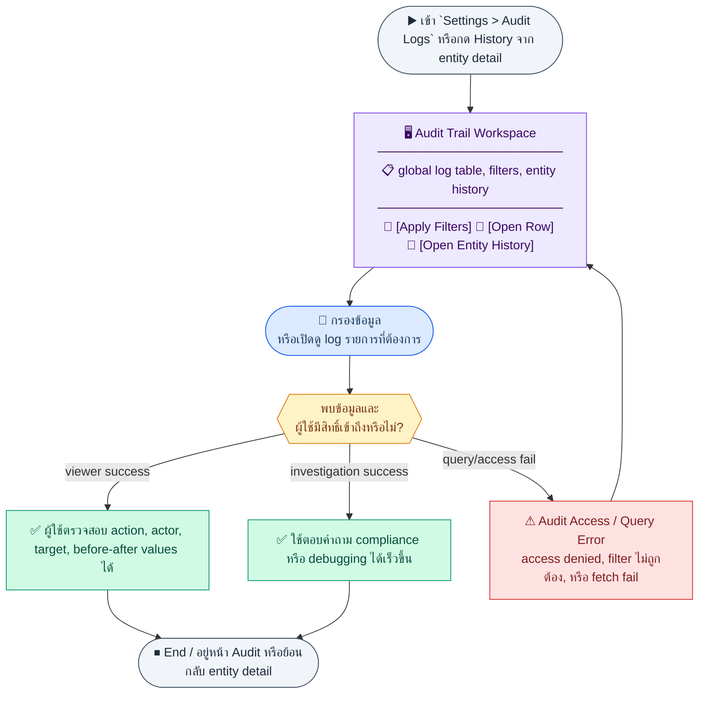
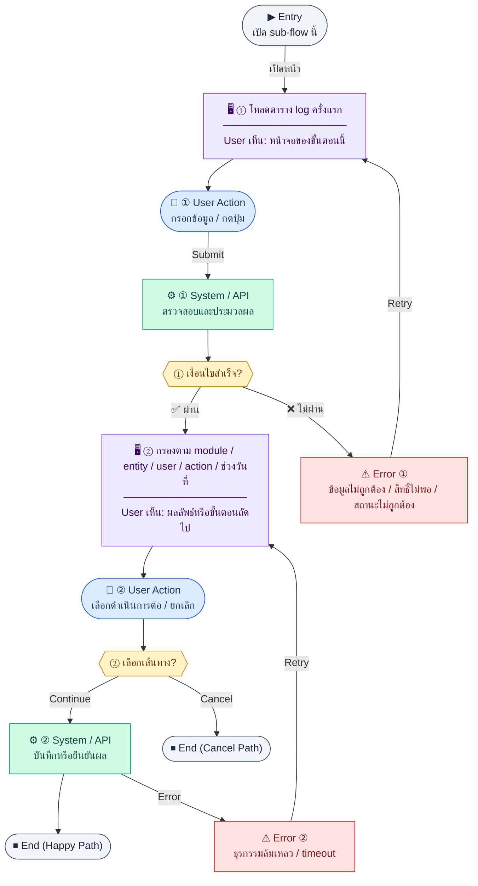
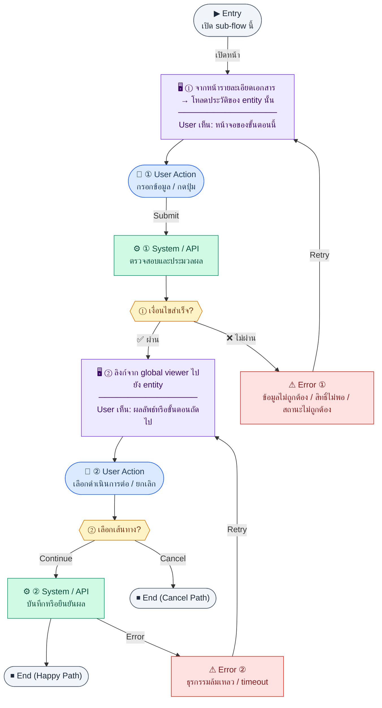

# UX Flow — Audit Trail (ประวัติการกระทำข้ามโมดูล)

ใช้เป็น UX flow สำหรับผู้ดูแลที่ต้องการตรวจสอบว่า **ใคร ทำอะไร กับข้อมูลใด เมื่อไหร่** ตาม Release 2 โดยผูกกับ endpoint จาก `Documents/SD_Flow/User_Login/settings_admin_r2.md` และ BR Feature 3.12

**แหล่งอ้างอิงที่ผูกกับเอกสารนี้**

- Business requirement (BR): `Documents/Requirements/Release_2.md` (Feature 3.12 Audit Trail)
- Traceability: `Documents/Requirements/Release_2_traceability_mermaid.md` (audit)
- Sequence / SD_Flow: `Documents/SD_Flow/User_Login/settings_admin_r2.md` (ส่วน audit-logs)
- Related screens (ตาม BR): `/settings/audit-logs` และแท็บ/ส่วน "History" ในหน้า entity detail

---

## E2E Scenario Flow

> ผู้ดูแลระบบใช้ audit trail เพื่อตรวจสอบว่าใครทำอะไรกับข้อมูลใดและเมื่อใด ผ่านทั้ง global log viewer และประวัติระดับ entity โดยกรองตาม module, action, user, entity และช่วงเวลาเพื่อใช้กับ compliance, debugging และ internal audit

### Scenario Summary

| Scenario | ขั้นตอน | ผลลัพธ์ |
|----------|---------|---------|
| ✅ โหลด global audit viewer | เปิด `/settings/audit-logs` | เห็น log ล่าสุดพร้อม pagination |
| ✅ กรอง log | ใส่ `module/entityType/actorId/action/startDate-endDate` | เห็นเฉพาะเหตุการณ์ที่ต้องการ |
| ✅ เปิดประวัติ entity | จาก detail page กด History หรือเข้า entity endpoint | เห็น trail ของ record เดียว |
| ✅ ตรวจ status change สำคัญ | เปิดรายการ invoice/AP/PO/payroll/leave | ตรวจสอบ old/new values และผู้กระทำได้ |
| ✅ ตรวจ system action | ค้น log ที่ `actorId` อาจว่าง | แยกเหตุการณ์จากระบบอัตโนมัติได้ |
| ✅ ใช้ยืนยันเหตุผิดปกติ | ไล่จาก filter → detail row | ตอบคำถาม compliance/debugging ได้เร็วขึ้น |
| ⚠ ไม่มีสิทธิ์หรือ query ไม่ถูกต้อง | ผู้ใช้ไม่ใช่ admin หรือกรองผิดรูปแบบ | ระบบปฏิเสธหรือแจ้ง query error |

---
## ชื่อ Flow & ขอบเขต

**Flow name:** `Audit — ดู log ทั้งระบบ และ drill-down ตาม entity`

**Actor(s):** admin ที่ BR ระบุว่า list endpoint เป็น **admin only** (ตามตาราง API ใน BR)

**Entry:** `/settings/audit-logs` หรือปุ่ม "ประวัติ" ในหน้ารายละเอียดเอกสาร (invoice, employee, AP bill, …)

**Exit:** ผู้ใช้ค้นพบ action ที่ต้องการหรือยืนยันว่าไม่มีเหตุการณ์ในช่วงที่ค้น

**Out of scope:** โครงสร้างภายในของ `AuditService` และรายการ inject ในทุก mutation (อธิบายใน BR แต่ไม่ใช่ UX step)

---

## Endpoint กลุ่ม Audit

| Method | Path |
|--------|------|
| `GET` | `/api/settings/audit-logs` |
| `GET` | `/api/settings/audit-logs/:entityType/:entityId` |

**Query params สำหรับ list (ตาม BR):** `module`, `entityType`, `actorId`, `action`, `startDate`, `endDate`, `page`, `limit`

---

## Sub-flow A — Global log viewer (`/settings/audit-logs`)

### Scenario Flow

### สัญลักษณ์ Node (Color Legend)

| สี | Node shape | หมายถึง |
|----|-----------|---------|
| 🟣 ม่วง | สี่เหลี่ยม `["…"]` | **Screen / UI State** |
| 🔵 น้ำเงิน | วงกลม `(["…"])` | **User Action** |
| 🟢 เขียว | สี่เหลี่ยม `["…"]` | **System / API** |
| 🟡 เหลือง | เพชร `{{"…"}}` | **Decision** |
| 🔴 แดง | สี่เหลี่ยม `["…"]` | **Error / Edge case** |
| ⚫ เทา | วงรี `(["…"])` | **Start / End** |

---

### Step A1 — โหลดตาราง log ครั้งแรก

**Goal:** แสดงประวัติล่าสุดของระบบพร้อม pagination

**User sees:** ตารางคอลัมน์หลักจากโมเดล `audit_logs`: เวลา, ผู้ทำ (`userEmail`), `action`, `module`, `entityType`, `entityId`, `entityLabel`

**User can do:** เปลี่ยนหน้า, เปิดตัวกรองขั้นสูง

**User Action:**
- ประเภท: `กดปุ่ม`
- ปุ่ม / Controls ในหน้านี้:
  - `[Open Filters]` → เปิดแผงตัวกรองขั้นสูง
  - `[Open Diff]` → ดูรายละเอียดแถวที่เลือก
  - `[Retry]` → โหลด log ใหม่

**Frontend behavior:**

- `GET /api/settings/audit-logs` พร้อม `page`, `limit`
- แสดง loading และ empty state

**System / AI behavior:** อ่านจาก `audit_logs` พร้อม index ตาม query plan

**Success:** ได้ `data` + meta

**Error:** 403 ไม่ใช่ admin, 401

**Notes:** ไม่ควรแสดงข้อมูลละเอียดที่ sensitive เกินจำเป็นใน cell หลัก — รายละเอียด JSON ไว้ใน drawer

### Step A2 — กรองตาม module / entity / user / action / ช่วงวันที่

**Goal:** ค้นหาเหตุการณ์เฉพาะเจาะจงสำหรับสอบสวน

**User sees:** แผงตัวกรอง, ปุ่ม "ใช้ตัวกรอง" และ "ล้าง"

**User can do:** เลือก `module`, `entityType`, `actorId`, `action`, `startDate`, `endDate`

**User Action:**
- ประเภท: `กรอกข้อมูล / เลือกตัวเลือก`
- ช่องที่ต้องกรอก:
  - `module` *(optional)* : โมดูลที่ต้องการค้นหา
  - `entityType` *(optional)* : ชนิดเอกสาร/ข้อมูล
  - `actorId` *(optional)* : ผู้กระทำ
  - `action` *(optional)* : create, update, delete, approve
  - `startDate` / `endDate` *(optional)* : ช่วงเวลา
- ปุ่ม / Controls ในหน้านี้:
  - `[Apply Filters]` → เรียก `GET /api/settings/audit-logs`
  - `[Clear Filters]` → ล้างเงื่อนไข

**Frontend behavior:**

- ส่ง query ทั้งหมดที่ผู้ใช้เลือกไปที่ `GET /api/settings/audit-logs`
- validate วันที่ (`startDate` <= `endDate`)

**System / AI behavior:** ใช้ index `module`, `actorId`, `entityType` ตามที่ BR ออกแบบ

**Success:** ตารางสะท้อนผลกรอง

**Error:** 400 ช่วงวันที่ไม่ถูกต้อง

**Notes:** สำหรับ `actorId` filter อาจต้องมี autocomplete จาก `GET /api/settings/users` (อยู่นอก endpoint audit แต่ช่วย UX); ถ้า UI state ภายในยังใช้ legacy key เช่น `userId` ให้ map เป็น `actorId` ก่อนส่งที่ API boundary เท่านั้น

### Step A3 — ดูรายละเอียด diff (old/new values)

**Goal:** เห็นค่าก่อน/หลังเปลี่ยนสำหรับ `update` / `delete`

**User sees:** drawer/modal แสดง `oldValues`, `newValues` (JSON) แบบอ่านง่ายหรือ diff view

**User can do:** คัดลอก JSON, ปิด drawer

**User Action:**
- ประเภท: `กดปุ่ม`
- ปุ่ม / Controls ในหน้านี้:
  - `[View Changes]` → เปิด drawer diff
  - `[Copy JSON]` → คัดลอก `oldValues`/`newValues`
  - `[Close]` → ปิด drawer

**Frontend behavior:** ใช้แถวที่ได้จาก list response โดยตรง หรือเรียก detail-by-entity ถ้า list ไม่ส่ง JSON เต็ม

**System / AI behavior:** ข้อมูลมาจากคอลัมน์ JSONB ตาม BR

**Success:** ผู้ใช้เข้าใจการเปลี่ยนแปลง

**Error:** —

**Notes:** ห้ามแสดง password หรือ secret — BR ระบุสำหรับ employee update

---

## Sub-flow B — Audit trail ของ entity เดียว (`detail-by-entity`)

### Scenario Flow

### สัญลักษณ์ Node (Color Legend)

| สี | Node shape | หมายถึง |
|----|-----------|---------|
| 🟣 ม่วง | สี่เหลี่ยม `["…"]` | **Screen / UI State** |
| 🔵 น้ำเงิน | วงกลม `(["…"])` | **User Action** |
| 🟢 เขียว | สี่เหลี่ยม `["…"]` | **System / API** |
| 🟡 เหลือง | เพชร `{{"…"}}` | **Decision** |
| 🔴 แดง | สี่เหลี่ยม `["…"]` | **Error / Edge case** |
| ⚫ เทา | วงรี `(["…"])` | **Start / End** |

---

### Step B1 — จากหน้ารายละเอียดเอกสาร → โหลดประวัติของ entity นั้น

**Goal:** แสดงเฉพาะเหตุการณ์ที่เกี่ยวกับ `entityType` + `entityId` หนึ่งคู่

**User sees:** แท็บ "History" ใน invoice detail, employee detail, AP bill detail, ฯลฯ (ตาม BR)

**User can do:** เลื่อนอ่าน timeline, เปิดรายละเอียด diff

**User Action:**
- ประเภท: `กดปุ่ม`
- ปุ่ม / Controls ในหน้านี้:
  - `[Open History Tab]` → โหลด history ของ entity ปัจจุบัน
  - `[View Changes]` → เปิด diff ของรายการที่เลือก
  - `[Retry]` → โหลด history ใหม่

**Frontend behavior:**

- ดึง `entityType` และ `entityId` จาก context ของหน้า (เช่น `invoice` + `uuid`)
- `GET /api/settings/audit-logs/:entityType/:entityId`

**System / AI behavior:** ใช้ index `idx_audit_logs_entity` ตาม BR

**Success:** แสดงลำดับเหตุการณ์จากสร้างจนถึงล่าสุด

**Error:** 404 ไม่มี log, 403

**Notes:** path พารามิเตอร์สองตัวต้องตรงกับค่าที่บันทึกใน `audit_logs` (case/format ให้สอดคล้องกับ BE)

### Step B2 — ลิงก์จาก global viewer ไปยัง entity

**Goal:** จากแถว log ไปยังหน้าธุรกิจที่เกี่ยวข้อง

**User sees:** คลิกได้ที่ `entityLabel` หรือไอคอนลิงก์

**User can do:** เปิดหน้า detail ของระบบนั้น (ถ้ามีสิทธิ์)

**User Action:**
- ประเภท: `กดปุ่ม`
- ปุ่ม / Controls ในหน้านี้:
  - `[Open Related Entity]` → นำทางไป route ของ entity
  - `[Back to Audit Logs]` → กลับ global viewer

**Frontend behavior:** map `module` + `entityType` + `entityId` เป็น route ฝั่ง FE (ตารางแมปเป็นสัญญาระหว่างทีม)

**System / AI behavior:** ไม่มี API เพิ่ม

**Success:** ผู้ใช้ตรวจสอบเอกสารต้นทางได้

**Error:** 403 ที่หน้าเป้าหมาย — แสดง unauthorized

**Notes:** การมองเห็น log กับการมองเห็นเอกสารอาจต่างกัน — ออกแบบให้ชัด

---

## Coverage Checklist

| Endpoint | Covered in UX file | Notes |
|----------|-------------------|-------|
| `GET /api/settings/audit-logs` | Sub-flow A — Global log viewer (`/settings/audit-logs`) | Steps A1–A3 list, filters, diff drawer |
| `GET /api/settings/audit-logs/:entityType/:entityId` | Sub-flow B — Audit trail ของ entity เดียว (`detail-by-entity`) | Entity History tab; drill-down from global viewer |

## Coverage Lock Notes (2026-04-16)

### In-scope endpoints
- `GET /api/settings/audit-logs`
- `GET /api/settings/audit-logs/:entityType/:entityId`

### Canonical filters / enums
- filters ต้องยึด `module`, `entityType`, `actorId`, `action`, `startDate`, `endDate`
- action enum lock: `create`, `update`, `delete`, `status_change`, `login`, `logout`, `approve`, `reject`

### UX lock
- ห้ามใช้ค่า `action=approve` เพิ่มเองนอกชุด canonical
- diff/detail drawer ต้องยึด `changes[]` และ `context` จาก response entity-detail ไม่ประกอบเองจาก list rows
- filter controls ต้อง map เป็น `module`, `entityType`, `actorId`, `action`, `startDate`, `endDate` เท่านั้น; legacy naming เช่น `userId`, `dateFrom`, `dateTo` ใช้ไม่ได้ใน canonical UX
- actor picker/source สำหรับ `actorId` ให้ reuse `GET /api/settings/users`; ถ้าเป็น system action และไม่มี actor ให้แสดงเป็น system-generated state ไม่บังคับเลือก user
- dropdown/options ของ `action` และ `entityType` ต้องยึด catalog/query semantics เดียวกับ API เพื่อให้ filter state, deep link, และ saved search ตรงกัน
