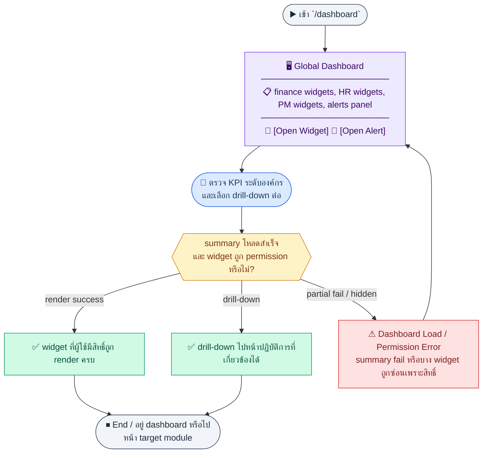
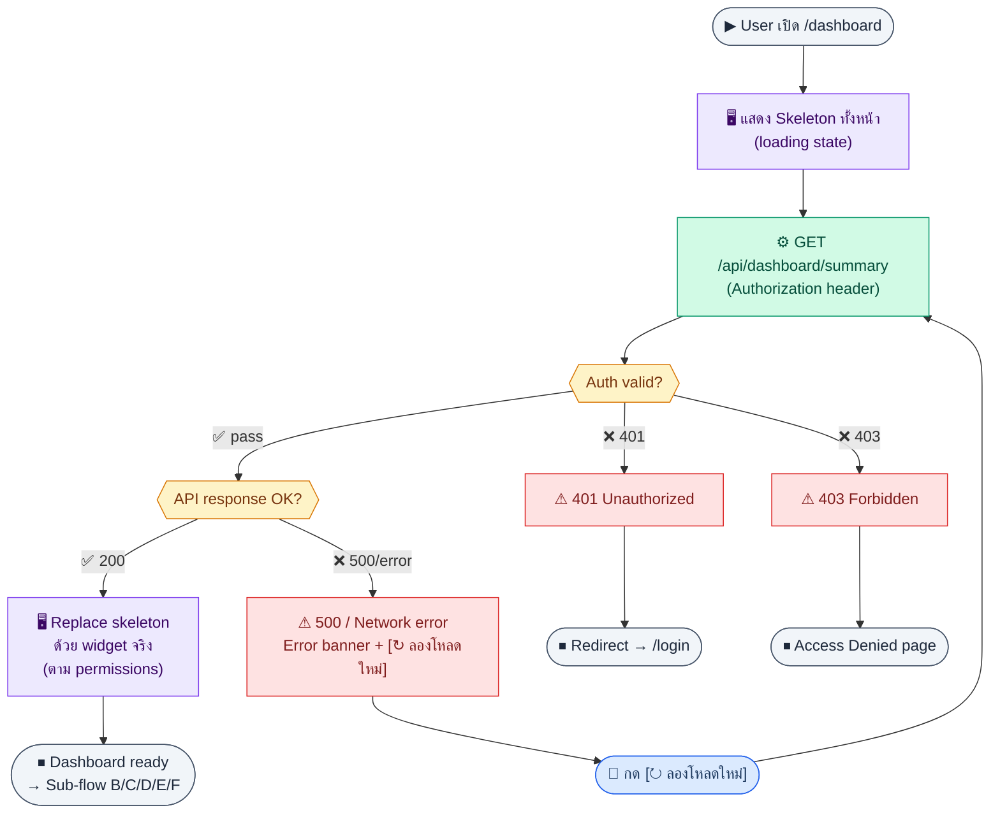
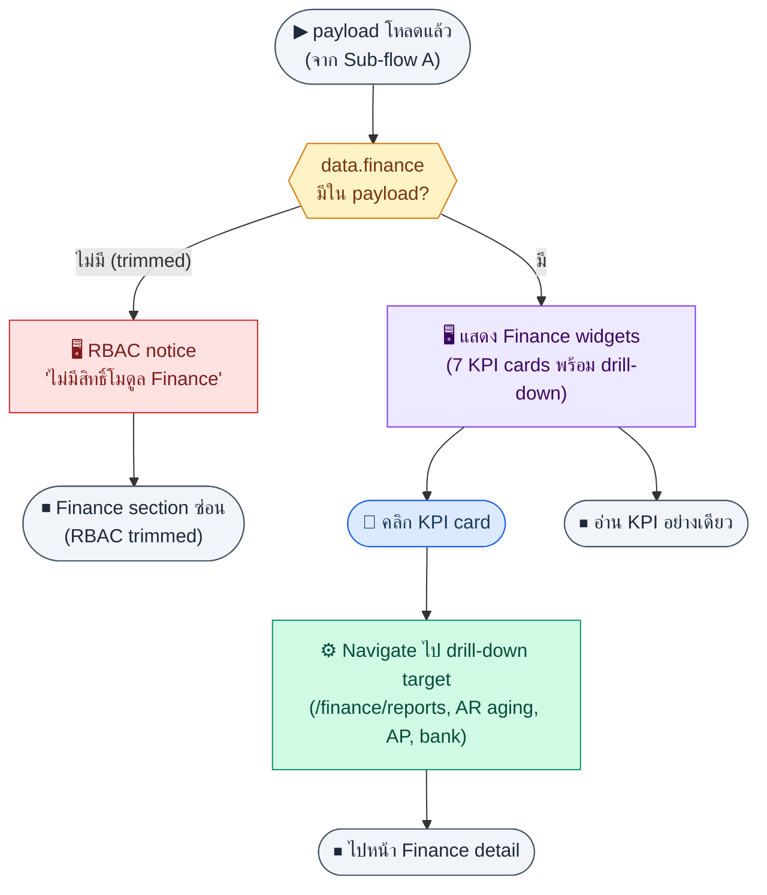
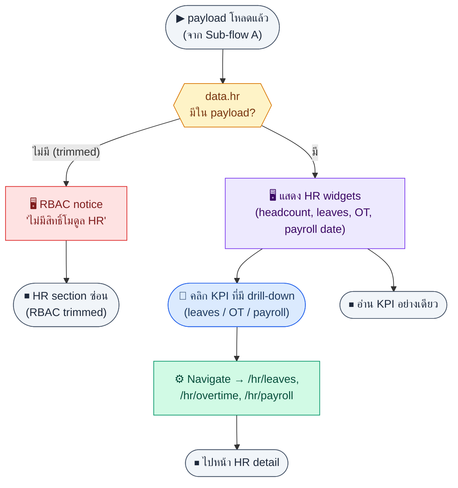
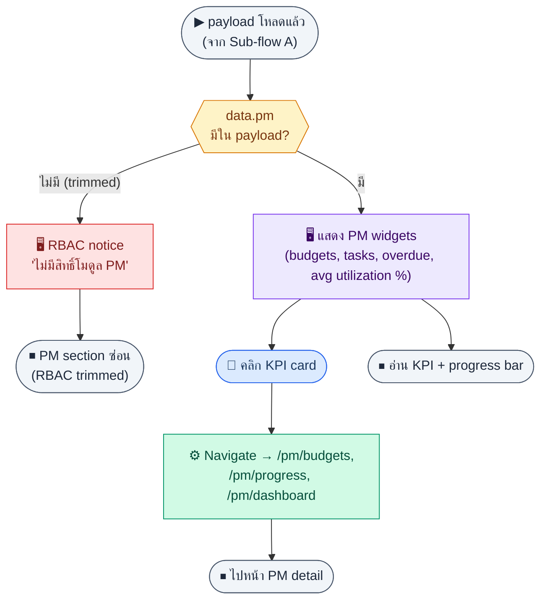
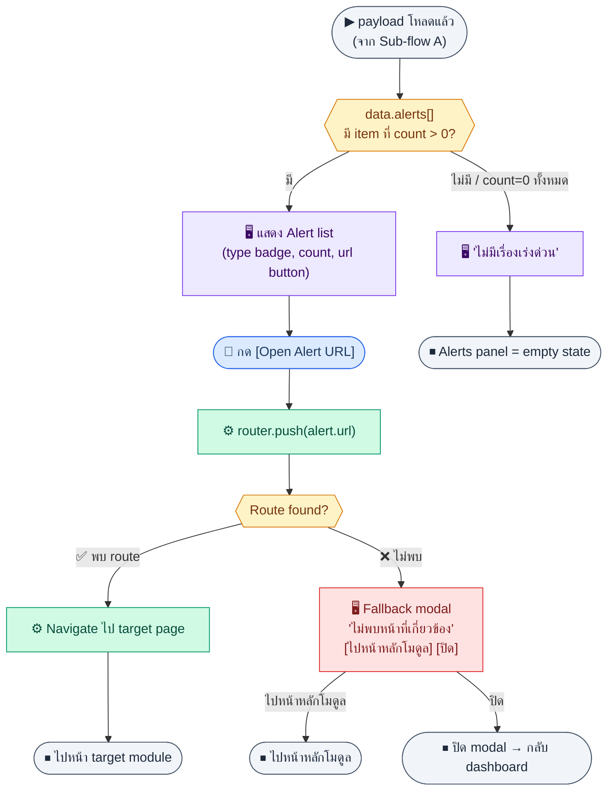
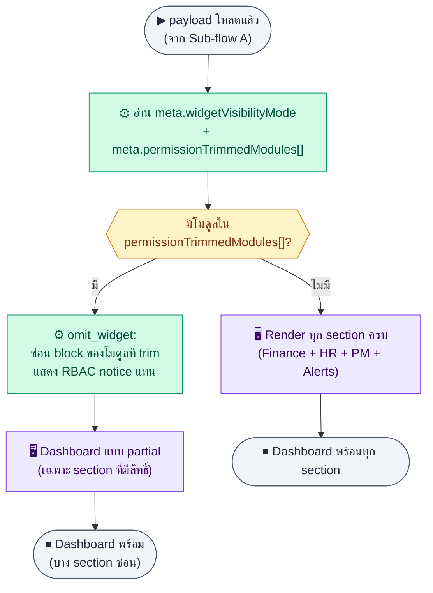

# UX Flow — Global Dashboard (ภาพรวมองค์กร)

ใช้เป็น UX flow สำหรับหน้า `/dashboard` ใน Release 2 โดยอิง **endpoint เดียว** `GET /api/dashboard/summary` จาก `Documents/SD_Flow/PM/global_dashboard.md` และโครงสร้าง response ใน BR Feature 3.13

**แหล่งอ้างอิงที่ผูกกับเอกสารนี้**

- Business requirement (BR): `Documents/Requirements/Release_2.md` (Feature 3.13 Global Dashboard)
- Traceability: `Documents/Requirements/Release_2_traceability_mermaid.md` (หน้า `/dashboard` → `GET /api/dashboard/summary`)
- Sequence / SD_Flow: `Documents/SD_Flow/PM/global_dashboard.md`
- Related screens (ตาม BR): `/dashboard`

---

## E2E Scenario Flow

> ผู้บริหารหรือผู้ใช้ที่ได้รับสิทธิ์เปิดหน้า dashboard เพื่อโหลด summary payload เดียวที่รวม KPI ฝั่งการเงิน HR PM และ alerts แล้วดูเฉพาะ widget ที่ตนมีสิทธิ์ พร้อมกดลิงก์เจาะไปยังหน้าปฏิบัติการที่เกี่ยวข้องได้ทันที



### Scenario Summary

| Scenario | ขั้นตอน | ผลลัพธ์ |
|----------|---------|---------|
| ✅ โหลด dashboard ครั้งแรก | เข้า `/dashboard` | หน้าแสดง skeleton แล้วเติม widget ตาม payload |
| ✅ ดู KPI การเงิน | อ่าน revenue, expense, AR, AP overdue, cash balance | เห็นสุขภาพการเงินระดับองค์กร |
| ✅ ดู KPI HR | อ่าน headcount, pending leave, next payroll, pending OT | เห็นภาระงาน HR ปัจจุบัน |
| ✅ ดู KPI PM | อ่าน active budgets, tasks in progress/overdue, utilization | เห็นภาพรวมโครงการ |
| ✅ ดู alerts panel | อ่านรายการ alert พร้อม count | รู้เรื่องที่ต้อง action ทันที |
| ✅ drill-down ไปโมดูลต้นทาง | กด widget หรือ alert URL | ไปยังหน้ารายละเอียดที่เกี่ยวข้อง |
| ✅ ใช้ตามสิทธิ์ | ระบบซ่อน widget ที่ผู้ใช้ไม่มีสิทธิ์ | dashboard ไม่เปิดเผยข้อมูลข้ามสิทธิ์ |
| ⚠ summary หรือ widget บางส่วนโหลดไม่สำเร็จ | partial data, auth fail, permission mismatch | ระบบแสดง partial error โดยไม่ทำให้ทั้งหน้าล้ม |

---
## ชื่อ Flow & ขอบเขต

**Flow name:** `Dashboard — สรุป KPI ข้ามโมดูลและแผง Alerts`

**Actor(s):** ผู้บริหาร / ผู้ใช้ที่ได้รับอนุญาตให้เห็นข้อมูลหลายโมดูล; **แต่ละ widget แสดงเฉพาะเมื่อมีสิทธิ์ module นั้น** (ตาม BR)

**Entry:** `/dashboard` จากเมนูหลักหรือ default route หลัง login

**Exit:** ผู้ใช้เห็นสรุปที่อนุญาตและสามารถ drill-down ไปหน้ารายละเอียดตามลิงก์

**Out of scope:** การคำนวณ aggregate ภายใน BE (อธิบายใน BR แต่ไม่ใช่ UX step ละเอียด)

---

## Endpoint หลัก

| Method | Path |
|--------|------|
| `GET` | `/api/dashboard/summary` |

---

## Sub-flow A — Bootstrap หน้า Dashboard

### Scenario Flow

### สัญลักษณ์ Node (Color Legend)

| สี | Node shape | หมายถึง |
|----|-----------|---------|
| 🟣 ม่วง | สี่เหลี่ยม `["…"]` | **Screen / UI State** |
| 🔵 น้ำเงิน | วงกลม `(["…"])` | **User Action** |
| 🟢 เขียว | สี่เหลี่ยม `["…"]` | **System / API** |
| 🟡 เหลือง | เพชร `{{"…"}}` | **Decision** |
| 🔴 แดง | สี่เหลี่ยม `["…"]` | **Error / Edge case** |
| ⚫ เทา | วงรี `(["…"])` | **Start / End** |



---

### Step A1 — โหลดสรุปครั้งเดียวสำหรับ layout ทั้งหน้า

**Goal:** ได้ข้อมูล `finance`, `hr`, `pm`, และ `alerts` ใน payload เดียวเพื่อลดความซับซ้อนของหน้า

**User sees:** skeleton ทั้งหน้าแล้วตามด้วย widget จริง

**User can do:** รอหรือกดรีเฟรช (ถ้ามีปุ่ม)

**User Action:**
- ประเภท: `กดปุ่ม`
- ปุ่ม / Controls ในหน้านี้:
  - `[Refresh Dashboard]` → โหลด summary ใหม่
  - `[Open Alert]` → ไปตาม deep link ของ alert

**Frontend behavior:**

- เรียก `GET /api/dashboard/summary` พร้อม `Authorization`
- แสดงข้อความ `ข้อมูลอาจล่าช้าสูงสุด 5 นาที` หรือ `Last updated` ถ้า API ส่ง `asOf`/timestamp เพื่อสะท้อน cache ตาม BR
- ถ้ามีปุ่ม refresh ให้บอกชัดว่าเป็นการ re-fetch จาก client; ตัวเลขอาจยังคงหน่วงได้ตาม server cache window
- แยกโครงสร้าง `data` ตามตัวอย่างใน BR:

```json
{
  "data": {
    "finance": { "revenueThisMonth": 0, "revenueYTD": 0, "expenseThisMonth": 0, "arOutstanding": 0, "apOverdueCount": 0, "netProfitThisMonth": 0 },
    "hr": { "totalHeadcount": 0, "pendingLeaveRequests": 0, "nextPayrollDate": null, "pendingOTApprovals": 0 },
    "pm": { "activeBudgets": 0, "tasksInProgress": 0, "tasksOverdue": 0, "avgBudgetUtilization": 0 },
    "alerts": [ { "type": "", "count": 0, "url": "" } ],
    "meta": {
      "asOf": "2026-04-16T10:30:00Z",
      "freshnessSeconds": 300,
      "permissionTrimmedModules": [],
      "widgetVisibilityMode": "omit_widget"
    }
  }
}
```

> ⚠️ `finance.cashBalance` จะปรากฏใน payload เฉพาะเมื่อ Feature 3.5 (bank_accounts) implement แล้วเท่านั้น — BE omit key นี้จนกว่าจะพร้อม; FE ต้องรองรับการที่ key หายไปโดยไม่ crash

**System / AI behavior:** aggregate จากตารางที่มีอยู่แล้วหลายโมดูล; ไม่มีตารางใหม่ตาม BR

**Success:** ทุก widget ที่ผู้ใช้มีสิทธิ์ render ได้และผู้ใช้เข้าใจ freshness ของข้อมูล

**Error:** 401 → login; 403 → แสดงหน้า access denied; 500 → retry

**Notes:** ถ้า BE ส่ง field บางส่วนหาย ควร defensive coding ที่ FE; dashboard เป็นหน้า snapshot ไม่ใช่ live monitor แบบ real-time

---

## Sub-flow B — Widget กลุ่ม Finance

### Scenario Flow

### สัญลักษณ์ Node (Color Legend)

| สี | Node shape | หมายถึง |
|----|-----------|---------|
| 🟣 ม่วง | สี่เหลี่ยม `["…"]` | **Screen / UI State** |
| 🔵 น้ำเงิน | วงกลม `(["…"])` | **User Action** |
| 🟢 เขียว | สี่เหลี่ยม `["…"]` | **System / API** |
| 🟡 เหลือง | เพชร `{{"…"}}` | **Decision** |
| 🔴 แดง | สี่เหลี่ยม `["…"]` | **Error / Edge case** |
| ⚫ เทา | วงรี `(["…"])` | **Start / End** |



---

### Step B1 — แสดงการ์ดและกราฟรายได้

**Goal:** ให้ผู้ใช้เห็นสุขภาพการเงินหลักในมุมมองเดียว

**User sees:** Revenue MTD/YTD, ค่าใช้จ่ายเดือนนี้, กำไรสุทธิ MTD, AR outstanding, AP overdue count, cash balance (7 fields ตาม keys ใน BR)

**User can do:** คลิกไปหน้ารายงานหรือรายการที่เกี่ยวข้อง (drilldown)

**User Action:**
- ประเภท: `กดปุ่ม`
- ปุ่ม / Controls ในหน้านี้:
  - `[Open Finance Report]` → ไปหน้า AR/AP/report ที่เกี่ยวข้อง
  - `[Refresh Dashboard]` → โหลดข้อมูลใหม่

**Frontend behavior:**

- **RBAC check:** ตรวจว่า `data.finance` มีใน payload หรือไม่ — ถ้าไม่มี (BE omitted) แสดง RBAC notice แทน widget; **ห้ามเรียก `/api/auth/me` แยกเพื่อตัดสิน**
- ไม่เรียก API อื่นเพิ่มใน happy path — ใช้ข้อมูลจาก `GET /api/dashboard/summary` เท่านั้น

**System / AI behavior:** ค่าใน `data.finance` คำนวณที่ BE

**Success:** ตัวเลขสอดคล้องกับแหล่งที่มาในระดับที่ BR ยอมรับ (BR มี known gaps บางเรื่องในโมดูลอื่น — ไม่ซ้ำในเอกสารนี้)

**Error:** ถ้าไม่มีสิทธิ์ — ซ่อน widget

**Notes:** drilldown สมมติฐาน (assumptions): คลิก "AR outstanding" → `/finance/reports/ar-aging` หรือ route ที่ทีมกำหนด; คลิก "AP overdue" → `/finance/ap` พร้อม query filter ถ้า FE รองรับ

---

## Sub-flow C — Widget กลุ่ม HR

### Scenario Flow

### สัญลักษณ์ Node (Color Legend)

| สี | Node shape | หมายถึง |
|----|-----------|---------|
| 🟣 ม่วง | สี่เหลี่ยม `["…"]` | **Screen / UI State** |
| 🔵 น้ำเงิน | วงกลม `(["…"])` | **User Action** |
| 🟢 เขียว | สี่เหลี่ยม `["…"]` | **System / API** |
| 🟡 เหลือง | เพชร `{{"…"}}` | **Decision** |
| 🔴 แดง | สี่เหลี่ยม `["…"]` | **Error / Edge case** |
| ⚫ เทา | วงรี `(["…"])` | **Start / End** |



---

### Step C1 — แสดง headcount และงานที่ค้าง

**Goal:** สรุปภาพคนและงาน HR ที่ต้อง action

**User sees:** `totalHeadcount`, `pendingLeaveRequests`, `nextPayrollDate`, `pendingOTApprovals`

**User can do:** drilldown ไป `/hr/leaves`, `/hr/payroll`, ฯลฯ

**User Action:**
- ประเภท: `กดปุ่ม`
- ปุ่ม / Controls ในหน้านี้:
  - `[Open Leave Queue]` → ไป `/hr/leaves`
  - `[Open Payroll]` → ไป `/hr/payroll`

**Frontend behavior:** ตรวจว่า `data.hr` มีใน payload หรือไม่ — ถ้าไม่มี (BE omitted) แสดง RBAC notice แทน widget

**System / AI behavior:** ค่าจาก `data.hr`

**Success:** widget ครบ

**Error:** `data.hr` ไม่มีใน payload → แสดง RBAC notice

**Notes:** drilldown สมมติฐาน: `pendingLeaveRequests` → `/hr/leaves?status=pending` (ตาม convention ที่ทีมกำหนด); `nextPayrollDate` → `/hr/payroll`

---

## Sub-flow D — Widget กลุ่ม PM

### Scenario Flow

### สัญลักษณ์ Node (Color Legend)

| สี | Node shape | หมายถึง |
|----|-----------|---------|
| 🟣 ม่วง | สี่เหลี่ยม `["…"]` | **Screen / UI State** |
| 🔵 น้ำเงิน | วงกลม `(["…"])` | **User Action** |
| 🟢 เขียว | สี่เหลี่ยม `["…"]` | **System / API** |
| 🟡 เหลือง | เพชร `{{"…"}}` | **Decision** |
| 🔴 แดง | สี่เหลี่ยม `["…"]` | **Error / Edge case** |
| ⚫ เทา | วงรี `(["…"])` | **Start / End** |



---

### Step D1 — แสดงมุมมองโครงการและงาน

**Goal:** เชื่อมภาพ PM เข้ากับภาพองค์กร

**User sees:** `activeBudgets`, `tasksInProgress`, `tasksOverdue`, `avgBudgetUtilization`

**User can do:** drilldown ไป `/pm/dashboard`, `/pm/progress`, `/pm/budgets`

**User Action:**
- ประเภท: `กดปุ่ม`
- ปุ่ม / Controls ในหน้านี้:
  - `[Open PM Dashboard]` → ไป `/pm/dashboard`
  - `[Open Task List]` → ไป `/pm/progress`

**Frontend behavior:** ตรวจว่า `data.pm` มีใน payload หรือไม่ — ถ้าไม่มี (BE omitted) แสดง RBAC notice แทน widget

**System / AI behavior:** ค่าจาก `data.pm`

**Success:** widget ครบ

**Error:** `data.pm` ไม่มีใน payload → แสดง RBAC notice

**Notes:** drilldown สมมติฐาน: `tasksOverdue` → `/pm/progress` พร้อม filter overdue; `avgBudgetUtilization` → `/pm/budgets` หรือ `/pm/dashboard`

---

## Sub-flow E — Alerts panel + deep links

### Scenario Flow

### สัญลักษณ์ Node (Color Legend)

| สี | Node shape | หมายถึง |
|----|-----------|---------|
| 🟣 ม่วง | สี่เหลี่ยม `["…"]` | **Screen / UI State** |
| 🔵 น้ำเงิน | วงกลม `(["…"])` | **User Action** |
| 🟢 เขียว | สี่เหลี่ยม `["…"]` | **System / API** |
| 🟡 เหลือง | เพชร `{{"…"}}` | **Decision** |
| 🔴 แดง | สี่เหลี่ยม `["…"]` | **Error / Edge case** |
| ⚫ เทา | วงรี `(["…"])` | **Start / End** |



---

### Step E1 — แสดงรายการ alerts จาก summary

**Goal:** รวมสิ่งที่ต้อง action หรือต้องระวังในที่เดียว

**User sees:** รายการจาก `data.alerts[]` พร้อม `type`, `count`, `url`

**User can do:** คลิกไปยัง `url` ที่ BE ส่งมา (ตามตัวอย่าง BR เช่น `/finance/reports/ar-aging`, `/finance/ap`, `/hr/leaves`)

**User Action:**
- ประเภท: `กดปุ่ม`
- ปุ่ม / Controls ในหน้านี้:
  - `[Open Alert URL]` → ไปยังหน้าที่ alert ระบุ
  - `[Dismiss Modal]` → ปิด fallback modal เมื่อ route ใช้งานไม่ได้

**Frontend behavior:**

- render list จาก payload โดยไม่ hardcode map ถ้า BE เป็นผู้กำหนด `url` แล้ว
- ถ้า `count=0` อาจซ่อนรายการหรือแสดงสถานะ "ไม่มีเรื่องเร่งด่วน"
- ตอน navigate ให้ห่อด้วย fallback (เช่น `router.push(url)` พร้อม handle failed navigation)
- ถ้า route ไม่พบหรือ push ล้มเหลว ให้เปิด modal `ไม่พบหน้าที่เกี่ยวข้อง`
  - แสดง URL ที่คลิก
  - มีปุ่ม `ไปหน้าหลักของโมดูล` (map จาก `alerts[].type` เช่น finance -> `/finance`, hr -> `/hr`, pm -> `/pm`)
  - มีปุ่ม `ปิด` เพื่อกลับหน้า dashboard โดยไม่สูญเสีย context

**System / AI behavior:** BE รวมเหตุการณ์จากหลายแหล่ง (invoice overdue, AP, leave pending, …)

**Success:** ผู้ใช้ไปยังหน้าจัดการปัญหาได้ในคลิกเดียว

**Error:** ถ้า `url` ไม่ตรง route จริงของ FE ให้ fallback modal + ทางไปหน้าหลักโมดูล แทนการพา user ไป dead end

**Notes:** นี่คือ **จุด drilldown หลัก** ของ global dashboard: อาศัย `url` จาก API มากกว่าการดึง API ย่อยเพิ่ม; BE ควร validate `url` ก่อนบันทึก alert และ FE fallback เป็น safety net

---

## Sub-flow F — สิทธิ์และการซ่อน widget (RBAC)

### Scenario Flow

### สัญลักษณ์ Node (Color Legend)

| สี | Node shape | หมายถึง |
|----|-----------|---------|
| 🟣 ม่วง | สี่เหลี่ยม `["…"]` | **Screen / UI State** |
| 🔵 น้ำเงิน | วงกลม `(["…"])` | **User Action** |
| 🟢 เขียว | สี่เหลี่ยม `["…"]` | **System / API** |
| 🟡 เหลือง | เพชร `{{"…"}}` | **Decision** |
| 🔴 แดง | สี่เหลี่ยม `["…"]` | **Error / Edge case** |
| ⚫ เทา | วงรี `(["…"])` | **Start / End** |



---

### Step F1 — จัด layout ตาม permission

**Goal:** ไม่เปิดเผย KPI โมดูลที่ผู้ใช้ไม่มีสิทธิ์

**User sees:** เฉพาะกลุ่ม widget ที่อนุญาต; พื้นที่ว่างหรือข้อความ "ไม่มีสิทธิ์ดูข้อมูลนี้" ตามดีไซน์

**User can do:** —

**User Action:**
- ประเภท: `ดูข้อมูล`
- ปุ่ม / Controls ในหน้านี้:
  - `[Refresh Dashboard]` *(optional)* : โหลด permission/layout ใหม่

**Frontend behavior:**

- ตรวจ key presence ของแต่ละโมดูลใน payload: ถ้า `data.finance` / `data.hr` / `data.pm` ไม่มี → ซ่อน block นั้นและแสดง RBAC notice
- อ่าน `meta.permissionTrimmedModules[]` เพื่อแสดงข้อความ empty-state เท่านั้น — **ห้ามคำนวณสิทธิ์เองจาก field นี้**
- ไม่เรียก `/api/auth/me` แยกเพื่อตัดสินว่า section ไหนจะแสดง

**System / AI behavior:** BE **ต้อง omit** key ของโมดูลที่ user ไม่มีสิทธิ์ออกจาก `data` ทั้งก้อน (ห้ามคืน `null` หรือ `{}`) — ระบุโมดูลที่ถูกตัดใน `meta.permissionTrimmedModules[]`

**Success:** ไม่มีการแสดงข้อมูลเกินสิทธิ์

**Error:** —

**Notes:** BR ระบุชัด: "แต่ละ widget แสดงเฉพาะ user ที่มีสิทธิ์ module นั้น"

---

## สรุปสมมติฐานการ Drilldown (explicit)

| แหล่งข้อมูลใน summary | ทิศทาง UI ที่สมเหตุสมผล (ปรับได้ตามทีม) |
|------------------------|------------------------------------------|
| `finance.*` | ไปหน้า finance reports, AR aging, cash/bank ตามชนิดตัวเลข |
| `hr.*` | ไป `/hr/leaves`, `/hr/payroll` พร้อม state ที่สอดคล้อง |
| `pm.*` | ไป `/pm/dashboard`, `/pm/progress`, `/pm/budgets` |
| `alerts[].url` | **ใช้ค่าจาก BE เป็นหลัก** — FE เป็น router ตาม string |

---

## Coverage Checklist

| Endpoint | Covered in UX file | Notes |
|----------|-------------------|-------|
| `GET /api/dashboard/summary` | Sub-flow A — Bootstrap หน้า Dashboard; Sub-flow B — Widget กลุ่ม Finance; Sub-flow C — Widget กลุ่ม HR; Sub-flow D — Widget กลุ่ม PM; Sub-flow E — Alerts panel + deep links | Single payload finance/hr/pm/alerts per `global_dashboard.md` |
| `GET /api/auth/me` | Sub-flow F — สิทธิ์และการซ่อน widget (RBAC) | สำหรับ session bootstrap เท่านั้น — **ไม่ใช้ตัดสิน widget visibility** บนหน้านี้ (FE ตรวจจาก payload key presence แทน) |

## Coverage Lock Notes (2026-04-16)

### In-scope endpoints
- `GET /api/dashboard/summary`
- `GET /api/auth/me`

### Canonical response model
- dashboard payload ต้องแยก `finance`, `hr`, `pm`, `alerts`, `meta`
- `meta` ต้องมี `asOf`, `freshnessSeconds`, `permissionTrimmedModules`, `widgetVisibilityMode`
- widget types ต้องแยกเป็น scalar, list, series, alert

### UX lock
- RBAC trimming ใช้ `widgetVisibilityMode = omit_widget`
- deep links ของ alerts ต้องยึด `alerts[].url` จาก BE เป็นหลัก
- widget field matrix ขั้นต่ำต้องอ้างประเภทเดียวกับ SD: scalar widget, list widget, series widget, alert widget
- module blocks ต้อง render ตาม payload `finance`, `hr`, `pm`, `alerts`, `meta` และใช้ `permissionTrimmedModules` เพื่ออธิบาย empty-state เท่านั้น ไม่ใช้คำนวณสิทธิ์เอง
- ถ้า BE omit widget/module ตาม `widgetVisibilityMode = omit_widget` ให้ซ่อนทั้ง block โดยไม่สร้าง placeholder field ว่างปลอมขึ้นมา
