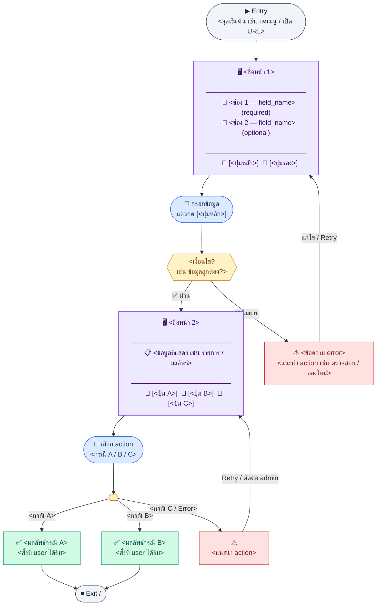
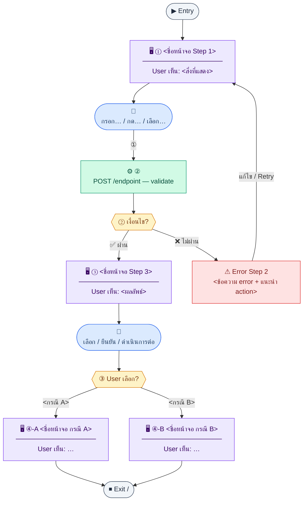
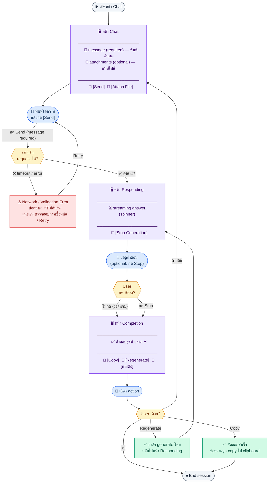
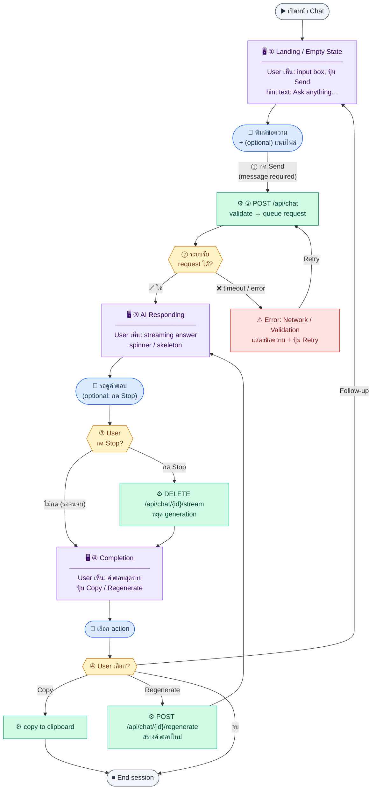

# UX Flow Template (Pattern)

ใช้ไฟล์นี้เป็น **pattern มาตรฐาน** เมื่อเขียน UX flow แยกตาม function / journey — เล่าให้ครบว่าผู้ใช้เห็นอะไร ทำอะไร เรียงลำดับจนจบ flow

**แหล่งอ้างอิงที่ควรผูกกับเอกสารนี้**

- Business requirement (BR): `<ลิงก์หรือ path>`
- Sequence diagram / SD_Flow: `<ลิงก์หรือ path>`
- Related screens / mockups: `<ถ้ามี หรือระบุ TBD>`
- Global frontend behaviors: `Documents/UX_Flow/_GLOBAL_FRONTEND_BEHAVIORS.md`

---

## E2E Scenario Flow

> **วัตถุประสงค์:** ภาพรวมทั้ง function สำหรับ BU และ User ที่ยังไม่รู้จัก flow นี้ — อ่านแล้วรู้ทันทีว่า "ถ้าจะใช้ Feature นี้ ฉันต้องเจออะไรบ้าง กรอกอะไรบ้าง แล้วจะเกิดอะไรขึ้น"
>
> ความแตกต่างจาก Scenario Flow รายละเอียด:
> - **E2E Scenario Flow** (ที่นี่) = ภาพรวม **ทั้ง function** อยู่บนสุดของเอกสาร
> - **Scenario Flow** (แต่ละ Sub-flow) = รายละเอียดลึกลงไปต่อ Sub-flow นั้น ๆ

### สัญลักษณ์ Node (Color Legend)

| สี | Node | หมายถึง |
|----|------|---------|
| 🟣 ม่วง | `🖥 หน้าจอ` + ช่องกรอก + ปุ่ม | **Screen** — หน้าจอที่ user พบ พร้อม input fields + actions |
| 🔵 น้ำเงิน | `👤 action` | **User Action** — สิ่งที่ user ทำ |
| 🟢 เขียว | `✅ ผลลัพธ์` | **Success Outcome** — ผลสำเร็จ / สิ่งที่ user ได้รับ |
| 🟡 เหลือง | เพชร | **Decision** — เงื่อนไข / จุดแตก branch |
| 🔴 แดง | `❌ / ⚠` | **Error / Blocked** — เกิดปัญหา + วิธีแก้ |
| ⚫ เทา | วงรี | **Start / End** |

### Scenario Summary

| Scenario | ขั้นตอน | ผลลัพธ์ |
|----------|---------|---------|
| ✅ Happy Path | กรอก → ผ่าน → ดำเนินการ → สำเร็จ | `<ผลลัพธ์หลัก>` |
| ⚠ Error Path 1 | กรอก → ไม่ผ่าน validation | แสดง error + ให้แก้ไข |
| ⚠ Error Path 2 | `<กรณีพิเศษ>` | `<ผลลัพธ์>` |

---

## ชื่อ Flow & ขอบเขต

**Flow name:** `<ชื่อสั้น ๆ เช่น Payroll — Run monthly payroll>`

**Actor(s):** `<บทบาทผู้ใช้ เช่น HR Admin>`

**Entry:** `<ผู้ใช้เข้ามาจากไหน / trigger อะไร>`

**Exit:** `<จบที่สถานะไหน หรือ drilldown / integration path ไป flow อื่น>`

**Out of scope:** `<สิ่งที่ไม่ครอบในเอกสารนี้>`

---

## มาตรฐานร่วมที่ต้องถือ

- มี `## ชื่อ Flow & ขอบเขต` ระดับเอกสารเพียงครั้งเดียว
- แต่ละ sub-flow ใช้ `## Sub-flow ...`
- แต่ละ step ใช้ `### Step ...`
- ห้ามคง placeholder เช่น `primary_input`, `note_or_filter`, `[Primary Action]` ในเอกสารที่พร้อมส่งต่อทีม
- ถ้าพฤติกรรมเรื่อง loading / 401 / 403 / 409 / unsaved changes / audit ใช้มาตรฐานเดียวกับระบบ ให้ลิงก์อ้างอิง `Documents/UX_Flow/_GLOBAL_FRONTEND_BEHAVIORS.md` ได้แทนการเขียนซ้ำเต็มทุกครั้ง

---

## Scenario Flow

ภาพรวม UX Scenario Map สำหรับ Sub-flow นี้ — ลำดับ step, branch, และ error path

### สัญลักษณ์ Node (Color Legend)

| สี | Node shape | หมายถึง |
|----|-----------|---------|
| 🟣 ม่วง | สี่เหลี่ยม `["…"]` | **Screen / UI State** — หน้าจอหรือ state ที่ user เห็น |
| 🔵 น้ำเงิน | วงกลม `(["…"])` | **User Action** — สิ่งที่ user ทำ (กด / กรอก / เลือก) |
| 🟢 เขียว | สี่เหลี่ยม `["…"]` | **System / API** — การตอบสนองของระบบหรือ API call |
| 🟡 เหลือง | เพชร `{{"…"}}` | **Decision** — จุดแตก branch / เงื่อนไข |
| 🔴 แดง | สี่เหลี่ยม `["…"]` | **Error / Edge case** — กรณีผิดพลาดหรือ exception |
| ⚫ เทา | วงรี `(["…"])` | **Start / End** — จุดเริ่มต้นและจุดจบ |

---

## Step pattern (คัดลอกไปใช้ทุก Step)

แต่ละ Step ใช้หัวข้อเดียวกันเสมอ เพื่อให้ AI / ทีมอ่านและ review ได้สม่ำเสมอ

### Step `<n>` — `<ชื่อหน้าจอ / สถานะ / ช่วงเวลาใน journey>`

**Goal:** ผู้ใช้ต้องการทำอะไรใน step นี้ (หนึ่งประโยค)

**User sees:** …

**User can do:** …

**User Action:**
- ประเภท: `<กรอกแบบฟอร์ม / กดยืนยัน / เลือกรายการ / อัปโหลด / ดูข้อมูล / …>`
- ช่องที่ต้องกรอกหรือค่าที่ใช้ใน step นี้:
  - `field_name` *(required/optional)* : คำอธิบาย / ค่าที่รับได้
  - `field_name` *(required/optional)* : คำอธิบาย / ค่าที่รับได้
- ปุ่ม / Controls ในหน้านี้:
  - `[ปุ่ม A]` → พฤติกรรม / ไป step ถัดไป
  - `[ปุ่ม B]` → ยกเลิก / กลับ

**Frontend behavior:** …

- …

**System / AI behavior:** …

- …

**Success:** …

**Error:** …

**Notes:** …

- ถ้าใช้กติกากลางเรื่อง loading / permission / conflict / unsaved changes / audit ให้ใส่ reference ไป `Documents/UX_Flow/_GLOBAL_FRONTEND_BEHAVIORS.md`

---

## ตัวอย่าง (Chat-style flow)

---

## E2E Scenario Flow

> ภาพรวม Chat Function ทั้งหมด — BU / User อ่านแล้วรู้ว่าต้องทำอะไรบ้าง เจอ scenario ไหนได้บ้าง

### Scenario Summary

| Scenario | ขั้นตอน | ผลลัพธ์ |
|----------|---------|---------|
| ✅ ถามและได้คำตอบ | พิมพ์ → Send → รอ AI → อ่านคำตอบ | ได้คำตอบจาก AI |
| ✅ ถามต่อเนื่อง | ... → Completion → กด [ถามต่อ] → กลับหน้า input | ถามใหม่ใน session เดิม |
| ✅ Copy คำตอบ | ... → Completion → กด [Copy] | ข้อความ copy ไป clipboard |
| ✅ Regenerate | ... → Completion → กด [Regenerate] | AI generate ใหม่ |
| ⚠ Send ไม่สำเร็จ | พิมพ์ → Send → Network error | แสดง error + Retry |
| ⚠ หยุดกลางคัน | ... → Responding → กด [Stop] | ได้คำตอบที่ generate ไปแล้ว |

---

### Scenario Flow (Sub-flow detail)

---

### Step 1 — Landing / Empty state

**Goal:** เริ่มสนทนาโดยยังไม่ส่งข้อความ

**User sees:** ช่องพิมพ์คำถาม, ปุ่ม Send, hint text "Ask anything…"

**User can do:** พิมพ์ข้อความ / แนบไฟล์

**User Action:**
- ประเภท: `กรอกข้อความ / อัปโหลดไฟล์`
- ช่องที่ต้องกรอก (ตาม API required fields):
  - `ช่อง 1 — message` *(required)* : ข้อความคำถาม (string, max length ตาม config)
  - `ช่อง 2 — attachments` *(optional)* : ไฟล์แนบ (array of file)
- ปุ่ม / Controls ในหน้านี้:
  - `[Send]` → ส่งข้อความ ไป Step 2 (disabled ถ้า message ว่าง)
  - `[Attach]` → เปิด file picker

**Frontend behavior:**

- ปุ่ม Send disabled ถ้ายังไม่มี input
- แสดงรายการไฟล์ที่แนบแล้ว
- จำกัดความยาว input

**System / AI behavior:** ยังไม่ทำงานจนกด Send

**Success:** ผู้ใช้พร้อมส่ง prompt

**Error:** —

**Notes:** —

### Step 2 — User submits prompt

**Goal:** ส่งคำถามและบริบทไปยังระบบ

**User sees:** (ต่อจาก step 1)

**User can do:** กด Send

**User Action:**
- ประเภท: `กดปุ่มยืนยัน`
- ช่องที่ต้องกรอก (ตาม API required fields):
  - `ช่อง 1 — message` *(required)* : ข้อความที่พิมพ์ไว้ใน Step 1 (ส่งผ่าน body)
  - `ช่อง 2 — session_id` *(required)* : ID session ปัจจุบัน (auto จาก frontend)
  - `ช่อง 3 — attachments` *(optional)* : ไฟล์ที่แนบไว้
- ปุ่ม / Controls ในหน้านี้:
  - `[Send]` → POST /api/chat — ส่ง prompt ไปยังระบบ

**Frontend behavior:**

- append message ของ user เข้า chat
- clear input box
- แสดง loading state / typing indicator
- disable input ชั่วคราวหรือยังพิมพ์ต่อได้ตาม product decision

**System / AI behavior:**

- รับ prompt + context + attachments
- เริ่ม generate response

**Success:** ข้อความ user แสดงใน thread และระบบรับคำขอแล้ว

**Error:** แสดงข้อความ error / retry ตามนโยบาย (network, validation)

**Notes:** ระบุว่า attachments ส่งแบบ sync หรือ async

### Step 3 — AI responding

**Goal:** รอและรับคำตอบจากระบบ

**User sees:** ข้อความ AI ค่อย ๆ โผล่ / skeleton / spinner

**User can do:** (ถ้ามี) กดหยุด / ยกเลิก

**User Action:**
- ประเภท: `ดูข้อมูล / กดยกเลิก (optional)`
- ช่องที่ต้องกรอก (ตาม API required fields): —
- ปุ่ม / Controls ในหน้านี้:
  - `[Stop]` *(optional)* → ยกเลิก generation — DELETE /api/chat/{session_id}/stream

**Frontend behavior:**

- stream response ทีละ chunk
- show stop button
- handle timeout / retry state

**System / AI behavior:** generate answer / call tools / return partial response

**Success:** ได้เนื้อหาคำตอบครบหรือครบตามข้อจำกัด product

**Error:** timeout, tool failure, rate limit — แสดง state ที่ชัด

**Notes:** —

### Step 4 — Completion

**Goal:** ใช้คำตอบหรือทำต่อใน session เดียวกัน

**User sees:** คำตอบสุดท้าย, action buttons เช่น Copy / Regenerate / Follow-up

**User can do:** copy, ถามต่อ, regenerate ตามที่มี

**User Action:**
- ประเภท: `กดปุ่ม / กรอกข้อความต่อ`
- ช่องที่ต้องกรอก (ตาม API required fields): —
- ปุ่ม / Controls ในหน้านี้:
  - `[Copy]` → คัดลอกคำตอบลง clipboard
  - `[Regenerate]` → POST /api/chat/{id}/regenerate — สร้างคำตอบใหม่
  - `[Follow-up input]` → กรอกคำถามต่อ กลับไป Step 1

**Frontend behavior:**

- hide loading
- enable input
- persist conversation state

**System / AI behavior:** save chat / log event / wait for next action

**Success:** ผู้ใช้ได้ outcome ที่ต้องการหรือกลับไป step ถามต่อ

**Error:** persist ล้มเหลว — แจ้งและให้ retry ถ้าจำเป็น

**Notes:** —

---

## แนวทางผูกกับ BR และ Sequence diagram

1. **จาก BR:** แต่ละ acceptance criterion / user story ที่เป็น "ผู้ใช้ทำสิ่งนี้ได้" → แมปเป็น **Goal** ของ step หรือหลาย step
2. **จาก sequence:** แต่ละข้อความระหว่าง actor กับระบบ → แบ่งเป็น **Frontend behavior** (สิ่งที่เกิดบน UI) กับ **System / AI behavior** (API, job, model, notification)
3. **ลำดับ step:** เรียงตามเวลาจริงของผู้ใช้ ไม่ใช่แค่ลำดับ technical call — ถ้า parallel ให้เขียนใน **Notes**
4. **Success / Error:** ต้องอ่านแล้วรู้ว่า "จบดี" และ "พังแล้วทำยังไง" ชัดเจน
5. **User Action:** เติม field ตาม API spec ของ step นั้น ๆ — ระบุ required/optional ให้ชัด เพื่อให้ทีม design รู้ว่า UI หน้านี้ต้องมี input ช่องไหนและปุ่มอะไรบ้าง
6. **E2E Scenario Flow:** วางบนสุดของเอกสาร — screen node ต้องระบุ fields + ปุ่มที่มีในหน้านั้น ใช้ Scenario Summary table สรุป happy / error paths ให้ BU อ่านได้ทันที
7. **Scenario Flow (Sub-flow):** วาดก่อนลงรายละเอียด step — ใช้ API node + numbered step + error retry loop

เมื่อสร้างเอกสาร UX flow จริง ให้คัดลอกในลำดับนี้:
**E2E Scenario Flow** → **ชื่อ Flow & ขอบเขต** → **Scenario Flow** → **Step detail**
