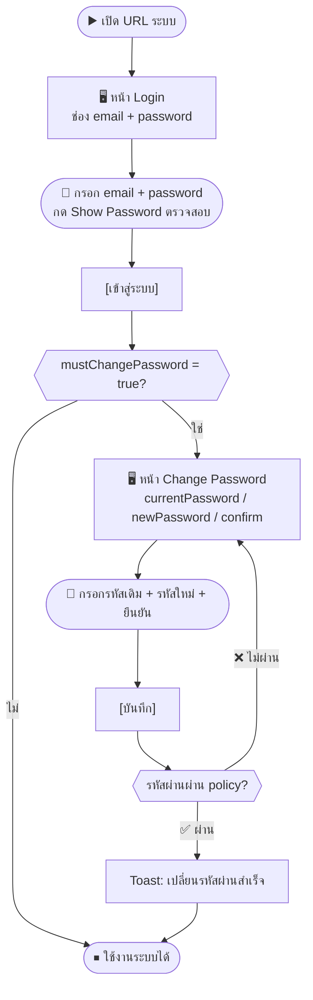
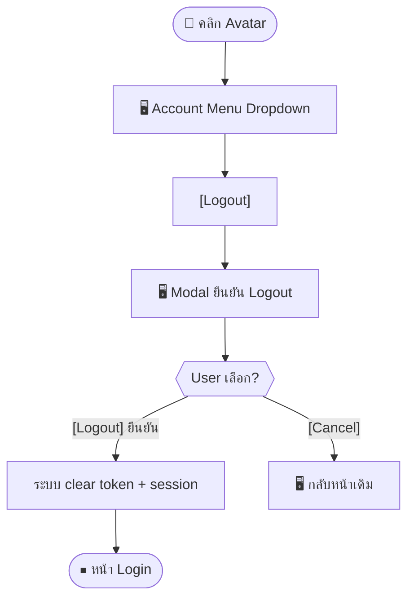

# SCN-01: Auth — Login / Logout / เปลี่ยนรหัสผ่าน

**Module:** Authentication  
**Actors:** พนักงานทุกบทบาท (`super_admin`, `hr_admin`, `finance_manager`, `pm_manager`, `employee`)  
**อ้างอิง UX Flow:** `Documents/UX_Flow/Functions/R1-01_Auth_Login_and_Session.md`

---

## Scenario 1: พนักงานใหม่เข้าสู่ระบบครั้งแรก (Login + Force Change Password)

**Actor:** พนักงานใหม่ที่ได้รับ credentials จาก Admin  
**Goal:** เข้าระบบแล้วเปลี่ยนรหัสผ่านตามนโยบาย

### Steps

| # | สิ่งที่ User ทำ | ปุ่ม / Control | หน้าจอ / ผลลัพธ์ |
|---|---------------|---------------|-----------------|
| 1 | เปิด browser ไปที่ URL ระบบ | — | หน้า Login แสดงช่องกรอก email และ password |
| 2 | กรอก email ที่ได้รับจาก HR | ช่อง `email` | ระบบ validate รูปแบบ email |
| 3 | กรอก password ชั่วคราวที่ได้รับ | ช่อง `password` | อักขระถูก mask แสดงเป็น *** |
| 4 | กด [Show Password] เพื่อตรวจสอบว่ากรอกถูกต้อง | `[แสดง/ซ่อน Password]` | password แสดงเป็นข้อความตรง |
| 5 | กด [เข้าสู่ระบบ] | `[เข้าสู่ระบบ]` | ระบบส่ง credentials → ตรวจสอบ |
| 6 | ระบบตรวจพบว่า `mustChangePassword = true` | — | redirect ไปหน้า Change Password |
| 7 | กรอก password เดิมในช่อง `currentPassword` | ช่อง `รหัสผ่านปัจจุบัน` | — |
| 8 | กรอก password ใหม่ (≥8 ตัวอักษร) | ช่อง `รหัสผ่านใหม่` | hint ความแข็งแกร่งแสดงขึ้น |
| 9 | กรอก password ใหม่ซ้ำเพื่อยืนยัน | ช่อง `ยืนยันรหัสผ่านใหม่` | ระบบ validate ว่าตรงกัน |
| 10 | กด [บันทึก] | `[บันทึก]` | ระบบบันทึกรหัสผ่านใหม่ → toast "เปลี่ยนรหัสผ่านสำเร็จ" |
| 11 | ระบบ redirect ไปหน้าแรกตาม role | — | เห็น Dashboard / หน้าแรกของโมดูลที่มีสิทธิ์ |

### Mermaid Flow

**ผลลัพธ์ที่คาดหวัง:** พนักงานสามารถเข้าระบบและใช้งานได้ตาม role ที่กำหนด

---

## Scenario 2: Login ปกติ (Happy Path)

**Actor:** พนักงานที่มีบัญชีและรหัสผ่านครบถ้วน  
**Goal:** เข้าสู่ระบบให้สำเร็จ

### Steps

| # | สิ่งที่ User ทำ | ปุ่ม / Control | หน้าจอ / ผลลัพธ์ |
|---|---------------|---------------|-----------------|
| 1 | เปิดหน้า `/login` | — | หน้า Login |
| 2 | กรอก email | ช่อง `email` | — |
| 3 | กรอก password | ช่อง `password` | — |
| 4 | กด Enter หรือ [เข้าสู่ระบบ] | `[เข้าสู่ระบบ]` หรือ `Enter` | Loading → ระบบตรวจ credential |
| 5 | ระบบ bootstrap `/me` โหลด permissions | — | Skeleton หน้า app |
| 6 | ระบบ redirect ไป landing page ตาม role | — | เห็นเมนูและหน้าแรกตามสิทธิ์ |

**ผลลัพธ์ที่คาดหวัง:** เข้าสู่ระบบสำเร็จใน < 3 วินาที

---

## Scenario 3: Login ไม่สำเร็จ (Wrong Password)

**Actor:** พนักงานที่จำรหัสผ่านไม่ได้  
**Goal:** เข้าใจว่า credentials ผิด และลองใหม่ได้

### Steps

| # | สิ่งที่ User ทำ | ปุ่ม / Control | หน้าจอ / ผลลัพธ์ |
|---|---------------|---------------|-----------------|
| 1 | กรอก email และ password ที่ผิด | — | — |
| 2 | กด [เข้าสู่ระบบ] | `[เข้าสู่ระบบ]` | ระบบแสดง error "รหัสผ่านไม่ถูกต้อง" |
| 3 | ลองใหม่ซ้ำ 5 ครั้ง | `[เข้าสู่ระบบ]` ×5 | ระบบแสดง "บัญชีถูกล็อก กรุณาติดต่อ Admin" |
| 4 | ติดต่อ Admin ให้ reset | — | Admin unlock บัญชีใน Settings |

---

## Scenario 4: Logout

**Actor:** พนักงานที่ใช้งานเสร็จหรือต้องการออกจากระบบ  
**Goal:** ออกจากระบบอย่างปลอดภัย

### Steps

| # | สิ่งที่ User ทำ | ปุ่ม / Control | หน้าจอ / ผลลัพธ์ |
|---|---------------|---------------|-----------------|
| 1 | คลิก avatar / ชื่อผู้ใช้ที่มุมบนขวา | Avatar/Menu | เมนู Account dropdown เปิด |
| 2 | คลิก [Logout] | `[Logout]` | Modal ยืนยัน "ต้องการออกจากระบบ?" |
| 3 | กด [Logout] ยืนยัน | `[Logout]` | ระบบ clear session → redirect ไปหน้า Login |

---

## Scenario 5: เปลี่ยนรหัสผ่านด้วยตนเอง (Self-service)

**Actor:** พนักงานที่ต้องการเปลี่ยนรหัสผ่าน  
**Goal:** เปลี่ยนรหัสผ่านได้โดยไม่ต้องขอ Admin

### Steps

| # | สิ่งที่ User ทำ | ปุ่ม / Control | หน้าจอ / ผลลัพธ์ |
|---|---------------|---------------|-----------------|
| 1 | คลิก Avatar → [Security] หรือ [Profile Settings] | `Avatar > Security` | หน้า Security Settings |
| 2 | กรอก รหัสผ่านปัจจุบัน | ช่อง `currentPassword` | masked input |
| 3 | กรอก รหัสผ่านใหม่ (≥8 ตัว มีตัวเลขและอักขระ) | ช่อง `newPassword` | hint policy แสดง |
| 4 | กรอก รหัสผ่านใหม่อีกครั้ง | ช่อง `confirmPassword` | ระบบตรวจว่าตรงกัน |
| 5 | กด [บันทึก] | `[บันทึก]` | Loading → toast "เปลี่ยนรหัสผ่านสำเร็จ" |

**ผลลัพธ์ที่คาดหวัง:** รหัสผ่านเปลี่ยนสำเร็จ ยังอยู่ใน session เดิม (หรือ login ใหม่ตาม policy)

---

## Scenario 6: Session หมดอายุขณะใช้งาน (Silent Refresh)

**Actor:** พนักงานที่ใช้งานนานจนกว่า access token จะหมดอายุ  
**Goal:** ใช้งานได้ต่อเนื่องโดยไม่ต้อง login ใหม่

### Steps

| # | สิ่งที่ User ทำ | ปุ่ม / Control | หน้าจอ / ผลลัพธ์ |
|---|---------------|---------------|-----------------|
| 1 | กด action บางอย่าง (เช่น บันทึก หรือ โหลดข้อมูล) | ปุ่มใดก็ได้ | ระบบพบว่า token หมดอายุ → spinner สั้น ๆ |
| 2 | ระบบทำ silent refresh โดยอัตโนมัติ | — | request เดิมถูก retry → ผลลัพธ์ปกติ |
| 3 | ใช้งานต่อได้ตามปกติ | — | ไม่มีการ interrupt |

**หมายเหตุ:** ถ้า refresh token หมดอายุด้วย → redirect `/login?reason=expired` พร้อม banner แจ้ง
