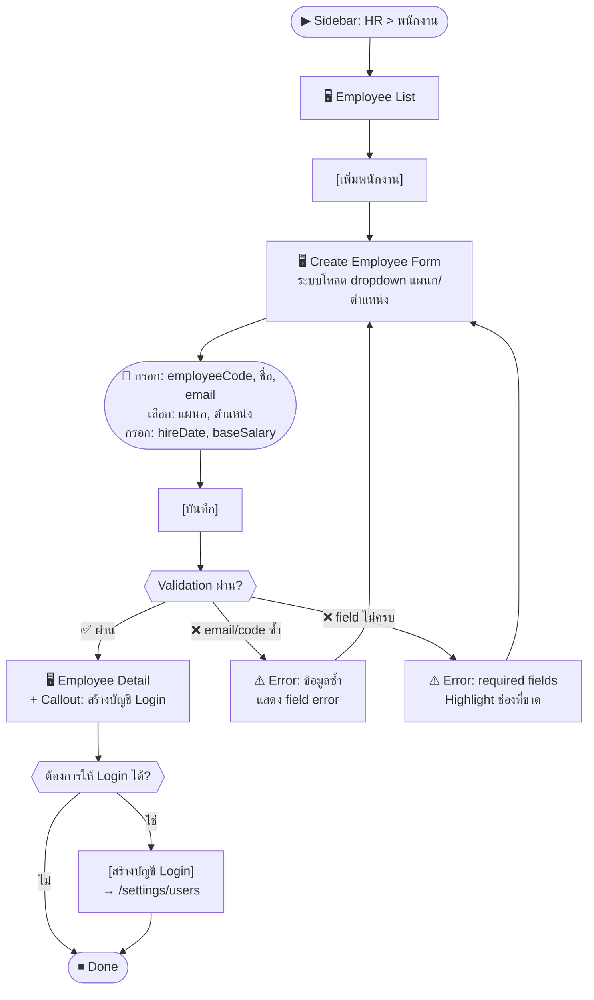
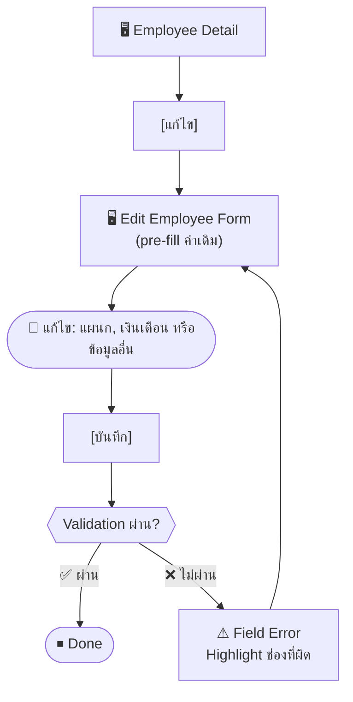
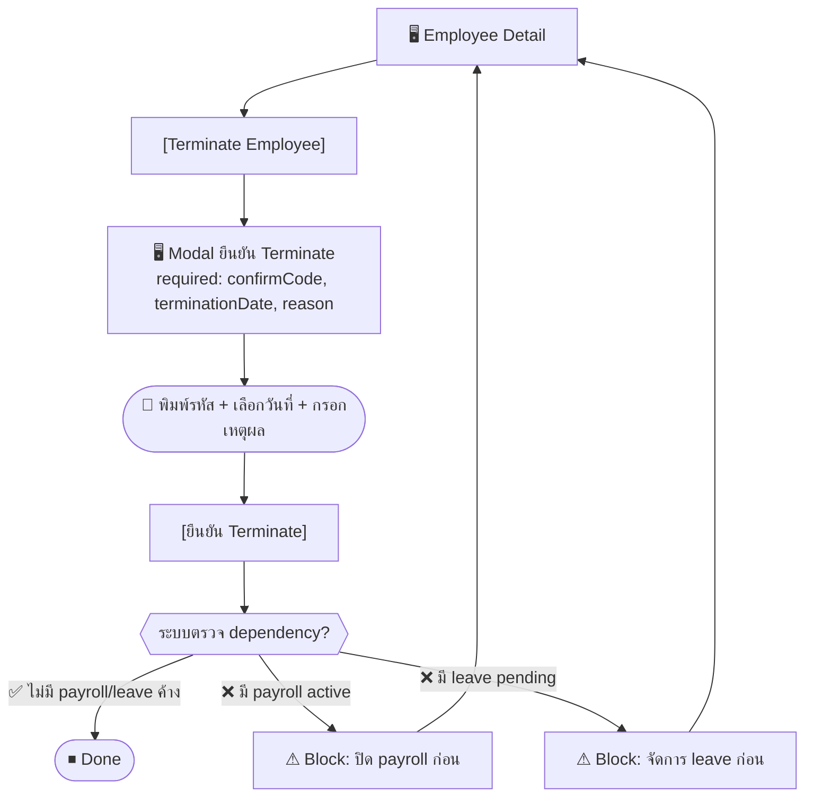

# SCN-02: HR Employee Management — เพิ่ม / แก้ไข / Terminate พนักงาน

**Module:** HR — Employee Management  
**Actors:** `hr_admin`, `super_admin` (CRUD), `employee` (ดูโปรไฟล์ตนเอง)  
**อ้างอิง UX Flow:** `Documents/UX_Flow/Functions/R1-02_HR_Employee_Management.md`

---

## Scenario 1: เพิ่มพนักงานใหม่เมื่อมีพนักงานเข้าใหม่

**Actor:** `hr_admin`  
**Goal:** บันทึกข้อมูลพนักงานที่เพิ่งรับเข้าทำงานในระบบ

### Steps

| # | สิ่งที่ User ทำ | ปุ่ม / Control | หน้าจอ / ผลลัพธ์ |
|---|---------------|---------------|-----------------|
| 1 | คลิกเมนู **HR** → **พนักงาน** | Sidebar: `HR > พนักงาน` | หน้า Employee List โหลดรายการ |
| 2 | คลิกปุ่ม [เพิ่มพนักงาน] | `[เพิ่มพนักงาน]` | หน้า Create Employee Form เปิด |
| 3 | ระบบโหลด dropdown แผนกและตำแหน่ง | — | Dropdown `แผนก` และ `ตำแหน่ง` พร้อมใช้งาน |
| 4 | กรอก **รหัสพนักงาน** (เช่น EMP-0042) | ช่อง `employeeCode` (required) | — |
| 5 | กรอก **ชื่อ** และ **นามสกุล** | ช่อง `firstName`, `lastName` (required) | — |
| 6 | กรอก **email** ของพนักงาน | ช่อง `email` (required) | ระบบตรวจรูปแบบ email |
| 7 | เลือก **แผนก** จาก dropdown | Dropdown `departmentId` (required) | ตัวเลือกแผนกทั้งหมดที่มีในระบบ |
| 8 | เลือก **ตำแหน่ง** จาก dropdown | Dropdown `positionId` (required) | ตัวเลือกตำแหน่งที่มีในระบบ |
| 9 | เลือก **วันเริ่มงาน** | Date picker `hireDate` (required) | ปฏิทินเปิดให้เลือกวันที่ |
| 10 | กรอก **เงินเดือนฐาน** | ช่อง `baseSalary` | ตัวเลข format สกุลเงิน |
| 11 | กรอกข้อมูลเพิ่มเติม (เลขบัตร, ที่อยู่, เบอร์โทร) | ช่องอื่น ๆ | — |
| 12 | กด [บันทึก] | `[บันทึก]` | Loading → ระบบสร้างพนักงาน → navigate ไปหน้า Employee Detail |
| 13 | เห็น callout แนะนำให้สร้างบัญชี Login | — | "ต้องการให้พนักงานนี้ login ได้? ไป Settings > Users" |
| 14 | (ทางเลือก) คลิกลิงก์ไป Settings เพื่อสร้าง User Account | `[สร้างบัญชี Login]` | redirect ไป `/settings/users?employeeId=<id>` |

### Mermaid Flow

**ผลลัพธ์ที่คาดหวัง:** ข้อมูลพนักงานถูกบันทึกในระบบ สามารถปรากฏใน payroll, leave และ reports ได้

---

## Scenario 2: ดูรายการและค้นหาพนักงาน

**Actor:** `hr_admin`  
**Goal:** หาพนักงานที่ต้องการจาก list

### Steps

| # | สิ่งที่ User ทำ | ปุ่ม / Control | หน้าจอ / ผลลัพธ์ |
|---|---------------|---------------|-----------------|
| 1 | เข้าเมนู HR → พนักงาน | Sidebar | Employee List โหลด |
| 2 | พิมพ์ชื่อหรือรหัสพนักงานในช่องค้นหา | ช่อง `search` | รายการ filter ตาม keyword (debounce) |
| 3 | เลือก filter แผนก | Dropdown `departmentId` | รายการแสดงเฉพาะแผนกที่เลือก |
| 4 | เลือก filter สถานะ = `active` | Dropdown `status` | แสดงเฉพาะพนักงานที่ active |
| 5 | กด [Apply Filters] หรือ Enter | `[Apply Filters]` | รายการ refresh ตามเงื่อนไข |
| 6 | คลิกแถวพนักงานที่ต้องการ | คลิกแถว | navigate ไปหน้า Employee Detail |
| 7 | (ทางเลือก) กด [Clear Filters] เพื่อล้างเงื่อนไข | `[Clear Filters]` | รายการกลับเป็นทั้งหมด |

---

## Scenario 3: แก้ไขข้อมูลพนักงาน (เช่น เปลี่ยนแผนก / ปรับเงินเดือน)

**Actor:** `hr_admin`  
**Goal:** อัปเดตข้อมูลพนักงานที่เปลี่ยนแปลง เช่น โยกย้ายแผนก

### Steps

| # | สิ่งที่ User ทำ | ปุ่ม / Control | หน้าจอ / ผลลัพธ์ |
|---|---------------|---------------|-----------------|
| 1 | เปิด Employee Detail ของพนักงานที่ต้องการ | คลิกแถวใน List | Employee Detail |
| 2 | คลิก [แก้ไข] | `[แก้ไข]` | หน้า Edit Employee Form — ค่าเดิม pre-fill ครบ |
| 3 | เปลี่ยน Dropdown แผนก | Dropdown `departmentId` | เลือกแผนกใหม่ |
| 4 | แก้ไขเงินเดือนฐาน | ช่อง `baseSalary` | ปรับตัวเลข |
| 5 | กด [บันทึก] | `[บันทึก]` | Loading → ระบบ PATCH → toast "แก้ไขสำเร็จ" |
| 6 | กลับไปหน้า Employee Detail | — | ข้อมูลล่าสุดแสดงทันที |

---

## Scenario 4: Terminate พนักงานที่ลาออก

**Actor:** `hr_admin`  
**Goal:** เปลี่ยนสถานะพนักงานเป็น terminated พร้อมวันที่และเหตุผล

### Steps

| # | สิ่งที่ User ทำ | ปุ่ม / Control | หน้าจอ / ผลลัพธ์ |
|---|---------------|---------------|-----------------|
| 1 | เปิด Employee Detail ของพนักงานที่จะ terminate | คลิกแถว | Employee Detail |
| 2 | คลิก [Terminate Employee] | `[Terminate Employee]` | Modal ยืนยันการ terminate เปิด |
| 3 | พิมพ์รหัสพนักงานเพื่อยืนยัน | ช่อง `confirmEmployeeCode` (required) | ปุ่มยืนยัน enable เมื่อพิมพ์ถูกต้อง |
| 4 | เลือกวันที่มีผล | Date picker `terminationDate` (required) | ปฏิทินเปิด |
| 5 | เลือกหรือกรอกเหตุผล | ช่อง `reason` (required) | เช่น "ลาออก", "สิ้นสุดสัญญา" |
| 6 | กด [ยืนยัน Terminate] | `[ยืนยัน Terminate]` | Loading → ระบบ DELETE → toast "Terminate สำเร็จ" |
| 7 | กลับหน้า Employee List | — | พนักงานแสดงสถานะ `terminated` |

**ผลลัพธ์ที่คาดหวัง:** สถานะเปลี่ยนเป็น `terminated`, `endDate` ถูกบันทึก, พนักงานไม่ปรากฏใน payroll รอบถัดไป

---

## Scenario 5: พนักงานดูโปรไฟล์ของตนเอง

**Actor:** `employee`  
**Goal:** ดูข้อมูลส่วนตัว แผนก ตำแหน่ง และเงินเดือนของตนเอง

### Steps

| # | สิ่งที่ User ทำ | ปุ่ม / Control | หน้าจอ / ผลลัพธ์ |
|---|---------------|---------------|-----------------|
| 1 | คลิก Avatar → [โปรไฟล์ของฉัน] | `Avatar > My Profile` | ระบบโหลด `GET /api/hr/employees/me` |
| 2 | เห็นข้อมูลส่วนตัว ตำแหน่ง แผนก | — | ข้อมูลครบถ้วน (บางฟิลด์อาจ mask เช่น เลขบัญชี) |
| 3 | กด [Refresh Profile] ถ้าต้องการดูข้อมูลล่าสุด | `[Refresh Profile]` | โหลดข้อมูลใหม่จาก API |
