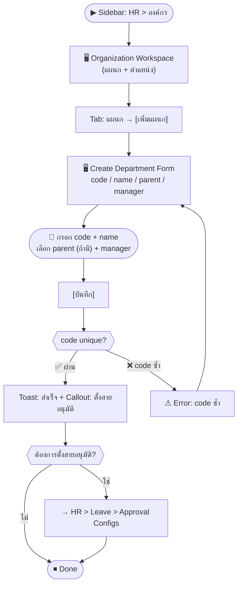
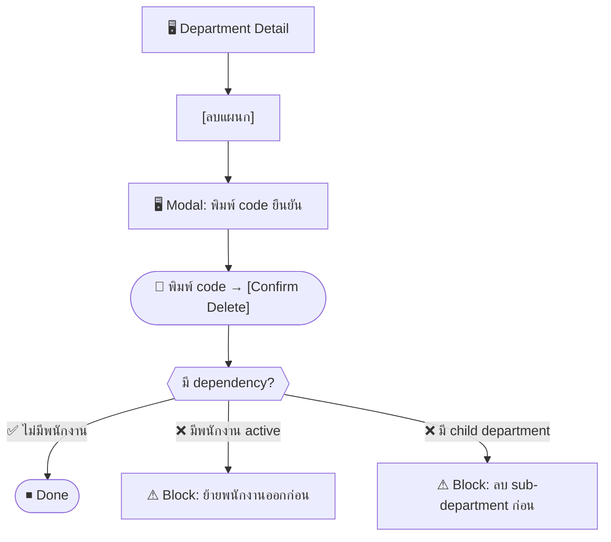

# SCN-03: HR Organization — จัดการแผนกและตำแหน่ง

**Module:** HR — Organization Management  
**Actors:** `hr_admin`, `super_admin`  
**อ้างอิง UX Flow:** `Documents/UX_Flow/Functions/R1-03_HR_Organization_Management.md`

---

## Scenario 1: เพิ่มแผนกใหม่ (เช่น เปิดแผนก IT ใหม่)

**Actor:** `hr_admin`  
**Goal:** สร้างแผนกใหม่ให้พร้อมรองรับพนักงาน

### Steps

| # | สิ่งที่ User ทำ | ปุ่ม / Control | หน้าจอ / ผลลัพธ์ |
|---|---------------|---------------|-----------------|
| 1 | คลิกเมนู **HR** → **องค์กร** | Sidebar: `HR > องค์กร` | หน้า Organization Workspace โหลด แสดงรายการแผนกและตำแหน่ง |
| 2 | คลิก tab **แผนก** | Tab `แผนก` | ตารางรายการแผนกทั้งหมด |
| 3 | คลิก [เพิ่มแผนก] | `[เพิ่มแผนก]` | ฟอร์มสร้างแผนกเปิด |
| 4 | กรอก **รหัสแผนก** (unique, ใช้ตัวพิมพ์ใหญ่) | ช่อง `code` (required) | เช่น `IT` |
| 5 | กรอก **ชื่อแผนก** | ช่อง `name` (required) | เช่น `Information Technology` |
| 6 | เลือก **แผนกแม่** (ถ้ามี) | Dropdown `parentDepartmentId` (optional) | เช่น สังกัด Operations |
| 7 | เลือก **ผู้จัดการแผนก** | Dropdown `managerId` (optional) | แสดงรายชื่อพนักงาน active |
| 8 | กด [บันทึก] | `[บันทึก]` | Loading → สร้างสำเร็จ → toast "เพิ่มแผนกสำเร็จ" |
| 9 | ระบบแนะนำให้ตั้งค่าสายอนุมัติการลา | — | callout: "ตั้งค่าสายอนุมัติการลาสำหรับแผนกนี้" |
| 10 | คลิกลิงก์ไปตั้งค่าสายอนุมัติ | `[ตั้งค่าสายอนุมัติ]` | navigate ไป HR > Leave > Approval Configs |

### Mermaid Flow

**ผลลัพธ์ที่คาดหวัง:** แผนกใหม่ปรากฏใน dropdown เมื่อเพิ่มพนักงาน, สามารถตั้ง leave approval chain ได้

---

## Scenario 2: แก้ไขแผนก (เช่น เปลี่ยนชื่อหรือผู้จัดการ)

**Actor:** `hr_admin`  
**Goal:** อัปเดตข้อมูลแผนกที่เปลี่ยนแปลง

### Steps

| # | สิ่งที่ User ทำ | ปุ่ม / Control | หน้าจอ / ผลลัพธ์ |
|---|---------------|---------------|-----------------|
| 1 | เข้าหน้า Organization → tab แผนก | — | ตารางแผนก |
| 2 | คลิกแถวแผนกที่ต้องการแก้ไข | คลิกแถว | Department Detail |
| 3 | คลิก [แก้ไข] | `[แก้ไข]` | Edit Form พร้อม pre-fill ค่าเดิม |
| 4 | แก้ไขชื่อแผนกหรือเปลี่ยนผู้จัดการ | ช่อง `name`, `managerId` | — |
| 5 | กด [บันทึก] | `[บันทึก]` | toast "แก้ไขสำเร็จ" |

---

## Scenario 3: ลบแผนกที่ไม่ใช้งาน

**Actor:** `hr_admin`  
**Goal:** ลบแผนกที่ยุบหรือไม่มีพนักงานแล้ว

### Steps

| # | สิ่งที่ User ทำ | ปุ่ม / Control | หน้าจอ / ผลลัพธ์ |
|---|---------------|---------------|-----------------|
| 1 | เปิด Department Detail | คลิกแถว | Department Detail |
| 2 | คลิก [ลบแผนก] | `[ลบแผนก]` | Modal ยืนยัน: "พิมพ์ code แผนกเพื่อยืนยัน" |
| 3 | พิมพ์ code แผนก | ช่อง `confirmDepartmentCode` | — |
| 4 | กด [Confirm Delete] | `[Confirm Delete]` | ระบบตรวจ dependency |
| 5a | (สำเร็จ) ระบบลบและ refresh list | — | แผนกหายจาก list |
| 5b | (ล้มเหลว) มีพนักงาน active อยู่ | — | ⚠ Error: "ย้ายพนักงานออกจากแผนกก่อน" |

---

## Scenario 4: เพิ่มตำแหน่งงานใหม่

**Actor:** `hr_admin`  
**Goal:** สร้างตำแหน่งงานใหม่ให้พร้อมกำหนดให้พนักงาน

### Steps

| # | สิ่งที่ User ทำ | ปุ่ม / Control | หน้าจอ / ผลลัพธ์ |
|---|---------------|---------------|-----------------|
| 1 | เข้าหน้า Organization → tab **ตำแหน่ง** | Tab `ตำแหน่ง` | ตารางตำแหน่งทั้งหมด |
| 2 | คลิก [เพิ่มตำแหน่ง] | `[เพิ่มตำแหน่ง]` | ฟอร์มสร้างตำแหน่งเปิด |
| 3 | กรอก **รหัสตำแหน่ง** | ช่อง `code` (required) | เช่น `DEV-SE` |
| 4 | กรอก **ชื่อตำแหน่ง** | ช่อง `name` (required) | เช่น `Software Engineer` |
| 5 | กรอก **ระดับตำแหน่ง** (optional) | ช่อง `level` | เช่น `3` |
| 6 | กด [บันทึก] | `[บันทึก]` | สร้างสำเร็จ → ตำแหน่งพร้อมใช้ใน Employee Form |

---

## Scenario 5: ค้นหาและดูรายละเอียดตำแหน่ง

**Actor:** `hr_admin`  
**Goal:** ตรวจสอบว่ามีตำแหน่งงานใดบ้างก่อนเพิ่มพนักงาน

### Steps

| # | สิ่งที่ User ทำ | ปุ่ม / Control | หน้าจอ / ผลลัพธ์ |
|---|---------------|---------------|-----------------|
| 1 | เข้า Organization → tab ตำแหน่ง | — | Position List |
| 2 | พิมพ์ชื่อหรือ code ในช่องค้นหา | ช่อง `search` | รายการ filter |
| 3 | คลิกแถวตำแหน่งที่ต้องการดู | คลิกแถว | Position Detail |
| 4 | เห็น code, name, level และพนักงานที่ดำรงตำแหน่งนี้ | — | รายละเอียดครบ |
| 5 | (ทางเลือก) คลิก [แก้ไข] หรือ [ลบ] | `[แก้ไข]`/`[ลบ]` | Edit form หรือ modal ยืนยันลบ |
