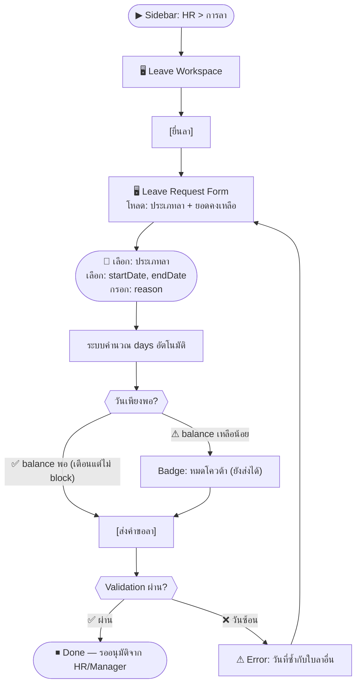
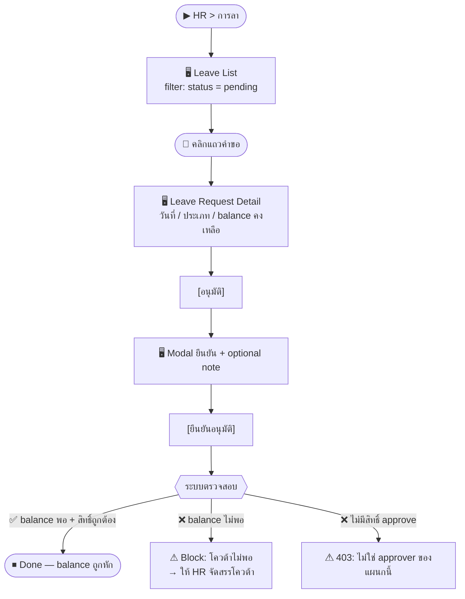

# SCN-04: HR Leave Management — ยื่นลา / อนุมัติ / ปฏิเสธ

**Module:** HR — Leave Management  
**Actors:** `employee` (ยื่นลา), `hr_admin`/approver (อนุมัติ/ปฏิเสธ), `hr_admin` (จัดการ master)  
**อ้างอิง UX Flow:** `Documents/UX_Flow/Functions/R1-04_HR_Leave_Management.md`

---

## Scenario 1: พนักงานยื่นใบลาพักร้อน

**Actor:** `employee`  
**Goal:** ยื่นคำขอลาพักร้อนล่วงหน้า

### Steps

| # | สิ่งที่ User ทำ | ปุ่ม / Control | หน้าจอ / ผลลัพธ์ |
|---|---------------|---------------|-----------------|
| 1 | คลิกเมนู **HR** → **การลา** | Sidebar: `HR > การลา` | หน้า Leave Workspace โหลด |
| 2 | คลิก [ยื่นลา] | `[ยื่นลา]` | ฟอร์มขอลาเปิด พร้อม dropdown ประเภทลา |
| 3 | ระบบโหลดประเภทลาและยอดคงเหลือ | — | Dropdown ประเภทลาพร้อม badge "เหลือ X วัน" |
| 4 | เลือก **ประเภทลา** = "ลาพักร้อน" | Dropdown `leaveTypeId` (required) | แสดง "คงเหลือ: 8 วัน" ใต้ dropdown |
| 5 | เลือก **วันเริ่มลา** | Date picker `startDate` (required) | ปฏิทินเปิด |
| 6 | เลือก **วันสิ้นสุดลา** | Date picker `endDate` (required) | ระบบคำนวณ `days` อัตโนมัติ |
| 7 | ตรวจสอบ **จำนวนวัน** ที่คำนวณอัตโนมัติ | ช่อง `days` (read-only) | แสดง "3 วัน" |
| 8 | กรอก **เหตุผล** (optional กรณีทั่วไป) | ช่อง `reason` | เช่น "ท่องเที่ยวครอบครัว" |
| 9 | กด [ส่งคำขอลา] | `[ส่งคำขอลา]` | Loading → สร้างสำเร็จ |
| 10 | ระบบแสดงสถานะ "รออนุมัติ" | — | คำขอปรากฏในรายการพร้อม status `pending` |

### Mermaid Flow

**ผลลัพธ์ที่คาดหวัง:** คำขอสถานะ `pending` ปรากฏใน list, approver ได้รับแจ้งเตือน (ถ้าตั้ง notification ไว้)

---

## Scenario 2: HR อนุมัติคำขอลา

**Actor:** `hr_admin` หรือ Manager ตาม approval chain  
**Goal:** ตรวจสอบและอนุมัติคำขอลาพนักงาน

### Steps

| # | สิ่งที่ User ทำ | ปุ่ม / Control | หน้าจอ / ผลลัพธ์ |
|---|---------------|---------------|-----------------|
| 1 | เข้าเมนู HR → การลา | Sidebar | Leave Workspace |
| 2 | กรอง filter: สถานะ = `pending` | Dropdown `status = pending` | แสดงเฉพาะคำขอที่รออนุมัติ |
| 3 | คลิกแถวคำขอที่ต้องการตรวจสอบ | คลิกแถว | Leave Request Detail |
| 4 | ตรวจสอบรายละเอียด: วันที่, ประเภท, เหตุผล, **ยอดคงเหลือ** | — | เห็น "balance คงเหลือ: 8 วัน" |
| 5 | ตรวจสอบว่าไม่ชนกับพนักงานคนอื่นในแผนก | — | (ถ้า UI มี calendar view) |
| 6 | คลิก [อนุมัติ] | `[อนุมัติ]` | Modal ยืนยัน: "ต้องการอนุมัติ?" |
| 7 | (optional) กรอกหมายเหตุถึงพนักงาน | ช่อง `approvalNote` | — |
| 8 | กด [ยืนยันอนุมัติ] | `[ยืนยันอนุมัติ]` | Loading → status = `approved` |
| 9 | กลับหน้า list | — | คำขอสถานะเปลี่ยนเป็น `approved` |

---

## Scenario 3: HR ปฏิเสธคำขอลา

**Actor:** `hr_admin` / approver  
**Goal:** ปฏิเสธคำขอลาพร้อมให้เหตุผลชัดเจน

### Steps

| # | สิ่งที่ User ทำ | ปุ่ม / Control | หน้าจอ / ผลลัพธ์ |
|---|---------------|---------------|-----------------|
| 1 | เปิด Leave Request Detail | คลิกแถว | Leave Request Detail |
| 2 | คลิก [ปฏิเสธ] | `[ปฏิเสธ]` | Modal: ต้องกรอกเหตุผล (required) |
| 3 | กรอกเหตุผลการปฏิเสธ | ช่อง `reason` (required, ≥10 ตัวอักษร) | — |
| 4 | กด [ยืนยันปฏิเสธ] | `[ยืนยันปฏิเสธ]` | status = `rejected` พร้อมเหตุผล |
| 5 | พนักงานเห็นสถานะ rejected พร้อมเหตุผล | — | (notification ถ้าตั้งไว้) |

---

## Scenario 4: HR จัดการประเภทการลา (สร้าง/แก้ไข Leave Type)

**Actor:** `hr_admin`  
**Goal:** เพิ่มประเภทลาใหม่ เช่น "ลากิจส่วนตัว" หรือแก้ไขกฎเดิม

### Steps

| # | สิ่งที่ User ทำ | ปุ่ม / Control | หน้าจอ / ผลลัพธ์ |
|---|---------------|---------------|-----------------|
| 1 | เข้า HR > การลา → tab **ประเภทการลา** | Tab `ประเภทการลา` | รายการประเภทลา |
| 2 | คลิก [สร้างประเภทการลา] | `[สร้างประเภทการลา]` | ฟอร์มสร้าง |
| 3 | กรอก **รหัส** | ช่อง `code` (required) | เช่น `PERSONAL` |
| 4 | กรอก **ชื่อประเภทลา** | ช่อง `name` (required) | เช่น `ลากิจส่วนตัว` |
| 5 | เลือก **ได้รับค่าจ้าง** หรือไม่ | Toggle `paidLeave` | ⚠ ถ้า unpaid จะมีผลต่อ payroll |
| 6 | เลือกว่า **ต้องแนบเอกสาร** หรือไม่ | Toggle `requireAttachment` | — |
| 7 | เลือกว่า **ยกยอดได้** หรือไม่ | Toggle `carryOver` | — |
| 8 | กด [บันทึก] | `[บันทึก]` | สร้างประเภทลาสำเร็จ |

---

## Scenario 5: HR ตั้งค่าสายอนุมัติการลาตามแผนก

**Actor:** `hr_admin`  
**Goal:** กำหนดว่าใครเป็น approver ของแต่ละแผนก

### Steps

| # | สิ่งที่ User ทำ | ปุ่ม / Control | หน้าจอ / ผลลัพธ์ |
|---|---------------|---------------|-----------------|
| 1 | เข้า HR > การลา → tab **สายอนุมัติ** | Tab `สายอนุมัติ` | ตาราง approval config ตามแผนก |
| 2 | กรอง filter ตาม `departmentId` | Dropdown `แผนก` | เห็น config ของแผนกนั้น |
| 3 | คลิก [เพิ่มระดับอนุมัติ] | `[เพิ่มระดับอนุมัติ]` | ฟอร์มเปิด |
| 4 | เลือก **แผนก** | Dropdown `departmentId` | — |
| 5 | ระบุ **ระดับการอนุมัติ** (1, 2, 3...) | ช่อง `approverLevel` | — |
| 6 | เลือก **ผู้อนุมัติ** | Dropdown `approverId` (พนักงาน active) | — |
| 7 | กด [บันทึก] | `[บันทึก]` | config ถูกบันทึก |
| 8 | ทำซ้ำสำหรับทุกแผนกที่ต้องการ | — | แต่ละแผนกมี approver chain |

---

## Scenario 6: HR จัดสรรโควต้าการลาประจำปี (Bulk Allocate)

**Actor:** `hr_admin`  
**Goal:** จัดสรรวันลาประจำปีให้พนักงานทุกคนพร้อมกัน

### Steps

| # | สิ่งที่ User ทำ | ปุ่ม / Control | หน้าจอ / ผลลัพธ์ |
|---|---------------|---------------|-----------------|
| 1 | เข้า HR > การลา → tab **โควต้าการลา** | Tab `โควต้าการลา` | ตาราง allocated/used/remaining |
| 2 | เลือก **ปี** ที่ต้องการจัดสรร | Dropdown `year` (required) | — |
| 3 | คลิก [Bulk Allocate] | `[Bulk Allocate]` | ฟอร์ม bulk เปิด |
| 4 | เลือก **ประเภทลา** ที่ต้องการจัดสรร | MultiSelect `leaveTypeIds` | — |
| 5 | เลือก **พนักงาน** เป้าหมาย (ทั้งหมดหรือบางกลุ่ม) | MultiSelect `employeeIds` | — |
| 6 | กรอก **จำนวนวัน** ต่อประเภท | ช่อง `allocated` | เช่น 10 วัน/ปี |
| 7 | กด [Run Bulk Allocation] | `[Run Bulk Allocation]` | Loading → จัดสรรครบทุกคน |
| 8 | ตรวจสอบผลใน table | — | แต่ละพนักงานเห็น `allocated = 10` |
