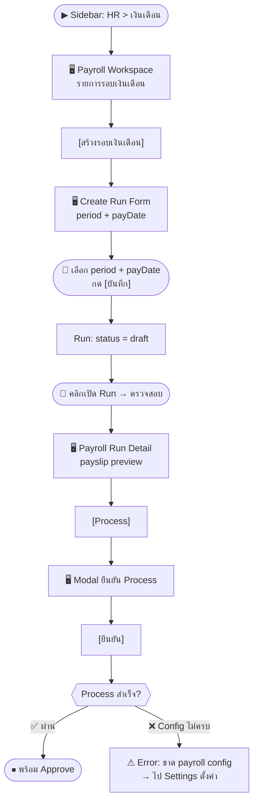
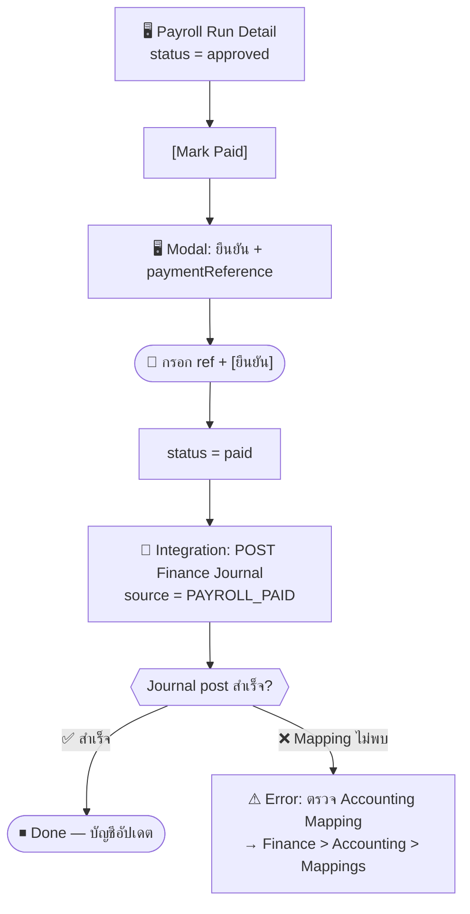

# SCN-05: HR Payroll — รอบเงินเดือน / Process / อนุมัติ / Mark Paid

**Module:** HR — Payroll  
**Actors:** `hr_admin` (สร้าง/process/approve), `finance_manager` (approve/mark-paid), `employee` (ดู payslip)  
**อ้างอิง UX Flow:** `Documents/UX_Flow/Functions/R1-05_HR_Payroll.md`

---

## Scenario 1: สร้างและ Process รอบเงินเดือนประจำเดือน

**Actor:** `hr_admin`  
**Goal:** รันเงินเดือนประจำเดือน April 2026

### Steps

| # | สิ่งที่ User ทำ | ปุ่ม / Control | หน้าจอ / ผลลัพธ์ |
|---|---------------|---------------|-----------------|
| 1 | คลิกเมนู **HR** → **เงินเดือน** | Sidebar: `HR > เงินเดือน` | Payroll Workspace: ตารางรอบเงินเดือน |
| 2 | ตรวจสอบว่า Payroll Settings ครบ (ค่าประกันสังคม, WHT, ค่าเบี้ยเลี้ยง) | `[Payroll Settings]` | หน้า Settings ตรวจสอบ |
| 3 | กลับหน้า Payroll | `[Back]` | Payroll Workspace |
| 4 | คลิก [สร้างรอบเงินเดือน] | `[สร้างรอบเงินเดือน]` | Create Run Form เปิด |
| 5 | เลือก **ช่วงเวลา** (Period) | Date range `period` | เช่น Apr 1–30, 2026 |
| 6 | เลือก **วันจ่าย** | Date picker `payDate` | เช่น May 2, 2026 |
| 7 | กด [บันทึก] | `[บันทึก]` | Run ถูกสร้าง สถานะ `draft` |
| 8 | เปิด Run ที่เพิ่งสร้าง | คลิกแถว | Payroll Run Detail |
| 9 | ตรวจสอบพนักงานที่จะประมวลผล | — | ตาราง payslip preview |
| 10 | คลิก [Process] | `[Process]` | Modal ยืนยัน: "ต้องการ process?" |
| 11 | กด [ยืนยัน Process] | `[ยืนยัน Process]` | Loading → ระบบคำนวณ payslip ทุกคน |
| 12 | ระบบคำนวณ: base salary, SS, WHT, unpaid leave deduction | — | สถานะเปลี่ยนเป็น `processed` |
| 13 | ตรวจสอบ payslip summary และ totals | — | เห็นยอดรวม net pay ทั้งหมด |

### Mermaid Flow

---

## Scenario 2: Approve รอบเงินเดือน

**Actor:** `hr_admin` หรือ `finance_manager`  
**Goal:** ตรวจสอบความถูกต้องและ approve รอบเงินเดือน

### Steps

| # | สิ่งที่ User ทำ | ปุ่ม / Control | หน้าจอ / ผลลัพธ์ |
|---|---------------|---------------|-----------------|
| 1 | เปิด Payroll Run ที่สถานะ `processed` | คลิกแถว | Payroll Run Detail |
| 2 | ตรวจสอบ payslips แต่ละคน | — | ดู net pay, deductions, ภาษี |
| 3 | ตรวจสอบ totals: gross, SS, WHT, net | — | Summary section |
| 4 | คลิก [Approve] | `[Approve]` | Modal ยืนยัน |
| 5 | กด [ยืนยัน Approve] | `[ยืนยัน Approve]` | status = `approved` |

---

## Scenario 3: Mark Paid และโพสต์เข้า Finance

**Actor:** `finance_manager`  
**Goal:** ยืนยันว่าจ่ายเงินเดือนออกไปแล้ว และให้ระบบโพสต์ journal เข้าบัญชี

### Steps

| # | สิ่งที่ User ทำ | ปุ่ม / Control | หน้าจอ / ผลลัพธ์ |
|---|---------------|---------------|-----------------|
| 1 | เปิด Payroll Run ที่สถานะ `approved` | คลิกแถว | Payroll Run Detail |
| 2 | กรอก **เลขอ้างอิงการโอน** | ช่อง `paymentReference` (optional) | เช่น เลข bank transfer |
| 3 | คลิก [Mark Paid] | `[Mark Paid]` | Modal ยืนยัน |
| 4 | กด [ยืนยัน] | `[ยืนยัน]` | Loading → status = `paid` |
| 5 | ระบบ trigger integration ไป Finance | — | Journal entry ถูกสร้างใน Finance Accounting |
| 6 | ตรวจสอบ Finance Journal | Sidebar: `Finance > บัญชี > Journal` | เห็น journal source = `PAYROLL` |

---

## Scenario 4: พนักงานดูและ Download Payslip

**Actor:** `employee`  
**Goal:** ตรวจสอบ payslip ประจำเดือนของตนเอง

### Steps

| # | สิ่งที่ User ทำ | ปุ่ม / Control | หน้าจอ / ผลลัพธ์ |
|---|---------------|---------------|-----------------|
| 1 | เข้าเมนู HR → เงินเดือน → **Payslips** | Sidebar หรือ sub-tab | รายการ payslip ของตนเอง |
| 2 | เลือกเดือนที่ต้องการ | Filter `period` | payslip ของเดือนนั้น |
| 3 | คลิก [ดู Payslip] | `[ดู Payslip]` | หน้า Payslip Detail: gross, deductions, net |
| 4 | คลิก [Export PDF] | `[Export PDF]` | ดาวน์โหลดไฟล์ PDF |

---

## Scenario 5: ตั้งค่า Payroll Config ก่อนประมวลผล

**Actor:** `hr_admin`  
**Goal:** ตั้งค่าอัตรา SS, WHT และค่าเบี้ยเลี้ยงก่อนรันเงินเดือนครั้งแรก

### Steps

| # | สิ่งที่ User ทำ | ปุ่ม / Control | หน้าจอ / ผลลัพธ์ |
|---|---------------|---------------|-----------------|
| 1 | เข้า HR > เงินเดือน → [Payroll Settings] | `[Payroll Settings]` | หน้า Settings |
| 2 | ตั้งค่า **อัตราประกันสังคม** (%) | ช่อง SS rate | เช่น 5% |
| 3 | ตั้งค่า **อัตราภาษีหัก ณ ที่จ่าย** | ช่อง WHT config | — |
| 4 | เพิ่มประเภทค่าเบี้ยเลี้ยง (allowance types) | `[เพิ่มประเภทเบี้ยเลี้ยง]` | เช่น "ค่าน้ำมัน", "ค่าที่พัก" |
| 5 | กด [บันทึก] | `[บันทึก]` | toast "บันทึกการตั้งค่าสำเร็จ" |
