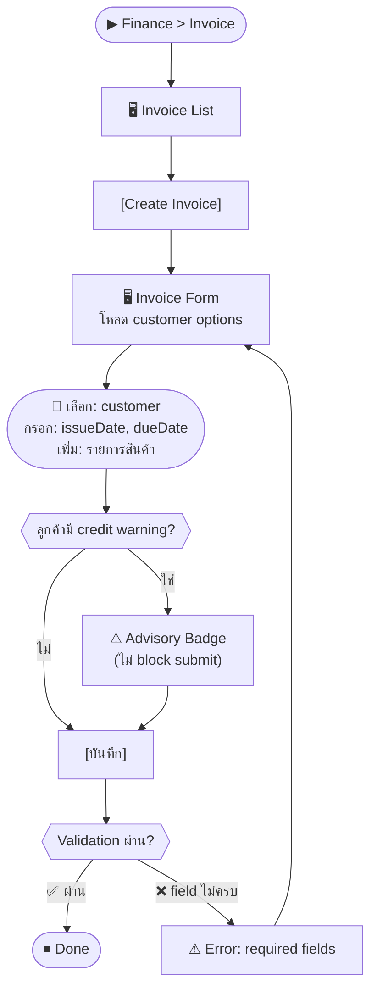

# SCN-06: Finance Invoice AR — ใบแจ้งหนี้ขาย

**Module:** Finance — Invoice (Accounts Receivable)  
**Actors:** `finance_manager`, `super_admin`  
**อ้างอิง UX Flow:** `Documents/UX_Flow/Functions/R1-06_Finance_Invoice_AR.md`

---

## Scenario 1: สร้างใบแจ้งหนี้ให้ลูกค้า

**Actor:** `finance_manager`  
**Goal:** สร้าง invoice สำหรับสินค้า/บริการที่ส่งให้ลูกค้าแล้ว

### Steps

| # | สิ่งที่ User ทำ | ปุ่ม / Control | หน้าจอ / ผลลัพธ์ |
|---|---------------|---------------|-----------------|
| 1 | คลิกเมนู **Finance** → **Invoice** | Sidebar: `Finance > Invoice` | Invoice List |
| 2 | คลิก [สร้าง Invoice] | `[Create Invoice]` | Invoice Form เปิด |
| 3 | ระบบโหลด customer options | — | Dropdown ลูกค้าพร้อมใช้ |
| 4 | เลือก **ลูกค้า** | Dropdown `customerId` (required) | แสดง `code`, `name`, `taxId` ของลูกค้า |
| 5 | ตรวจสอบว่าลูกค้ามี credit warning | — | ⚠ badge "มีใบแจ้งหนี้ค้างชำระ" (advisory) |
| 6 | เลือก **วันที่ออกใบ** | Date picker `issueDate` (required) | วันนี้เป็น default |
| 7 | เลือก **วันครบกำหนด** | Date picker `dueDate` (required) | เช่น 30 วันหลัง issueDate |
| 8 | เพิ่มรายการสินค้า/บริการ | `[เพิ่มรายการ]` | แถวรายการเพิ่ม |
| 9 | กรอก **ชื่อรายการ**, **จำนวน**, **ราคา/หน่วย** | ช่อง `description`, `qty`, `unitPrice` | ระบบคำนวณ subtotal อัตโนมัติ |
| 10 | เพิ่มรายการเพิ่มเติม (ถ้ามี) | `[เพิ่มรายการ]` ×n | รายการเพิ่ม |
| 11 | ตรวจสอบ **ยอด subtotal, VAT, grand total** | — | คำนวณอัตโนมัติ |
| 12 | กรอก **หมายเหตุ** (ถ้ามี) | ช่อง `notes` | — |
| 13 | กด [บันทึก] | `[บันทึก]` | Loading → Invoice ถูกสร้าง → navigate ไป Detail |
| 14 | เห็นเลข Invoice ที่ระบบ generate | — | เช่น `INV-2026-0042` |

### Mermaid Flow

---

## Scenario 2: เปลี่ยนสถานะ Invoice (Draft → Sent → Partially Paid → Paid)

**Actor:** `finance_manager`  
**Goal:** ติดตามสถานะ invoice ตามความเป็นจริง

### Steps

| # | สิ่งที่ User ทำ | ปุ่ม / Control | หน้าจอ / ผลลัพธ์ |
|---|---------------|---------------|-----------------|
| 1 | เปิด Invoice Detail | คลิก Invoice ใน list | Invoice Detail |
| 2 | คลิก [เปลี่ยนสถานะ] → เลือก **Sent** | `[Change Status]` > `Sent` | status = `sent` |
| 3 | (เมื่อลูกค้าชำระบางส่วน) คลิก [บันทึกรับชำระ] | `[Add Payment]` | Payment form เปิด |
| 4 | กรอก **จำนวนที่รับ**, **วันที่รับ**, **วิธีชำระ** | ช่อง `amount`, `paymentDate`, `method` | — |
| 5 | กด [บันทึก] | `[บันทึก]` | status เปลี่ยนเป็น `partially_paid` |
| 6 | เมื่อชำระครบ ทำซ้ำขั้นตอน 3-5 | — | status = `paid` |

---

## Scenario 3: Export Invoice เป็น PDF ส่งลูกค้า

**Actor:** `finance_manager`  
**Goal:** ดาวน์โหลด PDF ของ invoice เพื่อส่งให้ลูกค้า

### Steps

| # | สิ่งที่ User ทำ | ปุ่ม / Control | หน้าจอ / ผลลัพธ์ |
|---|---------------|---------------|-----------------|
| 1 | เปิด Invoice Detail | คลิก Invoice | Invoice Detail |
| 2 | คลิก [Export PDF] | `[Export PDF]` | Loading → ดาวน์โหลด PDF |
| 3 | (ทางเลือก) คลิก [Preview] ก่อน export | `[Preview]` | หน้า preview ใน browser |

---

## Scenario 4: ค้นหาและกรอง Invoice

**Actor:** `finance_manager`  
**Goal:** ค้นหา invoice ค้างชำระที่เลยกำหนด

### Steps

| # | สิ่งที่ User ทำ | ปุ่ม / Control | หน้าจอ / ผลลัพธ์ |
|---|---------------|---------------|-----------------|
| 1 | เข้าหน้า Invoice List | — | Invoice List |
| 2 | กรอง: status = `sent` หรือ `partially_paid` | Dropdown `status` | แสดงเฉพาะที่ยังค้างชำระ |
| 3 | กรอง: วันครบกำหนด < วันนี้ | Date filter `dueDate` | Invoice ที่เลย due date |
| 4 | ค้นหาด้วยชื่อลูกค้าหรือเลข invoice | ช่อง `search` | filter แบบ real-time |
| 5 | คลิกแถว | คลิกแถว | Invoice Detail |
