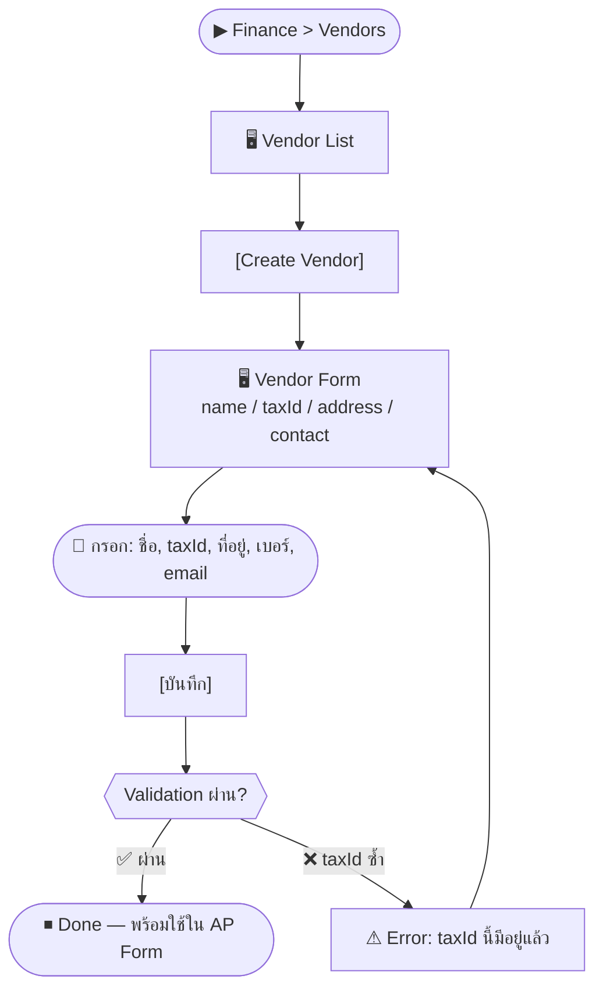

# SCN-07: Finance Vendor Management — จัดการข้อมูลคู่ค้า/ผู้ขาย

**Module:** Finance — Vendor Management  
**Actors:** `finance_manager`, `super_admin`  
**อ้างอิง UX Flow:** `Documents/UX_Flow/Functions/R1-07_Finance_Vendor_Management.md`

---

## Scenario 1: เพิ่มผู้ขายรายใหม่ (Vendor)

**Actor:** `finance_manager`  
**Goal:** บันทึกข้อมูลผู้ขายหรือผู้รับจ้างรายใหม่เข้าระบบ

### Steps

| # | สิ่งที่ User ทำ | ปุ่ม / Control | หน้าจอ / ผลลัพธ์ |
|---|---------------|---------------|-----------------|
| 1 | คลิกเมนู **Finance** → **Vendors** | Sidebar: `Finance > Vendors` | Vendor List |
| 2 | คลิก [เพิ่มผู้ขาย] | `[Create Vendor]` | Vendor Form เปิด |
| 3 | กรอก **ชื่อบริษัท/ผู้ขาย** | ช่อง `name` (required) | — |
| 4 | กรอก **เลขผู้เสียภาษี (Tax ID)** | ช่อง `taxId` | 13 หลัก |
| 5 | กรอก **ที่อยู่** | ช่อง `address` | — |
| 6 | กรอก **เบอร์ติดต่อ** | ช่อง `phone` | — |
| 7 | กรอก **email** | ช่อง `email` | — |
| 8 | กรอก **ประเภทธุรกิจ** | ช่อง/Dropdown `businessType` | — |
| 9 | กด [บันทึก] | `[บันทึก]` | สร้าง Vendor สำเร็จ → Vendor Detail |

### Mermaid Flow

---

## Scenario 2: แก้ไขข้อมูลผู้ขาย

**Actor:** `finance_manager`  
**Goal:** อัปเดตข้อมูลติดต่อผู้ขายที่เปลี่ยนแปลง

### Steps

| # | สิ่งที่ User ทำ | ปุ่ม / Control | หน้าจอ / ผลลัพธ์ |
|---|---------------|---------------|-----------------|
| 1 | ค้นหาผู้ขายใน Vendor List | ช่อง `search` | filter ชื่อหรือ code |
| 2 | คลิกแถวผู้ขาย | คลิกแถว | Vendor Detail |
| 3 | คลิก [แก้ไข] | `[แก้ไข]` | Edit Vendor Form (pre-fill) |
| 4 | แก้ไขข้อมูลที่ต้องการ | ช่องที่เกี่ยวข้อง | — |
| 5 | กด [บันทึก] | `[บันทึก]` | toast "แก้ไขสำเร็จ" |

---

## Scenario 3: สร้างผู้ขายแบบ Inline ขณะสร้าง AP Bill

**Actor:** `finance_manager`  
**Goal:** เพิ่มผู้ขายรายใหม่ได้เลยตอนกรอก AP Bill โดยไม่ต้องออกไปหน้า Vendor

### Steps

| # | สิ่งที่ User ทำ | ปุ่ม / Control | หน้าจอ / ผลลัพธ์ |
|---|---------------|---------------|-----------------|
| 1 | เปิด AP Bill Form | Finance > AP > Create Bill | AP Bill Form |
| 2 | Dropdown ผู้ขาย — ไม่พบผู้ขายที่ต้องการ | Dropdown `vendorId` | — |
| 3 | คลิก [+ เพิ่มผู้ขายใหม่] | `[+ สร้าง Vendor]` ใน dropdown | Inline Vendor Form เปิดใน modal/panel |
| 4 | กรอกข้อมูลพื้นฐาน: ชื่อ, taxId | ช่อง `name`, `taxId` | — |
| 5 | กด [บันทึก Vendor] | `[บันทึก]` | Vendor ถูกสร้าง → ถูกเลือกใน dropdown อัตโนมัติ |
| 6 | กลับไปกรอก AP Bill ต่อ | — | Vendor ID ถูก bind แล้ว |

---

## Scenario 4: ปิดใช้งาน Vendor ที่ไม่ได้ใช้แล้ว

**Actor:** `finance_manager`  
**Goal:** ทำเครื่องหมาย Vendor ว่าไม่ active เพื่อไม่ให้ปรากฏใน dropdown

### Steps

| # | สิ่งที่ User ทำ | ปุ่ม / Control | หน้าจอ / ผลลัพธ์ |
|---|---------------|---------------|-----------------|
| 1 | เปิด Vendor Detail | คลิกแถว | Vendor Detail |
| 2 | Toggle สถานะ | Toggle `isActive` → ปิด | Modal ยืนยัน |
| 3 | กด [ยืนยัน] | `[ยืนยัน]` | Vendor status = inactive |
| 4 | Vendor ไม่ปรากฏใน AP dropdown อีกต่อไป | — | ยกเว้นกรอง `includeInactive=true` |
