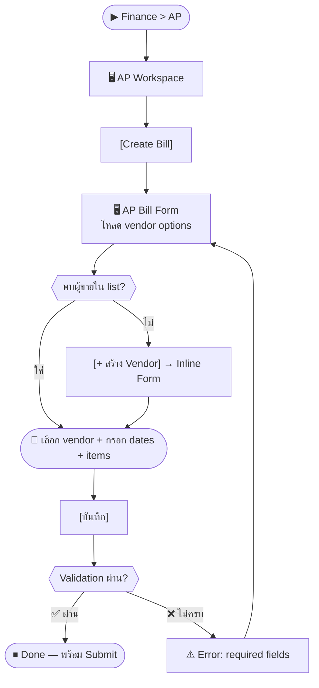
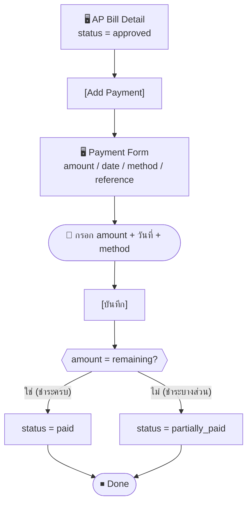

# SCN-08: Finance Accounts Payable — บัญชีเจ้าหนี้ (AP Bills)

**Module:** Finance — Accounts Payable  
**Actors:** `finance_manager`, `super_admin`  
**อ้างอิง UX Flow:** `Documents/UX_Flow/Functions/R1-08_Finance_Accounts_Payable.md`

**State machine:** `draft` → `submitted` → `approved` → `partially_paid` → `paid`  
(หรือ `rejected` จาก submitted/approved)

---

## Scenario 1: สร้างใบแจ้งหนี้ผู้ขาย (AP Bill)

**Actor:** `finance_manager`  
**Goal:** บันทึกค่าใช้จ่ายที่ต้องจ่ายให้ผู้ขาย

### Steps

| # | สิ่งที่ User ทำ | ปุ่ม / Control | หน้าจอ / ผลลัพธ์ |
|---|---------------|---------------|-----------------|
| 1 | คลิกเมนู **Finance** → **AP** | Sidebar: `Finance > AP` | AP Workspace: bill list |
| 2 | คลิก [Create Bill] | `[Create Bill]` | AP Bill Form เปิด |
| 3 | เลือก **ผู้ขาย** | Dropdown `vendorId` (required) | แสดงชื่อ, taxId ของผู้ขาย |
| 4 | (ถ้าไม่พบ) สร้างผู้ขายใหม่แบบ inline | `[+ สร้าง Vendor]` | Inline Vendor Form |
| 5 | กรอก **วันที่ใบแจ้งหนี้** | Date picker `invoiceDate` (required) | — |
| 6 | กรอก **วันครบกำหนดชำระ** | Date picker `dueDate` (required) | — |
| 7 | เพิ่ม **รายการค่าใช้จ่าย** | `[เพิ่มรายการ]` | แถวรายการเพิ่ม |
| 8 | กรอก description, qty, unitPrice ของแต่ละรายการ | ช่อง items | ระบบคำนวณ subtotal |
| 9 | ตรวจสอบ grand total | — | ยอดรวมพร้อม VAT |
| 10 | กด [บันทึก] (สร้างเป็น draft) | `[บันทึก]` | status = `draft` |

### Mermaid Flow

---

## Scenario 2: Submit AP Bill เพื่อขออนุมัติ

**Actor:** `finance_manager`  
**Goal:** ส่ง AP Bill ให้ผู้มีอำนาจอนุมัติตรวจสอบ

### Steps

| # | สิ่งที่ User ทำ | ปุ่ม / Control | หน้าจอ / ผลลัพธ์ |
|---|---------------|---------------|-----------------|
| 1 | เปิด AP Bill Detail (status = draft) | คลิกแถว | AP Bill Detail |
| 2 | ตรวจสอบรายละเอียด | — | header, items, totals |
| 3 | คลิก [Submit] | `[Submit]` | Modal ยืนยัน |
| 4 | กด [ยืนยัน Submit] | `[ยืนยัน]` | status = `submitted` |

---

## Scenario 3: Approve AP Bill

**Actor:** `finance_manager` (หรือผู้มีสิทธิ์ approve)  
**Goal:** อนุมัติค่าใช้จ่ายผู้ขาย

### Steps

| # | สิ่งที่ User ทำ | ปุ่ม / Control | หน้าจอ / ผลลัพธ์ |
|---|---------------|---------------|-----------------|
| 1 | กรอง list: status = `submitted` | Dropdown filter | แสดงเฉพาะที่รออนุมัติ |
| 2 | คลิกแถว AP Bill | คลิกแถว | AP Bill Detail |
| 3 | ตรวจสอบ items, totals, paidAmount, remainingAmount | — | ข้อมูลครบถ้วน |
| 4 | คลิก [Approve] | `[Approve]` | Modal ยืนยัน |
| 5 | กด [ยืนยัน Approve] | `[ยืนยัน]` | status = `approved` |

---

## Scenario 4: บันทึกการชำระเงินให้ผู้ขาย (Partial / Full Payment)

**Actor:** `finance_manager`  
**Goal:** บันทึกว่าจ่ายเงินให้ผู้ขายแล้วบางส่วนหรือทั้งหมด

### Steps

| # | สิ่งที่ User ทำ | ปุ่ม / Control | หน้าจอ / ผลลัพธ์ |
|---|---------------|---------------|-----------------|
| 1 | เปิด AP Bill Detail (status = approved) | คลิกแถว | AP Bill Detail |
| 2 | ดู **remainingAmount** | — | เช่น "คงเหลือ 15,000 บาท" |
| 3 | คลิก [Add Payment] | `[Add Payment]` | Payment form เปิด |
| 4 | กรอก **จำนวนที่จ่าย** | ช่อง `amount` (required) | ≤ remainingAmount |
| 5 | เลือก **วันที่จ่าย** | Date picker `paymentDate` | — |
| 6 | เลือก **วิธีชำระ** | Dropdown `method` | เช่น โอนธนาคาร, เช็ค |
| 7 | กรอก **เลขอ้างอิง** | ช่อง `reference` | เช่น เลข bank transfer |
| 8 | กด [บันทึก Payment] | `[บันทึก]` | payment recorded → status เปลี่ยนตาม |

---

## Scenario 5: Export AP Bill เป็น PDF

**Actor:** `finance_manager`  
**Goal:** พิมพ์หรือส่งเอกสารให้ผู้ขาย

### Steps

| # | สิ่งที่ User ทำ | ปุ่ม / Control | หน้าจอ / ผลลัพธ์ |
|---|---------------|---------------|-----------------|
| 1 | เปิด AP Bill Detail | — | AP Bill Detail |
| 2 | คลิก [Export PDF] | `[Export PDF]` | ดาวน์โหลด PDF ของ AP Bill |
