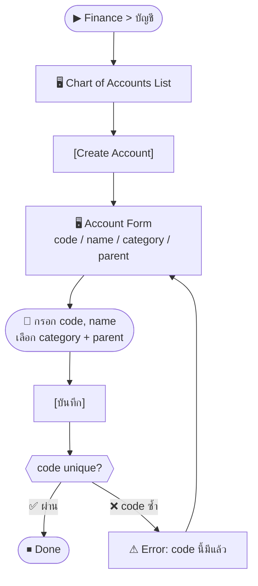
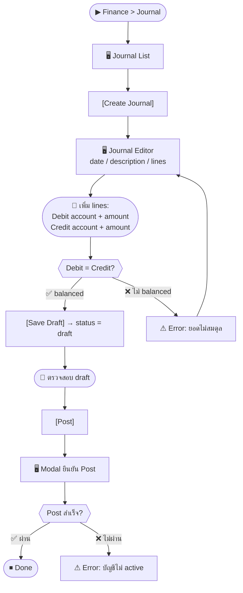

# SCN-09: Finance Accounting Core — ผังบัญชี / Journal / Ledger

**Module:** Finance — Accounting Core  
**Actors:** `finance_manager`, `super_admin`  
**อ้างอิง UX Flow:** `Documents/UX_Flow/Functions/R1-09_Finance_Accounting_Core.md`

---

## Scenario 1: ตั้งค่าผังบัญชี (Chart of Accounts)

**Actor:** `finance_manager`  
**Goal:** เพิ่มบัญชีใหม่เข้าผังบัญชีก่อนเริ่มใช้งานระบบ

### Steps

| # | สิ่งที่ User ทำ | ปุ่ม / Control | หน้าจอ / ผลลัพธ์ |
|---|---------------|---------------|-----------------|
| 1 | คลิกเมนู **Finance** → **บัญชี** | Sidebar: `Finance > บัญชี` | Chart of Accounts List |
| 2 | คลิก [เพิ่มบัญชี] | `[Create Account]` | Account Form เปิด |
| 3 | กรอก **รหัสบัญชี** | ช่อง `code` (required) | เช่น `1101` |
| 4 | กรอก **ชื่อบัญชี** | ช่อง `name` (required) | เช่น `เงินสด` |
| 5 | เลือก **ประเภทบัญชี** | Dropdown `category` | เช่น `asset`, `liability`, `revenue`, `expense` |
| 6 | เลือก **บัญชีแม่** (ถ้ามี) | Dropdown `parentId` | สำหรับบัญชีย่อย |
| 7 | ตั้งค่า `isActive` | Toggle | Active by default |
| 8 | กด [บันทึก] | `[บันทึก]` | บัญชีถูกสร้างและพร้อมใช้ใน Journal |

### Mermaid Flow

---

## Scenario 2: สร้าง Journal Entry แบบ Manual

**Actor:** `finance_manager`  
**Goal:** บันทึกรายการทางบัญชีที่ไม่ได้มาจากโมดูลอื่น (เช่น ค่าเสื่อมราคา)

### Steps

| # | สิ่งที่ User ทำ | ปุ่ม / Control | หน้าจอ / ผลลัพธ์ |
|---|---------------|---------------|-----------------|
| 1 | คลิกเมนู Finance → **Journal** | `Finance > Journal` | Journal List |
| 2 | คลิก [สร้าง Journal] | `[Create Journal]` | Journal Editor เปิด |
| 3 | กรอก **วันที่** | Date picker `date` (required) | — |
| 4 | กรอก **คำอธิบาย** | ช่อง `description` | เช่น "ค่าเสื่อมราคาเครื่องจักร เดือน April" |
| 5 | เพิ่ม **บรรทัดรายการ** บัญชีแรก (Debit) | `[เพิ่มบรรทัด]` | แถวใหม่ |
| 6 | เลือก **Account** (บัญชีค่าเสื่อม) | Dropdown `accountId` | — |
| 7 | กรอก **จำนวน Debit** | ช่อง `debit` | เช่น 5,000 |
| 8 | เพิ่ม **บรรทัดรายการ** บัญชีที่สอง (Credit) | `[เพิ่มบรรทัด]` | แถวใหม่ |
| 9 | เลือก **Account** (สินทรัพย์สะสม) | Dropdown `accountId` | — |
| 10 | กรอก **จำนวน Credit** | ช่อง `credit` | 5,000 |
| 11 | ตรวจสอบว่า **Debit = Credit** | — | ระบบแสดง balance check |
| 12 | กด [บันทึก Draft] | `[Save Draft]` | status = `draft` |
| 13 | ตรวจสอบความถูกต้อง | — | Review lines |
| 14 | กด [Post] เมื่อมั่นใจ | `[Post]` | Modal ยืนยัน |
| 15 | กด [ยืนยัน Post] | `[ยืนยัน]` | status = `posted` (ล็อคไม่ให้แก้) |

---

## Scenario 3: Reverse Journal ที่ Post ไปแล้ว (ผิดพลาด)

**Actor:** `finance_manager`  
**Goal:** ยกเลิกผลของ journal entry ที่ post ไปแล้วอย่างผิดพลาด

### Steps

| # | สิ่งที่ User ทำ | ปุ่ม / Control | หน้าจอ / ผลลัพธ์ |
|---|---------------|---------------|-----------------|
| 1 | ค้นหา Journal ที่ต้องการ reverse | Search หรือกรอง | Journal List |
| 2 | คลิกเปิด Journal Detail | คลิกแถว | Journal Detail (status = posted) |
| 3 | คลิก [Reverse] | `[Reverse]` | Modal: ยืนยันวันที่ reversing entry |
| 4 | เลือกวันที่สำหรับ reversal | Date picker | วันที่ของ reversing journal |
| 5 | กด [ยืนยัน Reverse] | `[ยืนยัน]` | ระบบสร้าง journal คู่ที่ยกเลิกผล |
| 6 | เห็น reversal journal ที่ลิงก์กัน | — | Journal list แสดงทั้งคู่ (original + reversal) |

---

## Scenario 4: ดู Income-Expense Ledger

**Actor:** `finance_manager`  
**Goal:** ตรวจสอบรายรับ-รายจ่ายสะสมตามบัญชี

### Steps

| # | สิ่งที่ User ทำ | ปุ่ม / Control | หน้าจอ / ผลลัพธ์ |
|---|---------------|---------------|-----------------|
| 1 | เข้าเมนู Finance → **Ledger** | `Finance > Ledger` | Income-Expense Ledger |
| 2 | กรอง: ช่วงวันที่ | Date range filter | — |
| 3 | กรอง: account / category | Dropdown | — |
| 4 | ดู summary: รายรับ, รายจ่าย, กำไร/ขาดทุน | — | ตาราง summary |
| 5 | คลิกแถวเพื่อดู journal entries ที่เกี่ยวข้อง | คลิกแถว | รายละเอียด entries |
| 6 | (ทางเลือก) สร้าง manual income/expense entry | `[Create Entry]` | Form เพิ่มรายการ |

---

## Scenario 5: ตรวจสอบ Auto-Post จาก Payroll / PM

**Actor:** `finance_manager`  
**Goal:** ตรวจสอบว่า journal ที่ระบบสร้างอัตโนมัติจาก payroll/PM ถูกต้อง

### Steps

| # | สิ่งที่ User ทำ | ปุ่ม / Control | หน้าจอ / ผลลัพธ์ |
|---|---------------|---------------|-----------------|
| 1 | เปิด Journal List | Finance > Journal | Journal List |
| 2 | กรอง source = `PAYROLL` หรือ `PM_EXPENSE` | Dropdown `source` | แสดงเฉพาะ auto-post |
| 3 | คลิก Journal ที่ต้องการตรวจ | คลิกแถว | Journal Detail + source reference |
| 4 | ตรวจสอบ lines ว่าถูกต้องตาม mapping | — | เห็น debit/credit ตาม account mapping |
| 5 | ถ้า mapping ผิด → คลิก [Fix Mapping] | `[Fix Mapping]` | ไปหน้า Source Mappings แก้ไข |
| 6 | กด [Retry Post] ถ้า post ค้าง | `[Retry Post]` | ลอง post ใหม่ |
