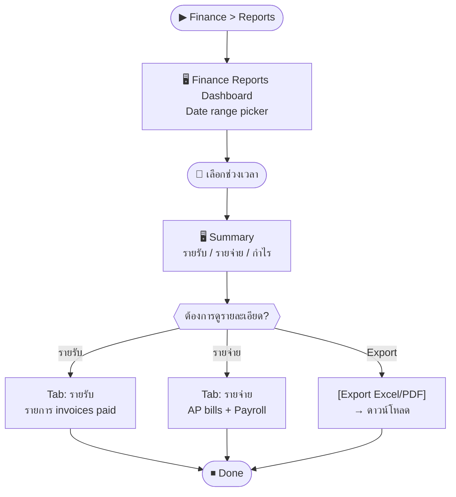

# SCN-10: Finance Reports — รายงานสรุปการเงิน

**Module:** Finance — Reports & Summary  
**Actors:** `finance_manager`, `super_admin`  
**อ้างอิง UX Flow:** `Documents/UX_Flow/Functions/R1-10_Finance_Reports_Summary.md`

---

## Scenario 1: ดูรายงานสรุปรายรับ-รายจ่ายประจำเดือน

**Actor:** `finance_manager`  
**Goal:** ตรวจสอบภาพรวมการเงินประจำเดือน

### Steps

| # | สิ่งที่ User ทำ | ปุ่ม / Control | หน้าจอ / ผลลัพธ์ |
|---|---------------|---------------|-----------------|
| 1 | คลิกเมนู **Finance** → **Reports** | Sidebar: `Finance > Reports` | Finance Reports Dashboard |
| 2 | เลือก **ช่วงเวลา**: เดือน April 2026 | Date range picker | กรอง report ตามช่วง |
| 3 | ดู **Summary Cards**: รายรับ, รายจ่าย, กำไร | — | KPI cards แสดงยอดรวม |
| 4 | คลิกแถบ **รายรับ** เพื่อดูรายละเอียด | Tab `รายรับ` | รายการ invoice ที่ชำระแล้ว |
| 5 | คลิกแถบ **รายจ่าย** | Tab `รายจ่าย` | รายการ AP bill ที่จ่ายแล้ว + payroll |
| 6 | กด [Export Excel] หรือ [Export PDF] | `[Export]` | ดาวน์โหลดรายงาน |

### Mermaid Flow

---

## Scenario 2: ดูรายงาน AR Aging (ลูกหนี้ค้างชำระ)

**Actor:** `finance_manager`  
**Goal:** ติดตามลูกค้าที่ค้างชำระเกินกำหนด

### Steps

| # | สิ่งที่ User ทำ | ปุ่ม / Control | หน้าจอ / ผลลัพธ์ |
|---|---------------|---------------|-----------------|
| 1 | เข้า Finance > Reports → tab **AR Aging** | Tab `AR Aging` | ตาราง aging: 0-30, 31-60, 61-90, 90+ วัน |
| 2 | กรองตามลูกค้า (optional) | Dropdown `customerId` | — |
| 3 | ดูยอดค้างชำระแต่ละ bucket | — | เห็นว่าลูกค้าไหนค้างเท่าไหร่ |
| 4 | คลิกแถวลูกค้า | คลิกแถว | ไป Invoice List กรองตาม customer |

---

## Scenario 3: ดูรายงาน AP Aging (เจ้าหนี้ที่ต้องจ่าย)

**Actor:** `finance_manager`  
**Goal:** วางแผนการจ่ายเงินให้ผู้ขาย

### Steps

| # | สิ่งที่ User ทำ | ปุ่ม / Control | หน้าจอ / ผลลัพธ์ |
|---|---------------|---------------|-----------------|
| 1 | เข้า Finance > Reports → tab **AP Aging** | Tab `AP Aging` | ตาราง aging ฝั่ง AP |
| 2 | เรียงลำดับตาม due date | คลิก column header | เรียง ascending |
| 3 | ดูผู้ขายที่ต้องจ่ายเร็วที่สุด | — | highlight แถวที่เลย due date |
| 4 | คลิกแถวผู้ขาย | คลิกแถว | ไป AP Bill List กรองตาม vendor |

---

## Scenario 4: ดูรายงาน Payroll Summary ประจำเดือน

**Actor:** `finance_manager`  
**Goal:** ดูยอดรวมค่าใช้จ่ายเงินเดือนแต่ละเดือน

### Steps

| # | สิ่งที่ User ทำ | ปุ่ม / Control | หน้าจอ / ผลลัพธ์ |
|---|---------------|---------------|-----------------|
| 1 | เข้า Finance > Reports → tab **Payroll** | Tab `Payroll` | ตาราง payroll runs |
| 2 | เลือกปี / เดือน | Date filter | — |
| 3 | ดู gross pay, SS, WHT, net pay | — | ยอดรวมแต่ละ component |
| 4 | Export เพื่อนำไปยื่นสรรพากร | `[Export]` | Excel/PDF |
