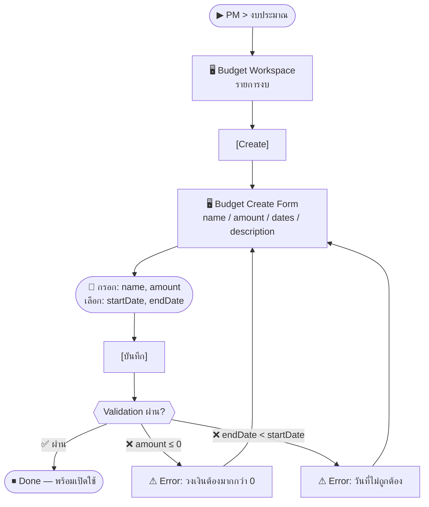

# SCN-11: PM Budget Management — จัดการงบประมาณโครงการ

**Module:** Project Management — Budget  
**Actors:** `pm_manager`, `finance_manager`  
**อ้างอิง UX Flow:** `Documents/UX_Flow/Functions/R1-11_PM_Budget_Management.md`

**Status lifecycle:** `draft` → `active` → `on_hold` / `closed`

---

## Scenario 1: สร้างงบประมาณโครงการใหม่

**Actor:** `pm_manager`  
**Goal:** ตั้งงบประมาณสำหรับโครงการที่เพิ่งได้รับอนุมัติ

### Steps

| # | สิ่งที่ User ทำ | ปุ่ม / Control | หน้าจอ / ผลลัพธ์ |
|---|---------------|---------------|-----------------|
| 1 | คลิกเมนู **PM** → **งบประมาณ** | Sidebar: `PM > งบประมาณ` | Budget Workspace: ตารางงบ |
| 2 | คลิก [สร้างงบ] | `[Create]` | Budget Create Form เปิด |
| 3 | กรอก **ชื่องบประมาณ** | ช่อง `name` (required) | เช่น "โครงการ Digital Transform Q2-2026" |
| 4 | กรอก **วงเงิน** | ช่อง `amount` (required) | เช่น 500,000 บาท |
| 5 | เลือก **วันเริ่มต้น** | Date picker `startDate` | — |
| 6 | เลือก **วันสิ้นสุด** | Date picker `endDate` | — |
| 7 | กรอก **คำอธิบาย** | ช่อง `description` | — |
| 8 | กด [บันทึก] | `[บันทึก]` | สร้าง budget สำเร็จ, status = `draft` |
| 9 | เห็น **budgetCode** ที่ระบบ generate | — | เช่น `BUD-2026-0012` |

### Mermaid Flow

---

## Scenario 2: เปิดใช้งานงบ (Draft → Active)

**Actor:** `pm_manager`  
**Goal:** เปิดงบให้ทีมสามารถเบิกค่าใช้จ่ายได้

### Steps

| # | สิ่งที่ User ทำ | ปุ่ม / Control | หน้าจอ / ผลลัพธ์ |
|---|---------------|---------------|-----------------|
| 1 | เปิด Budget Detail (status = draft) | คลิกแถว | Budget Detail |
| 2 | คลิก [เปลี่ยนสถานะ] → **Active** | `[Change Status]` > `Active` | Modal ยืนยัน |
| 3 | กด [ยืนยัน] | `[ยืนยัน]` | status = `active` |
| 4 | ทีมสามารถสร้าง expense ผูกกับงบนี้ได้ | — | budgetId ปรากฏใน PM Expense Form |

---

## Scenario 3: ดูสรุปการใช้งบประมาณ (Utilization)

**Actor:** `pm_manager`  
**Goal:** ติดตามว่าใช้งบไปเท่าไหร่แล้ว เหลือเท่าไหร่

### Steps

| # | สิ่งที่ User ทำ | ปุ่ม / Control | หน้าจอ / ผลลัพธ์ |
|---|---------------|---------------|-----------------|
| 1 | เปิด Budget Detail | คลิกแถว | Budget Summary |
| 2 | ดู **usedAmount**, **remainingAmount**, **utilizationPct** | — | เช่น "ใช้แล้ว 120,000 / 500,000 (24%)" |
| 3 | เลื่อนดู **รายการค่าใช้จ่ายที่ผูก** | ตาราง linked expenses | รายการ expenses ที่ approved |
| 4 | คลิก expense เพื่อดูรายละเอียด | คลิกแถว | ไป PM Expense Detail |

---

## Scenario 4: ปิดงบประมาณเมื่อโครงการสิ้นสุด

**Actor:** `pm_manager`  
**Goal:** ปิดงบเมื่อโครงการเสร็จสิ้น

### Steps

| # | สิ่งที่ User ทำ | ปุ่ม / Control | หน้าจอ / ผลลัพธ์ |
|---|---------------|---------------|-----------------|
| 1 | เปิด Budget Detail | คลิกแถว | Budget Detail |
| 2 | คลิก [เปลี่ยนสถานะ] → **Closed** | `[Change Status]` > `Closed` | Modal: ยืนยัน |
| 3 | กด [ยืนยัน] | `[ยืนยัน]` | status = `closed` |
| 4 | ไม่สามารถสร้าง expense ใหม่ผูกกับงบนี้ได้ | — | Expense Form: งบนี้ไม่ปรากฏ |

---

## Scenario 5: ลบงบร่าง (Draft)

**Actor:** `pm_manager`  
**Goal:** ลบงบที่ยังไม่ได้เปิดใช้ออก

### Steps

| # | สิ่งที่ User ทำ | ปุ่ม / Control | หน้าจอ / ผลลัพธ์ |
|---|---------------|---------------|-----------------|
| 1 | เปิด Budget Detail (status = draft) | คลิกแถว | Budget Detail |
| 2 | คลิก [ลบ] | `[ลบ]` | Modal ยืนยัน |
| 3 | กด [Confirm Delete] | `[Confirm Delete]` | ระบบตรวจ: ต้องเป็น draft |
| 4a | (สำเร็จ) งบถูกลบ | — | กลับ Budget List |
| 4b | (ล้มเหลว) งบไม่ใช่ draft | — | ⚠ "ลบได้เฉพาะงบที่ยังเป็น draft" |

---

## Scenario 6: ส่ง Budget Adjustment เข้า Finance

**Actor:** `pm_manager` / `finance_manager`  
**Goal:** ส่งการปรับงบเข้าระบบบัญชีเมื่อมีการปรับวงเงิน

### Steps

| # | สิ่งที่ User ทำ | ปุ่ม / Control | หน้าจอ / ผลลัพธ์ |
|---|---------------|---------------|-----------------|
| 1 | เปิด Budget Summary | คลิกแถว | Budget Summary |
| 2 | คลิก [Post Adjustment] | `[Post Adjustment]` | Modal: ยืนยันการส่งเข้า Finance |
| 3 | กด [ยืนยัน] | `[ยืนยัน]` | ระบบสร้าง Journal ใน Finance Accounting |
| 4 | ตรวจสอบ Journal | Finance > Journal | เห็น source = `PM_BUDGET_ADJ` |
