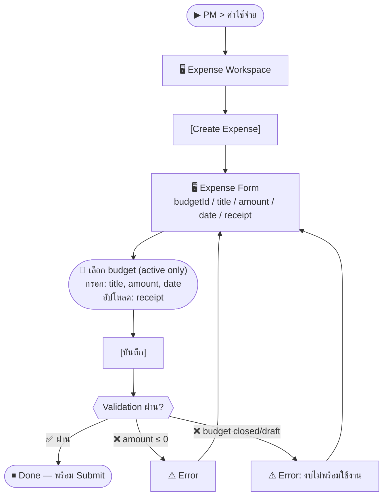
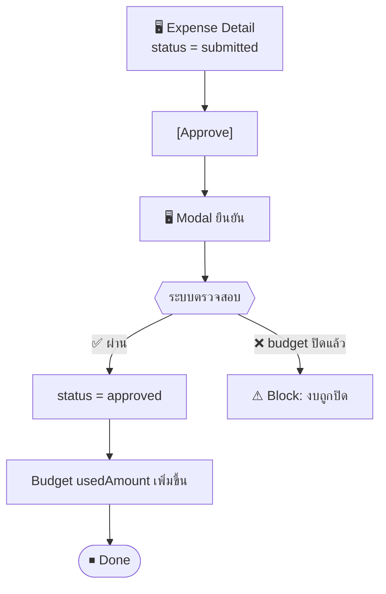

# SCN-12: PM Expense Management — ค่าใช้จ่ายโครงการ

**Module:** Project Management — Expense  
**Actors:** `pm_manager` (สร้าง/จัดการ), `finance_manager` (approve)  
**อ้างอิง UX Flow:** `Documents/UX_Flow/Functions/R1-12_PM_Expense_Management.md`

**Status workflow:** `draft` → `submitted` → `approved` / `rejected`

---

## Scenario 1: สร้างรายการค่าใช้จ่ายโครงการ

**Actor:** `pm_manager`  
**Goal:** บันทึกค่าใช้จ่ายที่เกิดขึ้นในโครงการ และผูกกับงบประมาณ

### Steps

| # | สิ่งที่ User ทำ | ปุ่ม / Control | หน้าจอ / ผลลัพธ์ |
|---|---------------|---------------|-----------------|
| 1 | คลิกเมนู **PM** → **ค่าใช้จ่าย** | Sidebar: `PM > ค่าใช้จ่าย` | Expense Workspace |
| 2 | คลิก [สร้างค่าใช้จ่าย] | `[Create Expense]` | Expense Create Form เปิด |
| 3 | เลือก **งบประมาณ** ที่ผูก | Dropdown `budgetId` (required) | แสดงงบที่ status = `active` เท่านั้น |
| 4 | กรอก **ชื่อรายการ** | ช่อง `title` (required) | เช่น "ค่าเดินทาง Meeting ลูกค้า" |
| 5 | กรอก **จำนวนเงิน** | ช่อง `amount` (required) | เช่น 2,500 บาท |
| 6 | เลือก **วันที่เกิดรายการ** | Date picker `date` (required) | — |
| 7 | อัปโหลด **ใบเสร็จ/หลักฐาน** | `[Upload Receipt]` | ไฟล์ PDF/Image |
| 8 | กด [บันทึก] | `[บันทึก]` | Expense: status = `draft` |

### Mermaid Flow

---

## Scenario 2: Submit Expense เพื่อขออนุมัติ

**Actor:** `pm_manager`  
**Goal:** ส่งรายการค่าใช้จ่ายให้ผู้มีอำนาจอนุมัติ

### Steps

| # | สิ่งที่ User ทำ | ปุ่ม / Control | หน้าจอ / ผลลัพธ์ |
|---|---------------|---------------|-----------------|
| 1 | เปิด Expense Detail (status = draft) | คลิกแถว | Expense Detail |
| 2 | ตรวจสอบข้อมูลครบถ้วน | — | title, amount, receipt, budget |
| 3 | คลิก [Submit] | `[Submit]` | Modal ยืนยัน |
| 4 | กด [ยืนยัน Submit] | `[ยืนยัน]` | status = `submitted` |
| 5 | ระบบแจ้งเตือน finance_manager | — | Notification (ถ้าตั้งค่าไว้) |

---

## Scenario 3: Finance Manager Approve Expense

**Actor:** `finance_manager`  
**Goal:** ตรวจสอบและอนุมัติค่าใช้จ่ายโครงการ

### Steps

| # | สิ่งที่ User ทำ | ปุ่ม / Control | หน้าจอ / ผลลัพธ์ |
|---|---------------|---------------|-----------------|
| 1 | เข้าหน้า PM > ค่าใช้จ่าย | — | Expense List |
| 2 | กรอง: status = `submitted` | Dropdown filter | แสดงเฉพาะที่รออนุมัติ |
| 3 | คลิก Expense ที่ต้องการตรวจ | คลิกแถว | Expense Detail |
| 4 | ตรวจสอบ: ชื่อรายการ, จำนวน, หลักฐาน, งบที่ผูก | — | ดู receipt PDF |
| 5 | คลิก [Approve] | `[Approve]` | Modal ยืนยัน |
| 6 | กด [ยืนยัน Approve] | `[ยืนยัน]` | status = `approved` |
| 7 | ระบบอัปเดต **usedAmount** ของงบที่ผูก | — | Budget: used amount เพิ่มขึ้น |
| 8 | ระบบ trigger integration ไป Finance | — | Journal entry สร้างใน Accounting |

---

## Scenario 4: Reject Expense พร้อมเหตุผล

**Actor:** `finance_manager`  
**Goal:** ปฏิเสธค่าใช้จ่ายที่ไม่เหมาะสม

### Steps

| # | สิ่งที่ User ทำ | ปุ่ม / Control | หน้าจอ / ผลลัพธ์ |
|---|---------------|---------------|-----------------|
| 1 | เปิด Expense Detail (submitted) | คลิกแถว | Expense Detail |
| 2 | คลิก [Reject] | `[Reject]` | Modal: กรอกเหตุผล (required) |
| 3 | กรอกเหตุผลการปฏิเสธ | ช่อง `reason` | — |
| 4 | กด [ยืนยันปฏิเสธ] | `[ยืนยัน]` | status = `rejected` + reason บันทึก |
| 5 | pm_manager เห็นสถานะ rejected + เหตุผล | — | สามารถแก้ไขและ submit ใหม่ได้ |

---

## Scenario 5: ลบ Expense Draft

**Actor:** `pm_manager`  
**Goal:** ลบรายการที่บันทึกผิด

### Steps

| # | สิ่งที่ User ทำ | ปุ่ม / Control | หน้าจอ / ผลลัพธ์ |
|---|---------------|---------------|-----------------|
| 1 | เปิด Expense Detail (draft) | คลิกแถว | Expense Detail |
| 2 | คลิก [ลบ] | `[ลบ]` | Modal ยืนยัน |
| 3 | กด [Confirm Delete] | `[Confirm Delete]` | Expense ถูกลบ → กลับ List |
