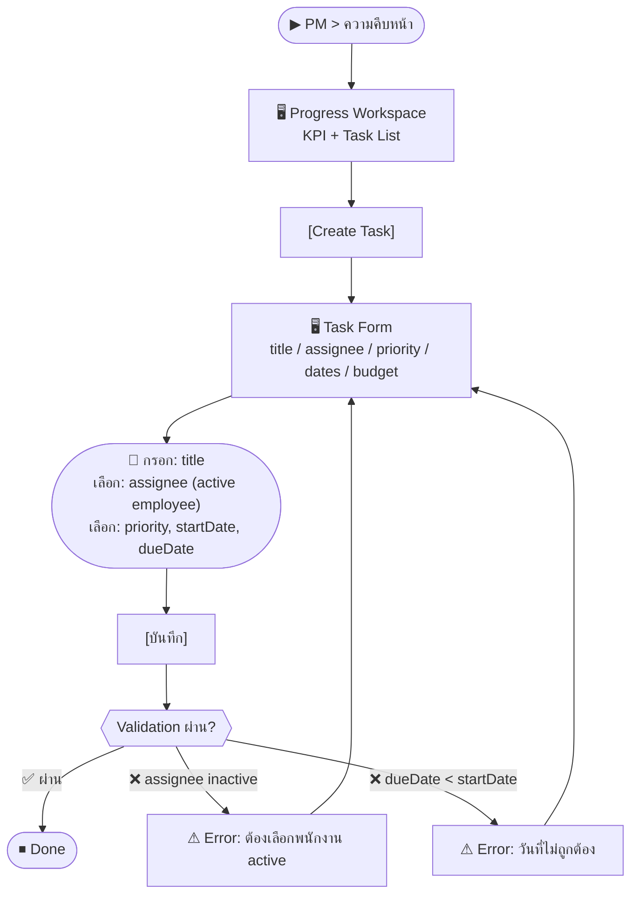
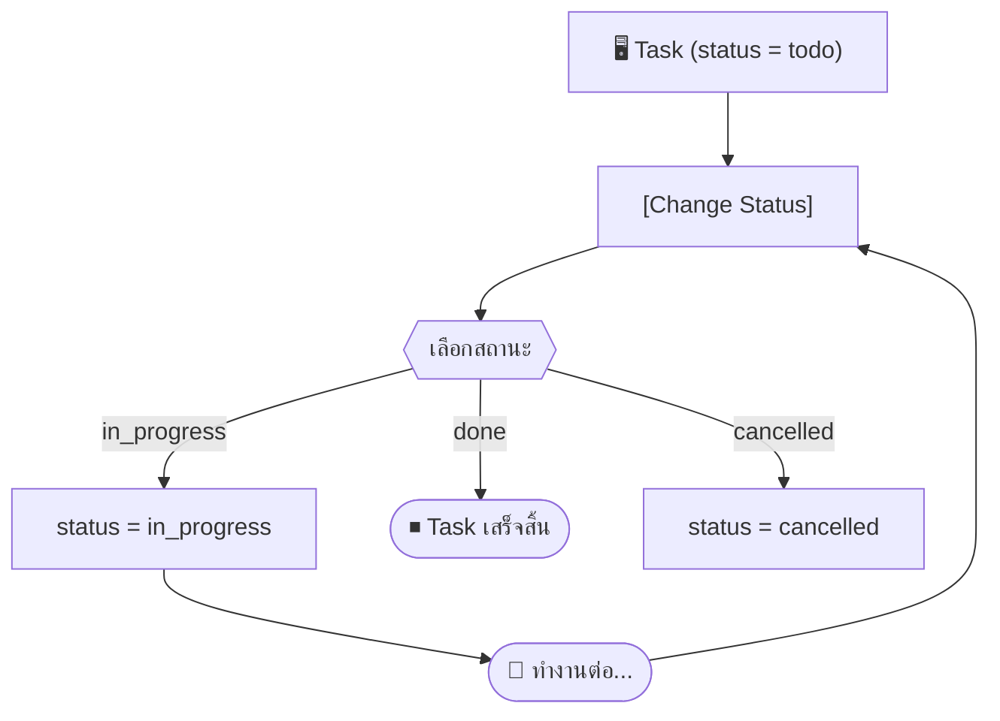

# SCN-13: PM Progress & Tasks — ติดตามความคืบหน้าและงาน

**Module:** Project Management — Progress / Tasks  
**Actors:** `pm_manager`, `employee` (assignee)  
**อ้างอิง UX Flow:** `Documents/UX_Flow/Functions/R1-13_PM_Progress_Tasks.md`

---

## Scenario 1: สร้างงานใหม่และมอบหมายให้ทีม

**Actor:** `pm_manager`  
**Goal:** สร้าง task ใหม่ในโครงการและกำหนดผู้รับผิดชอบ

### Steps

| # | สิ่งที่ User ทำ | ปุ่ม / Control | หน้าจอ / ผลลัพธ์ |
|---|---------------|---------------|-----------------|
| 1 | คลิกเมนู **PM** → **ความคืบหน้า** | Sidebar: `PM > ความคืบหน้า` | Progress Workspace: KPI summary + task list |
| 2 | ดู KPI summary: งานทั้งหมด, เสร็จ, ค้าง, overdue | — | Cards แสดงตัวเลข |
| 3 | คลิก [สร้างงาน] | `[Create Task]` | Task Form เปิด |
| 4 | กรอก **ชื่องาน** | ช่อง `title` (required) | เช่น "Design System UI Components" |
| 5 | เลือก **ผู้รับผิดชอบ** | Dropdown `assigneeId` | เฉพาะพนักงาน active เท่านั้น |
| 6 | เลือก **ลำดับความสำคัญ** | Dropdown `priority` | `low`, `medium`, `high`, `critical` |
| 7 | เลือก **วันเริ่มต้น** | Date picker `startDate` | — |
| 8 | เลือก **วันกำหนดเสร็จ** | Date picker `dueDate` | — |
| 9 | ผูก **งบประมาณ** (ถ้ามี) | Dropdown `budgetId` | งบที่ active |
| 10 | กด [บันทึก] | `[บันทึก]` | Task สร้างสำเร็จ status = `todo` |

### Mermaid Flow

---

## Scenario 2: อัปเดตสถานะงาน (In Progress → Done)

**Actor:** `pm_manager` หรือ `employee` (assignee)  
**Goal:** อัปเดตความคืบหน้าของงาน

### Steps

| # | สิ่งที่ User ทำ | ปุ่ม / Control | หน้าจอ / ผลลัพธ์ |
|---|---------------|---------------|-----------------|
| 1 | เข้า Progress Workspace | Sidebar | Task List |
| 2 | ค้นหาหรือเลือกงาน | Filter หรือคลิก | Task ใน list |
| 3 | คลิก [เปลี่ยนสถานะ] | `[Change Status]` | Dropdown: todo / in_progress / done / cancelled |
| 4 | เลือก **In Progress** | `in_progress` | status อัปเดต |
| 5 | (เมื่อเสร็จ) คลิก [เปลี่ยนสถานะ] → **Done** | `done` | status = `done` + ระบบบันทึก completedDate อัตโนมัติ |

---

## Scenario 3: อัปเดตเปอร์เซ็นต์ความคืบหน้า

**Actor:** `pm_manager` / `employee`  
**Goal:** อัปเดต % ความคืบหน้าของงานแต่ละวัน

### Steps

| # | สิ่งที่ User ทำ | ปุ่ม / Control | หน้าจอ / ผลลัพธ์ |
|---|---------------|---------------|-----------------|
| 1 | เปิด Task ที่ต้องการอัปเดต | คลิกแถว | Task Detail |
| 2 | คลิก [Update Progress] | `[Update %]` | Slider หรือช่องกรอก % |
| 3 | ปรับค่า % ความคืบหน้า | ช่อง `progressPct` | 0-100% |
| 4 | กด [บันทึก] | `[บันทึก]` | progressPct อัปเดต → KPI summary เปลี่ยน |

---

## Scenario 4: ดูงานที่ Overdue

**Actor:** `pm_manager`  
**Goal:** ตรวจสอบงานที่เลยกำหนดส่ง

### Steps

| # | สิ่งที่ User ทำ | ปุ่ม / Control | หน้าจอ / ผลลัพธ์ |
|---|---------------|---------------|-----------------|
| 1 | เข้า Progress Workspace | — | KPI: แสดง card "Overdue: X งาน" |
| 2 | คลิก filter: **Overdue** | `[Filter: Overdue]` | Task list แสดงเฉพาะที่เลย dueDate |
| 3 | ดูรายงานว่างานไหน delay | — | เห็น assignee และ delay กี่วัน |
| 4 | คลิกงานเพื่อ assign ใหม่หรือขยาย dueDate | คลิกแถว | Task Detail → [แก้ไข] |

---

## Scenario 5: แก้ไขรายละเอียดงาน

**Actor:** `pm_manager`  
**Goal:** เปลี่ยนผู้รับผิดชอบหรือขยายวันกำหนดส่ง

### Steps

| # | สิ่งที่ User ทำ | ปุ่ม / Control | หน้าจอ / ผลลัพธ์ |
|---|---------------|---------------|-----------------|
| 1 | เปิด Task Detail | คลิกแถว | Task Detail |
| 2 | คลิก [แก้ไข] | `[แก้ไข]` | Task Edit Form (pre-fill) |
| 3 | เปลี่ยน assignee หรือ dueDate | ช่องที่เกี่ยวข้อง | — |
| 4 | กด [บันทึก] | `[บันทึก]` | Task อัปเดตสำเร็จ |
