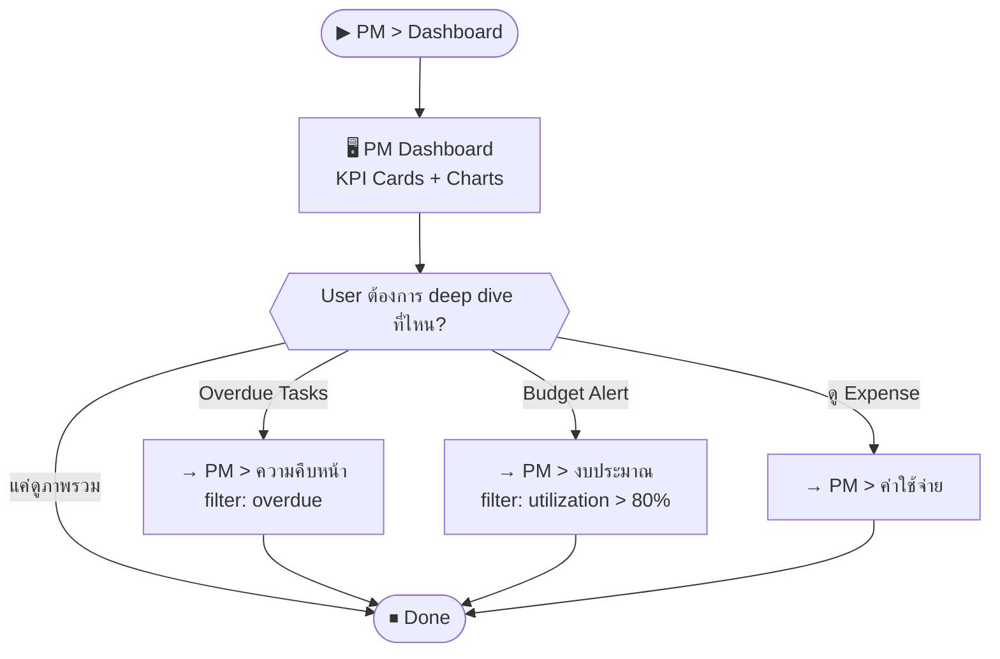

# SCN-14: PM Dashboard — แดชบอร์ดโครงการ

**Module:** Project Management — Dashboard  
**Actors:** `pm_manager`, `finance_manager`, `super_admin`  
**อ้างอิง UX Flow:** `Documents/UX_Flow/Functions/R1-14_PM_Dashboard.md`

---

## Scenario 1: ดูภาพรวม PM Dashboard

**Actor:** `pm_manager`  
**Goal:** ตรวจสอบสถานะโครงการและงบประมาณในมุมมองเดียว

### Steps

| # | สิ่งที่ User ทำ | ปุ่ม / Control | หน้าจอ / ผลลัพธ์ |
|---|---------------|---------------|-----------------|
| 1 | คลิกเมนู **PM** → **Dashboard** | Sidebar: `PM > Dashboard` | PM Dashboard โหลด |
| 2 | ดู KPI Cards: งบทั้งหมด, ใช้แล้ว, งานทั้งหมด, overdue | — | Cards summary |
| 3 | ดูกราฟ Budget Utilization | — | Bar/Pie chart แสดง % การใช้งบแต่ละโครงการ |
| 4 | ดู Task Status Distribution | — | Pie chart: todo/in_progress/done/overdue |
| 5 | คลิก card "Overdue Tasks" | `[Overdue Tasks]` card | navigate ไป PM > Progress + filter overdue |
| 6 | คลิก card "Budget Alert" | `[Budget Alert]` card | navigate ไป PM > Budget + กรอง utilization > 80% |

### Mermaid Flow

---

## Scenario 2: กรองดู Dashboard ตามช่วงเวลา

**Actor:** `pm_manager`  
**Goal:** ดู performance ของโครงการในช่วง Q1 2026

### Steps

| # | สิ่งที่ User ทำ | ปุ่ม / Control | หน้าจอ / ผลลัพธ์ |
|---|---------------|---------------|-----------------|
| 1 | เข้า PM Dashboard | — | Dashboard |
| 2 | เลือก date range filter | Date range picker | เช่น Jan 1 – Mar 31, 2026 |
| 3 | ดู KPI และ chart ที่ filter ตามช่วงวัน | — | ข้อมูลแสดงเฉพาะ Q1 |
| 4 | Export report | `[Export]` | ดาวน์โหลด summary |
