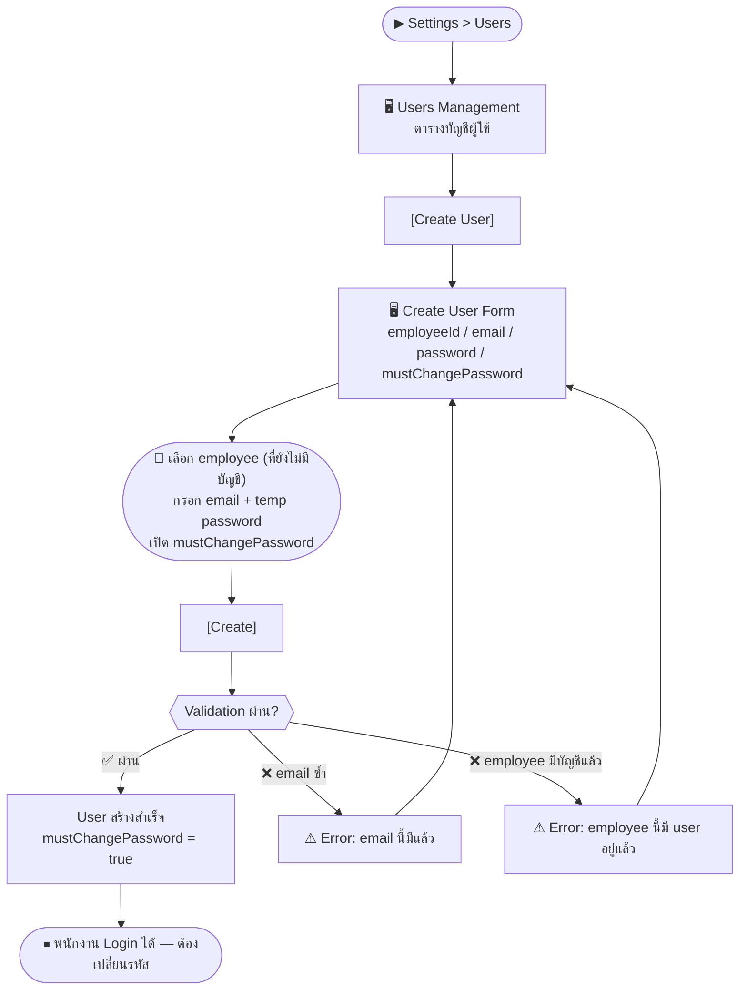
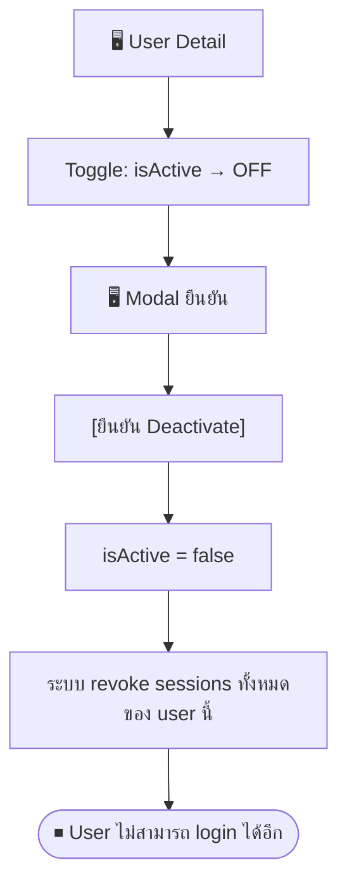

# SCN-15: Settings User Management — จัดการบัญชีผู้ใช้

**Module:** Settings — User Management  
**Actors:** `super_admin`  
**อ้างอิง UX Flow:** `Documents/UX_Flow/Functions/R1-15_Settings_User_Management.md`

---

## Scenario 1: สร้างบัญชี Login ให้พนักงานใหม่ (หลังจากเพิ่มพนักงานแล้ว)

**Actor:** `super_admin`  
**Goal:** สร้าง user account และผูกกับ employee record เพื่อให้พนักงานสามารถ login ได้

### Steps

| # | สิ่งที่ User ทำ | ปุ่ม / Control | หน้าจอ / ผลลัพธ์ |
|---|---------------|---------------|-----------------|
| 1 | คลิกเมนู **Settings** → **Users** | Sidebar: `Settings > Users` | Users Management: ตารางบัญชีผู้ใช้ |
| 2 | คลิก [Create User] | `[Create User]` | Create User Form เปิด |
| 3 | เลือก **พนักงาน** ที่ต้องการผูก | Dropdown `employeeId` | แสดงเฉพาะพนักงาน active ที่ **ยังไม่มีบัญชี** |
| 4 | กรอก **email** สำหรับ login | ช่อง `email` (required) | ต้องไม่ซ้ำในระบบ |
| 5 | กรอก **password ชั่วคราว** | ช่อง `password` (required) | ≥8 ตัวอักษร |
| 6 | เปิด Toggle **mustChangePassword** | Toggle `mustChangePassword` | ✅ เปิดเสมอสำหรับผู้ใช้ใหม่ |
| 7 | กด [Create] | `[Create]` | User ถูกสร้าง |
| 8 | แจ้ง password ให้พนักงาน | (ช่องทางอื่น เช่น email) | พนักงาน login แล้วต้องเปลี่ยนรหัส |

### Mermaid Flow

**ผลลัพธ์ที่คาดหวัง:** พนักงาน login ด้วย temp password แล้วถูกบังคับให้เปลี่ยนรหัสผ่านทันที

---

## Scenario 2: กำหนด Role ให้ User

**Actor:** `super_admin`  
**Goal:** กำหนดบทบาทให้ user สามารถเข้าถึงโมดูลที่เหมาะสม

### Steps

| # | สิ่งที่ User ทำ | ปุ่ม / Control | หน้าจอ / ผลลัพธ์ |
|---|---------------|---------------|-----------------|
| 1 | เข้า Settings > Users | — | Users List |
| 2 | คลิก user ที่ต้องการแก้ไข | คลิกแถว | User Detail |
| 3 | คลิก [Assign Roles] | `[Assign Roles]` | Role picker เปิด |
| 4 | เลือก roles ที่ต้องการ (เช่น `hr_admin`) | Checkbox หรือ MultiSelect | — |
| 5 | กด [Save Roles] | `[Save Roles]` | Roles อัปเดตสำเร็จ |
| 6 | User จะเห็นเมนูตาม role ใหม่ในครั้ง login ถัดไป | — | หรือ refresh session |

---

## Scenario 3: Deactivate User ที่ลาออก

**Actor:** `super_admin`  
**Goal:** ปิดใช้งานบัญชีของพนักงานที่ลาออกแล้ว

### Steps

| # | สิ่งที่ User ทำ | ปุ่ม / Control | หน้าจอ / ผลลัพธ์ |
|---|---------------|---------------|-----------------|
| 1 | เข้า Settings > Users | — | Users List |
| 2 | ค้นหา user ที่ต้องการ | ช่อง `search` | — |
| 3 | คลิก user | คลิกแถว | User Detail |
| 4 | Toggle `isActive` → ปิด | Toggle | Modal ยืนยัน |
| 5 | กด [ยืนยัน Deactivate] | `[ยืนยัน]` | isActive = false |
| 6 | ระบบ logout user นี้ออกจาก session ที่ active ทันที | — | user ถูก redirect `/login?reason=unauthorized` |

---

## Scenario 4: Reset Password ให้ User (Admin Reset)

**Actor:** `super_admin`  
**Goal:** ตั้ง password ใหม่ให้ user ที่ลืม password

### Steps

| # | สิ่งที่ User ทำ | ปุ่ม / Control | หน้าจอ / ผลลัพธ์ |
|---|---------------|---------------|-----------------|
| 1 | เปิด User Detail | คลิกแถว | User Detail |
| 2 | คลิก [Reset Password] | `[Reset Password]` | Form: กรอก password ใหม่ |
| 3 | กรอก password ชั่วคราว | ช่อง `newPassword` | — |
| 4 | เปิด mustChangePassword | Toggle | ✅ บังคับให้เปลี่ยนรหัสครั้งแรก login |
| 5 | กด [บันทึก] | `[บันทึก]` | password reset สำเร็จ |
| 6 | แจ้ง password ใหม่ให้ user | (ช่องทางอื่น) | — |
