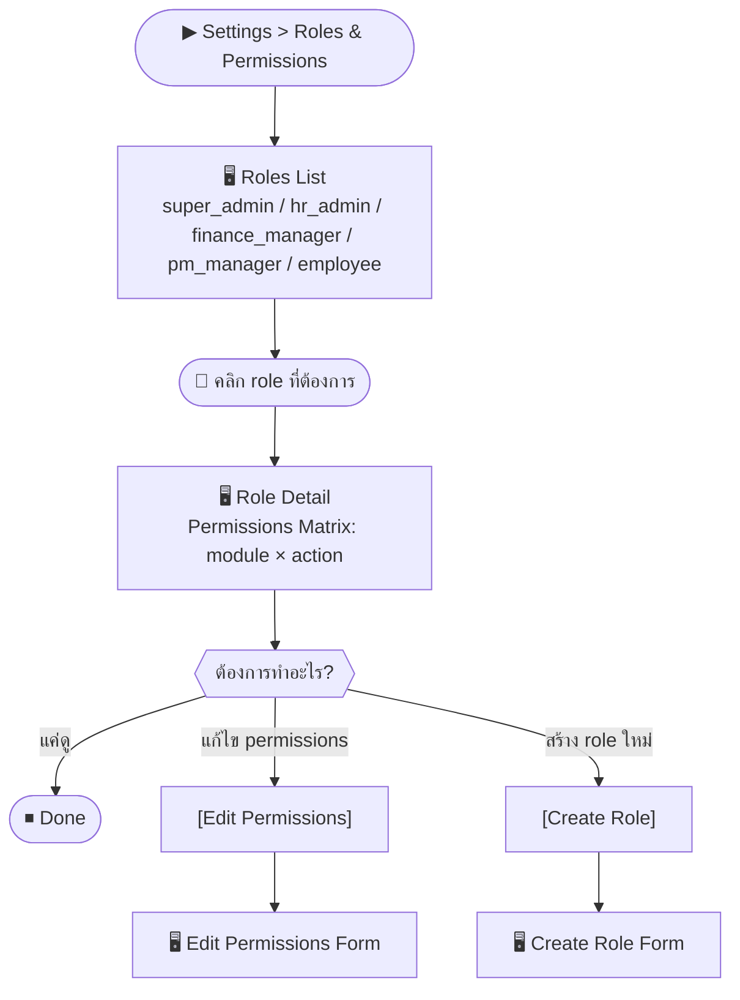
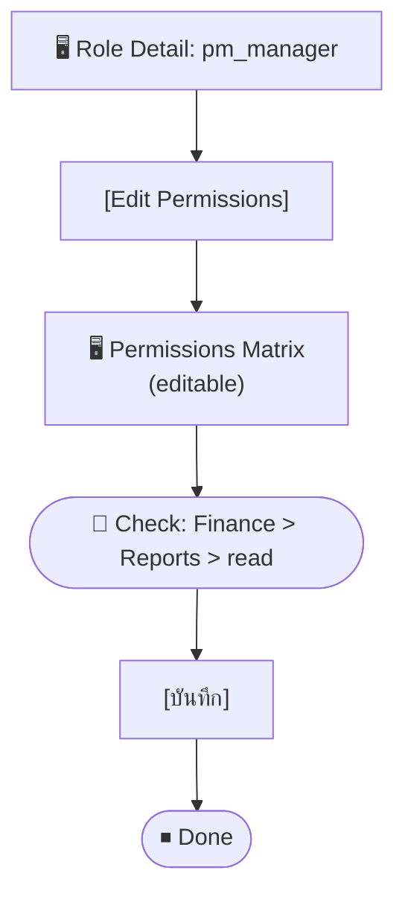

# SCN-16: Settings Role & Permission — จัดการบทบาทและสิทธิ์การใช้งาน

**Module:** Settings — Role and Permission  
**Actors:** `super_admin`  
**อ้างอิง UX Flow:** `Documents/UX_Flow/Functions/R1-16_Settings_Role_and_Permission.md`

---

## Scenario 1: ดูและตรวจสอบ Roles ในระบบ

**Actor:** `super_admin`  
**Goal:** ตรวจสอบว่า roles ในระบบมีอะไรบ้างและแต่ละ role มีสิทธิ์อะไร

### Steps

| # | สิ่งที่ User ทำ | ปุ่ม / Control | หน้าจอ / ผลลัพธ์ |
|---|---------------|---------------|-----------------|
| 1 | คลิกเมนู **Settings** → **Roles & Permissions** | Sidebar: `Settings > Roles` | Roles List: แสดง roles ทั้งหมด |
| 2 | เห็น default roles: `super_admin`, `hr_admin`, `finance_manager`, `pm_manager`, `employee` | — | ตาราง roles |
| 3 | คลิก role ที่ต้องการดูรายละเอียด | คลิกแถว | Role Detail: permissions matrix |
| 4 | ดู permissions แต่ละโมดูล: read/create/update/delete | — | Checkbox matrix |

### Mermaid Flow

---

## Scenario 2: สร้าง Custom Role ใหม่

**Actor:** `super_admin`  
**Goal:** สร้าง role พิเศษ เช่น "Accounting Viewer" ที่ดูได้แต่แก้ไขไม่ได้

### Steps

| # | สิ่งที่ User ทำ | ปุ่ม / Control | หน้าจอ / ผลลัพธ์ |
|---|---------------|---------------|-----------------|
| 1 | เข้า Settings > Roles | — | Roles List |
| 2 | คลิก [Create Role] | `[Create Role]` | Role Create Form |
| 3 | กรอก **ชื่อ role** | ช่อง `name` (required) | เช่น `accounting_viewer` |
| 4 | กรอก **คำอธิบาย** | ช่อง `description` | เช่น "ดูรายงานการเงินได้ ไม่แก้ไข" |
| 5 | เลือก **Permissions** โดย check/uncheck | Checkbox matrix | เช่น Finance: read ✅, create ❌, update ❌ |
| 6 | กด [บันทึก] | `[บันทึก]` | Role ถูกสร้าง พร้อม assign ให้ user |

---

## Scenario 3: แก้ไข Permissions ของ Role ที่มีอยู่

**Actor:** `super_admin`  
**Goal:** เพิ่มสิทธิ์ให้ `pm_manager` สามารถดู Finance Reports ได้

### Steps

| # | สิ่งที่ User ทำ | ปุ่ม / Control | หน้าจอ / ผลลัพธ์ |
|---|---------------|---------------|-----------------|
| 1 | เปิด Role Detail ของ `pm_manager` | คลิกแถว | Role Detail |
| 2 | คลิก [Edit Permissions] | `[Edit Permissions]` | Permissions Matrix แบบ editable |
| 3 | หาโมดูล **Finance Reports** | Scroll หรือ search | แถว Finance Reports |
| 4 | Check สิทธิ์ `read` | Checkbox `finance:reports:read` ✅ | — |
| 5 | กด [บันทึก] | `[บันทึก]` | Permissions อัปเดต |
| 6 | User ที่มี role นี้จะเห็นเมนู Finance Reports ใน session ถัดไป | — | หรือ refresh |

---

## Scenario 4: กำหนด Role ให้ User หลายคนพร้อมกัน

**Actor:** `super_admin`  
**Goal:** assign role ให้ทีม HR ใหม่ 3 คนพร้อมกัน

### Steps

| # | สิ่งที่ User ทำ | ปุ่ม / Control | หน้าจอ / ผลลัพธ์ |
|---|---------------|---------------|-----------------|
| 1 | เข้า Settings > Users | — | Users List |
| 2 | เลือก users หลายคน | Checkbox แต่ละแถว | 3 users ถูกเลือก |
| 3 | คลิก [Bulk Assign Role] | `[Bulk Assign Role]` | Dropdown เลือก role |
| 4 | เลือก `hr_admin` | Dropdown | — |
| 5 | กด [ยืนยัน] | `[ยืนยัน]` | ทั้ง 3 users ได้ role `hr_admin` |

---

## สรุป Role Matrix — Reference

| Role | HR | Finance | PM | Settings |
|------|----|---------|----|----------|
| `super_admin` | ✅ Full | ✅ Full | ✅ Full | ✅ Full |
| `hr_admin` | ✅ Full | ❌ Read only | ❌ | ❌ |
| `finance_manager` | ❌ Read only | ✅ Full | ❌ Read only | ❌ |
| `pm_manager` | ❌ Read only | ❌ Read only | ✅ Full | ❌ |
| `employee` | ✅ Self only | ❌ | ❌ | ❌ |
