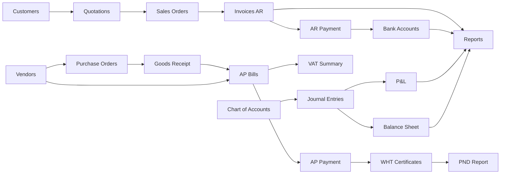

# SCN-17: Finance Real User Journeys — Use Cases ที่ผู้ใช้ทำจริงในระบบ

**Module:** Finance — Cross-feature review  
**Actors:** `finance_manager`, `sales_admin`, `procurement_officer`, `accounting_manager`, `super_admin`  
**Review date:** `2026-04-25`  

**อ้างอิงที่ใช้รีวิว**
- UI flow / page specs: `Documents/UI_Flow_mockup/Page/R1-06_Finance_Invoice_AR/*`
- UI flow / page specs: `Documents/UI_Flow_mockup/Page/R1-07_Finance_Vendor_Management/*`
- UI flow / page specs: `Documents/UI_Flow_mockup/Page/R1-08_Finance_Accounts_Payable/*`
- UI flow / page specs: `Documents/UI_Flow_mockup/Page/R1-09_Finance_Accounting_Core/*`
- UI flow / page specs: `Documents/UI_Flow_mockup/Page/R1-10_Finance_Reports_Summary/*`
- UI flow / page specs: `Documents/UI_Flow_mockup/Page/R2-01_Customer_Management/*`
- UI flow / page specs: `Documents/UI_Flow_mockup/Page/R2-03_Thai_Tax_VAT_WHT/*`
- UI flow / page specs: `Documents/UI_Flow_mockup/Page/R2-05_Cash_Bank_Management/*`
- UI flow / page specs: `Documents/UI_Flow_mockup/Page/R2-06_Purchase_Order/*`
- UI flow / page specs: `Documents/UI_Flow_mockup/Page/R2-09_Document_Print_Export/*`
- UI flow / page specs: `Documents/UI_Flow_mockup/Page/R2-11_Sales_Order_Quotation/*`
- Testcase docs: `Documents/Testcase/R1-06_testcases.md`, `R1-07_testcases.md`, `R1-08_testcases.md`, `R1-09_testcases.md`, `R1-10_testcases.md`
- Testcase docs: `Documents/Testcase/R2-01_testcases.md`, `R2-03_testcases.md`, `R2-05_testcases.md`, `R2-06_testcases.md`, `R2-09_testcases.md`, `R2-11_testcases.md`
- Current FE/BE implementation: `erp_frontend/src/modules/finance/*`, `erp_backend/src/modules/finance/*`

---

## เป้าหมายเอกสารนี้

ไฟล์ scenario เดิมแยกตาม feature ย่อยอยู่แล้ว แต่ยังไม่ตอบคำถามนี้โดยตรง:

`ผู้ใช้จริงเข้าระบบมาแล้วทำอะไรต่อจากอะไร?`

เอกสารนี้เลยสรุปเป็น **end-to-end user journeys** ที่วิ่งข้ามหลาย feature พร้อม assessment ว่า:

- flow ไหน **make sense** แล้วสำหรับ user จริง
- flow ไหนยัง **ต่อไม่สุด**
- flow ไหนมี **gap ระหว่าง requirement / UI flow / implementation ปัจจุบัน**

---

## Finance Feature Map ปัจจุบัน

---

## Quick Fit Summary

| Feature | งานจริงที่ user ต้องการทำ | สถานะโดยรวม |
|---|---|---|
| Customers | เก็บ master ลูกค้า + ดู credit / overdue | `Good` |
| Quotations | ออกใบเสนอราคาและเดินต่อไป SO | `Partial` |
| Sales Orders | ยืนยัน order และแปลงเป็น invoice | `Good` |
| Invoices AR | วางบิล รับเงิน และ export PDF | `Good` |
| Vendors | เก็บ master vendor เพื่อใช้งาน AP/PO | `Good` |
| AP Bills | บันทึกหนี้ อนุมัติ และจ่าย | `Partial` |
| Purchase Orders | ซื้อของก่อนรับของ/ก่อนจ่ายเงิน | `Partial` |
| Bank Accounts | คุมยอดธนาคารและ reconcile | `Partial` |
| Tax | VAT / WHT / PND สำหรับงานไทย | `Partial` |
| Chart of Accounts | ดูผังบัญชี | `Partial` |
| Journal Entries | ดูรายการบัญชี | `Weak` |
| Reports | ดู summary, AR aging, P&L, BS | `Partial` |

---

## Scenario 1: ขายแบบ B2B เต็มเส้นทาง จากลูกค้าใหม่จนเก็บเงินได้

**Actor:** `sales_admin` + `finance_manager`  
**Business trigger:** ได้ lead ใหม่และต้องปิดการขายแบบมีเอกสารครบ

**Features ที่เกี่ยวข้อง**
- Customers
- Quotations
- Sales Orders
- Invoices AR
- Bank Accounts
- Reports / AR aging

### Happy Path

| # | สิ่งที่ user ทำ | ใช้ feature ไหน | ผลลัพธ์ที่ user คาดหวัง |
|---|---|---|---|
| 1 | สร้างลูกค้าใหม่พร้อม credit term / credit limit | Customer | ลูกค้าพร้อมใช้ในเอกสารขาย |
| 2 | สร้าง quotation ให้ลูกค้า | Quotation | ได้ draft quotation |
| 3 | เปลี่ยนสถานะเป็น `sent` และส่งให้ลูกค้า | Quotation | เอกสารถูก track ว่าส่งแล้ว |
| 4 | เมื่อลูกค้าตกลง สร้าง Sales Order จาก quotation | Quotation -> Sales Order | งานขายเข้าสถานะที่พร้อมส่งมอบ |
| 5 | ยืนยัน Sales Order | Sales Order | SO พร้อมแปลงเป็น invoice |
| 6 | แปลง Sales Order เป็น Invoice | Sales Order -> Invoice | ได้ invoice จริงสำหรับวางบิล |
| 7 | ออก invoice / ดาวน์โหลด PDF / ส่งให้ลูกค้า | Invoice AR | ลูกค้าได้รับเอกสารชำระเงิน |
| 8 | ลูกค้าโอนเงินเข้าบัญชีบริษัท | Invoice AR + Bank Account | finance บันทึกรับชำระได้ |
| 9 | ตรวจว่า AR ค้างชำระลดลง | Reports / AR aging | ทีมการเงินเห็นยอดค้างลดลงจริง |

### Reality Check

- `Make sense:` เส้นทางธุรกิจหลักฝั่งขายมีครบตั้งแต่ customer -> quotation -> SO -> invoice -> payment
- `Good:` Invoice รับชำระเงินได้และเลือกบัญชีธนาคารได้
- `Gap:` quotation PDF ยังไม่พร้อมใช้งานใน backend (`/finance/quotations/:id/pdf` ตอบ `501`)
- `Gap:` warning เรื่องเครดิตลูกค้ามีใน model/backend แต่ UI ฟอร์ม quotation / sales order / invoice ยังไม่แสดงแบบชัดเจน
- `Gap:` ระบบอนุญาต convert quotation เป็น SO ได้ตั้งแต่สถานะ `sent` ไม่จำเป็นต้อง `accepted` ก่อน ซึ่งอาจเร็วเกิน expected ของบางองค์กร

### Assessment

`Overall: ใช้ได้จริงสำหรับทีมขาย + การเงินขนาดเล็กถึงกลาง`  
ถ้าจะให้ตรง expected ขององค์กรที่ process ชัดขึ้น ควรบังคับ acceptance ชัดกว่านี้และเติม PDF/credit control ในจุดใช้งานจริง

---

## Scenario 2: ธุรกิจบริการรายเดือน ออก invoice ตรงโดยไม่ผ่าน quotation/SO

**Actor:** `finance_manager`  
**Business trigger:** เก็บค่าบริการ recurring เช่น MA, subscription, consulting retainer

**Features ที่เกี่ยวข้อง**
- Customers
- Invoices AR
- Bank Accounts
- Reports

### Happy Path

| # | สิ่งที่ user ทำ | ใช้ feature ไหน | ผลลัพธ์ที่ user คาดหวัง |
|---|---|---|---|
| 1 | เปิด customer ที่มีอยู่แล้ว | Customer | ตรวจข้อมูลเครดิตลูกค้า |
| 2 | สร้าง invoice ใหม่ทันที | Invoice AR | ได้ draft invoice |
| 3 | เปลี่ยนสถานะเป็น `sent` | Invoice AR | invoice ถูกใช้งานจริง |
| 4 | ดาวน์โหลด PDF ส่งลูกค้า | Invoice AR | ส่งเอกสารได้ทันที |
| 5 | ลูกค้าชำระเงินบางส่วนหรือเต็มจำนวน | Invoice AR | ระบบอัปเดต paid/balance |
| 6 | ตรวจผลใน summary report | Reports | รายรับ/AR ปรับตามจริง |

### Reality Check

- `Make sense:` มากสำหรับธุรกิจบริการ เพราะ user ไม่จำเป็นต้องผ่าน quotation/SO ทุกครั้ง
- `Good:` payment history และ PDF invoice ใช้งานได้
- `Gap:` หน้า create invoice ไม่มีช่อง `issueDate` ให้กรอก แม้ backend รองรับ optional field นี้
- `Gap:` invoice list ปัจจุบันเรียบมาก ยังไม่ช่วย user ทำ collection work เช่น filter แบบ overdue-heavy, batch follow-up, reminder

### Assessment

`Overall: make sense มาก`  
นี่คือหนึ่งใน flow ที่พร้อมใช้งานจริงที่สุดของ finance module ปัจจุบัน

---

## Scenario 3: ทีม finance คุมเครดิตลูกหนี้และตามหนี้

**Actor:** `finance_manager`, `accounting_manager`  
**Business trigger:** ลูกค้าหลายรายเริ่มค้างจ่าย และทีมต้อง prioritise follow-up

**Features ที่เกี่ยวข้อง**
- Customers
- Invoices AR
- Reports (AR aging)

### Happy Path

| # | สิ่งที่ user ทำ | ใช้ feature ไหน | ผลลัพธ์ที่ user คาดหวัง |
|---|---|---|---|
| 1 | เปิด customer list ดูลูกค้าที่มี overdue | Customer | เห็นลูกค้าที่เริ่มมีปัญหา |
| 2 | เปิด AR aging ตามวัน cutoff | Reports | เห็นยอดค้างตาม bucket |
| 3 | เปิด invoice ของลูกค้าที่ค้าง | Invoice AR | ตรวจรายการที่ยังไม่ปิด |
| 4 | บันทึกรับชำระบางส่วนถ้ามี | Invoice AR | balanceDue ลดลง |
| 5 | กลับไปดู AR aging ใหม่ | Reports | bucket ควรอัปเดตตามจริง |

### Reality Check

- `Make sense:` ระดับข้อมูลที่ต้องใช้สำหรับ collection มีพอแล้ว
- `Good:` customer list มี overdue indicator และ customer edit page มี AR summary
- `Gap:` ไม่มี customer detail page แยกที่รวม open invoices / quotations / history แบบ one-stop
- `Gap:` ไม่มี workflow ตามหนี้ เช่น reminder, note การติดตาม, next action, promise-to-pay
- `Gap:` AR aging ปัจจุบันดูได้ แต่หน้า report ยังไม่มี drilldown action ใน UI จริงตามที่เอกสารเก่าบางส่วนคาดหวัง

### Assessment

`Overall: พอใช้สำหรับ monitoring แต่ยังไม่พอสำหรับ collection workflow จริง`

---

## Scenario 4: ซื้อบริการจาก vendor แล้วจ่าย พร้อมออก WHT

**Actor:** `finance_manager`  
**Business trigger:** บริษัทได้รับ invoice จาก vendor บริการ และต้องจ่ายพร้อมเอกสารภาษี

**Features ที่เกี่ยวข้อง**
- Vendors
- AP Bills
- Tax Hub / WHT / PND
- VAT Summary

### Happy Path

| # | สิ่งที่ user ทำ | ใช้ feature ไหน | ผลลัพธ์ที่ user คาดหวัง |
|---|---|---|---|
| 1 | สร้าง vendor หรือแก้ไขข้อมูล vendor | Vendor | ข้อมูลผู้ขายพร้อมใช้ |
| 2 | สร้าง AP bill จาก invoice ที่ vendor ส่งมา | AP | ระบบรับรู้เจ้าหนี้ |
| 3 | ใส่ VAT/WHT amount แล้วบันทึก | AP | ยอด payable ถูกต้อง |
| 4 | ผู้มีสิทธิ์ approve รายการ | AP | AP เปลี่ยนเป็น `approved` |
| 5 | บันทึกการจ่ายเงิน | AP | หนี้ถูกลดหรือปิด |
| 6 | สร้าง WHT certificate | Tax WHT | ได้เลขใบรับรองหัก ณ ที่จ่าย |
| 7 | ดาวน์โหลด PDF และออกรายงาน PND | Tax WHT / PND | ใช้ยื่นภาษีได้ |
| 8 | ตรวจ VAT summary ของเดือน | Tax VAT | เห็น input VAT จากฝั่งซื้อ |

### Reality Check

- `Make sense:` flow หลักฝั่ง AP + tax ไทยมีแกนที่ถูกต้อง
- `Good:` WHT certificate และ PND export ใช้งานได้จริง
- `Gap:` AP ปัจจุบันไม่มีสถานะ `draft -> submit`; create แล้วเข้า `pending` เลย เหมาะกับทีมเล็ก แต่ไม่เหมาะกับ maker-checker ที่ต้องการ stage ชัด
- `Gap:` payment form ฝั่ง AP ใน UI ยังไม่ให้เลือก bank account / reference / notes แบบเดียวกับฝั่ง AR แม้ backend รองรับ field เพิ่มเติม
- `Gap:` หลังจ่าย AP ยังไม่มี prompt เชื่อมไปสร้าง WHT ต่ออัตโนมัติแบบใน UI flow docs
- `Gap:` การสร้าง WHT ตอนนี้ยังกรอกด้วย `AP bill UUID`/`employee UUID` ตรง ๆ ใน modal ซึ่งไม่ใช่ UX ที่ user การเงินจริงอยากใช้

### Assessment

`Overall: logic ถูก แต่ UX ยังไม่ลื่นพอสำหรับงานบัญชีจ่ายจริง`

---

## Scenario 5: Procure-to-Pay แบบมี PO และรับของก่อนจ่าย

**Actor:** `procurement_officer` + `finance_manager`  
**Business trigger:** ซื้อสินค้า/อุปกรณ์ที่ต้องควบคุมการสั่งซื้อก่อนตั้งเจ้าหนี้

**Features ที่เกี่ยวข้อง**
- Vendors
- Purchase Orders
- Goods Receipt
- AP Bills

### Happy Path ที่ user คาดหวัง

| # | สิ่งที่ user อยากทำ | ใช้ feature ไหน | Expected outcome |
|---|---|---|---|
| 1 | สร้าง PO draft | Purchase Order | ได้คำสั่งซื้อ |
| 2 | submit / approve PO | Purchase Order | PO พร้อมสั่ง |
| 3 | รับของบางส่วนหรือทั้งหมด | Goods Receipt | receivedQty อัปเดต |
| 4 | ตั้ง AP bill อ้างอิง PO / GR | AP | จ่ายบนของที่รับจริง |
| 5 | ดู linked AP bills จาก PO | Purchase Order | ตรวจ trace ได้ครบ |

### Reality Check

- `Make sense:` PO + GR flow ฝั่งซื้อมีทิศทางที่ถูกต้อง
- `Good:` PO มีสถานะ `draft/submitted/approved/partially_received/received/cancelled`
- `Good:` บันทึกรับของบางส่วนได้จริง
- `Gap:` frontend ยังไม่มีจุดสร้าง AP จาก PO โดยตรง แม้ backend รองรับ `poId`
- `Gap:` หน้า PO detail ดู linked AP ได้ แต่ user ยังต้องกระโดดไปสร้าง AP เอง
- `Gap:` ฟิลด์ `departmentId` และ `projectBudgetId` มีใน backend แต่หน้า PO form ยังไม่เปิดให้ใช้
- `Gap:` PO PDF ยังไม่พร้อมใช้งานใน backend (`501`)
- `Gap:` ยังไม่มี 3-way matching UX ชัด ๆ ระหว่าง PO / GR / AP

### Assessment

`Overall: เป็น flow ที่มี foundation ดี แต่ยังไม่ end-to-end ใน UI`

---

## Scenario 6: คุมเงินสด/ธนาคารและกระทบยอด

**Actor:** `finance_manager`, `accounting_manager`  
**Business trigger:** ต้องรู้ว่ารับเงิน-จ่ายเงินเข้าบัญชีไหน และยอดจริงตรง statement ไหม

**Features ที่เกี่ยวข้อง**
- Bank Accounts
- Invoices AR
- AP Bills

### Happy Path

| # | สิ่งที่ user ทำ | ใช้ feature ไหน | ผลลัพธ์ที่ user คาดหวัง |
|---|---|---|---|
| 1 | สร้างบัญชีธนาคารใหม่ | Bank Accounts | บัญชีพร้อมใช้งาน |
| 2 | ใช้บัญชีนี้ตอนรับชำระ invoice | Invoice AR | AR payment trace ถึง bank account |
| 3 | บันทึก movement manual ถ้ามี | Bank Accounts | currentBalance ขยับ |
| 4 | เลือกรายการที่ statement ยืนยันแล้ว | Bank Accounts | mark reconciled |
| 5 | ตรวจ opening / closing / running balance | Bank Accounts | เช็กเงินในบัญชีได้ |

### Reality Check

- `Make sense:` สำหรับ SME ที่ยังไม่ต่อ statement import จริง
- `Good:` manual deposit/withdrawal และ reconcile selected ใช้งานได้
- `Gap:` ฝั่ง AP payment ยังไม่ผูก bank account ใน UI ทำให้ cash-out trace ไม่สวยเท่าฝั่ง AR
- `Gap:` ยังไม่มี import bank statement, auto-match, unmatched queue
- `Gap:` ไม่มี transfer ระหว่างบัญชี หรือ cash/bank transfer flow โดยตรง

### Assessment

`Overall: พอใช้สำหรับควบคุมพื้นฐาน แต่ยังไม่ใช่ cash management เต็มรูป`

---

## Scenario 7: ปิดภาษีประจำเดือนสำหรับบริษัทไทย

**Actor:** `accounting_manager`  
**Business trigger:** สิ้นเดือนต้องปิด VAT / WHT / PND ให้ครบ

**Features ที่เกี่ยวข้อง**
- Tax rates
- VAT summary
- WHT certificates
- PND report
- AP / Invoice data

### Happy Path

| # | สิ่งที่ user ทำ | ใช้ feature ไหน | ผลลัพธ์ที่ user คาดหวัง |
|---|---|---|---|
| 1 | ตรวจ tax rates ที่ active | Tax Hub | มั่นใจว่าใช้อัตราถูก |
| 2 | ดู VAT summary ของเดือน | VAT Report | เห็น output/input/net VAT |
| 3 | ตรวจ WHT certificates ที่ออกแล้ว | WHT | audit ใบหักครบ |
| 4 | สร้าง WHT ที่ยังขาด | WHT | ใบรับรองครบ |
| 5 | export PND report | WHT / PND | พร้อมใช้งานต่อภายนอก |

### Reality Check

- `Make sense:` กรณีใช้งานในไทย flow นี้สำคัญและระบบมีของจริงเยอะกว่าที่คิด
- `Good:` VAT summary + export, WHT PDF, PND export มีแล้ว
- `Gap:` VAT report มีแบบ summary มากกว่าหน้าตรวจ transaction ระดับเอกสาร
- `Gap:` WHT create UX ยังเป็น power-user oriented มาก
- `Gap:` behavior “บริษัทไม่จด VAT ให้ซ่อน VAT fields” อยู่ใน testcase/docs แต่ยังไม่เห็นในฟอร์ม invoice ปัจจุบัน

### Assessment

`Overall: useful มาก แต่ยังต้อง polish UX เพื่อให้ accountant ใช้เร็วจริง`

---

## Scenario 8: ผู้บริหารการเงินดูภาพรวมบริษัทและตรวจงบ

**Actor:** `accounting_manager`, `finance_manager`, `super_admin`  
**Business trigger:** ต้องประชุม review สถานะการเงินสิ้นสัปดาห์หรือสิ้นเดือน

**Features ที่เกี่ยวข้อง**
- Reports summary
- AR aging
- Profit & Loss
- Balance Sheet
- Chart of Accounts
- Journal Entries

### Happy Path

| # | สิ่งที่ user ทำ | ใช้ feature ไหน | ผลลัพธ์ที่ user คาดหวัง |
|---|---|---|---|
| 1 | เปิด finance reports | Reports | เห็น KPI รวม |
| 2 | ดู AR aging as-of วันนี้ | Reports | เห็นลูกหนี้ค้าง |
| 3 | ดู P&L ตามช่วงวัน | Reports | เห็นรายได้/ค่าใช้จ่ายตามบัญชี |
| 4 | ดู Balance Sheet as-of | Reports | เห็น assets/liabilities/equity |
| 5 | เปิด Chart of Accounts และ Journal Entries ถ้าต้อง trace | GL | ตรวจบัญชีต้นทางได้ |

### Reality Check

- `Make sense:` reporting layer เริ่มตอบโจทย์ finance manager แล้ว
- `Good:` P&L และ Balance Sheet ใช้ journal lines จริง ไม่ได้คำนวณแบบ mock
- `Gap:` summary KPI กับ P&L/BS ใช้ฐานข้อมูลคนละแนว
- `Gap detail:` `summary` เอา expense จาก `pm_expenses` โดยตรง แต่ P&L / BS เอาจาก `journal_entries`
- `Impact:` ผู้ใช้มีโอกาสเห็น “summary ไม่ตรงกับงบ” ถ้า journal ยังไม่ครบหรือ PM expense ไม่ได้ post เข้าบัญชี
- `Gap:` หน้า reports ยังไม่มี export หรือ drilldown action ตาม docs เก่าบางส่วน

### Assessment

`Overall: มีประโยชน์สำหรับ review แต่ยังต้องจัด narrative ของตัวเลขให้สอดคล้องกัน`

---

## Scenario 9: ปิดเดือนบัญชีด้วย manual journal adjustment

**Actor:** `accounting_manager`  
**Business trigger:** ต้องลงค่าใช้จ่ายค้างจ่าย, accrual, adjustment, reclass, closing entries

**Features ที่เกี่ยวข้อง**
- Chart of Accounts
- Journal Entries
- Profit & Loss
- Balance Sheet

### Expected Happy Path ของ user

| # | สิ่งที่ user อยากทำ | Expected feature |
|---|---|---|
| 1 | เปิดผังบัญชีเพื่อเลือก account | Chart of Accounts |
| 2 | สร้าง journal แบบ debit/credit หลายบรรทัด | Journal editor |
| 3 | save draft / review / post | Journal workflow |
| 4 | reverse journal ถ้าผิด | Reversal |
| 5 | กลับไปดู P&L / BS ใหม่ | Reports |

### Reality Check

- `Gap ใหญ่:` backend มี `POST /finance/journal-entries` แต่ frontend ตอนนี้มีแค่ journal list แบบอ่านอย่างเดียว
- `Gap ใหญ่:` ไม่มี UI สำหรับ create / post / reverse journal
- `Gap:` Chart of Accounts UI ปัจจุบันก็ยังเป็น list-only ไม่มี create/edit flow ฝั่งหน้าใช้งานจริง
- `ผลกระทบ:` finance/accounting ปิดเดือนเองจาก UI ไม่ได้ครบ แม้ reports จะเริ่มดูงบได้แล้ว

### Assessment

`Overall: ยังไม่ make sense สำหรับ accounting close`  
นี่คือจุดที่สำคัญที่สุดถ้าจะขยับจาก “finance operations” ไปสู่ “accounting system จริง”

---

## ข้อสรุปใหญ่: ตอนนี้ feature finance make sense แค่ไหน

### ส่วนที่ make sense แล้ว

- งานขายแบบ `quotation -> SO -> invoice -> payment` ใช้งานได้ในระดับดี
- งานวางบิลตรงสำหรับธุรกิจบริการใช้งานได้ดีมาก
- vendor / customer master data มีโครงที่ใช้จริงได้
- tax ไทยมีของจริงเยอะกว่าค่าเฉลี่ยระบบ prototype ทั่วไป
- reports ระดับผู้จัดการเริ่มใช้คุยสถานะการเงินได้แล้ว

### ส่วนที่ยัง make sense ไม่สุด

- AP, PO, WHT, bank ยังต่อกันไม่ลื่นพอเป็น procure-to-pay แบบ end-to-end
- cash/bank trace ฝั่งจ่ายเงินยังอ่อนกว่าฝั่งรับเงิน
- reports summary กับ accounting statements ยังมีโอกาสเล่า “คนละเรื่อง”
- GL / journal ฝั่ง UI ยังไม่พอสำหรับคนบัญชีปิดงานจริง

### ส่วนที่ควรแก้ก่อนถ้าต้องเลือกเป็นลำดับ

1. ทำ `Journal UI` ให้ครบ create / review / reverse
2. เชื่อม `PO -> AP -> Payment -> WHT` ให้เป็น flow เดียวใน UI
3. ทำให้ `AP payment` ผูก bank account และ reference ได้เหมือน AR
4. ปิดช่องว่าง `Quotation PDF` และ `PO PDF`
5. ทำให้ `summary KPI` กับ `P&L / BS` ใช้ logic ที่สอดคล้องกันหรืออธิบายชัดเจน
6. surface `credit warning` ให้เห็นในจุดที่ user ตัดสินใจสร้างเอกสารขาย

---

## Coverage Matrix

| Scenario | Customer | Quotation | SO | Invoice | Vendor | AP | PO/GR | Bank | Tax | GL | Reports |
|---|---|---|---|---|---|---|---|---|---|---|---|
| 1. Lead-to-cash | ✅ | ✅ | ✅ | ✅ |  |  |  | ✅ |  |  | ✅ |
| 2. Direct recurring billing | ✅ |  |  | ✅ |  |  |  | ✅ |  |  | ✅ |
| 3. Credit control / collection | ✅ |  |  | ✅ |  |  |  |  |  |  | ✅ |
| 4. Vendor bill + WHT |  |  |  |  | ✅ | ✅ |  |  | ✅ |  |  |
| 5. Procure-to-pay |  |  |  |  | ✅ | ✅ | ✅ |  |  |  |  |
| 6. Cash / bank control |  |  |  | ✅ |  | ✅ |  | ✅ |  |  |  |
| 7. Monthly tax close |  |  |  | ✅ |  | ✅ |  |  | ✅ |  |  |
| 8. Management review |  |  |  |  |  |  |  |  |  | ✅ | ✅ |
| 9. Month-end close |  |  |  |  |  |  |  |  |  | ✅ | ✅ |

